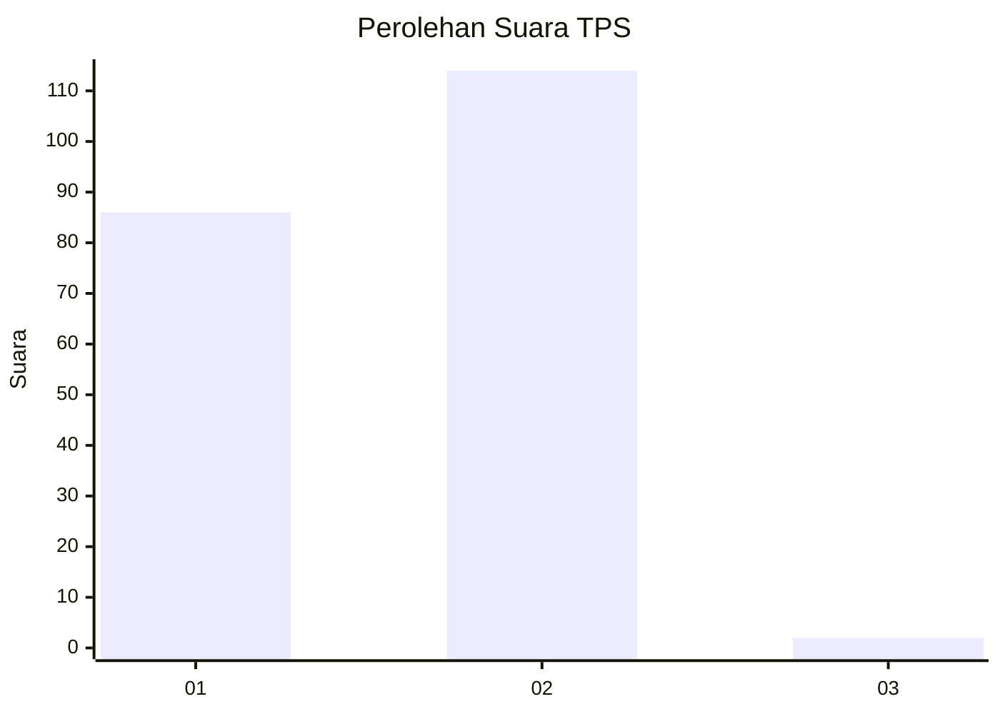
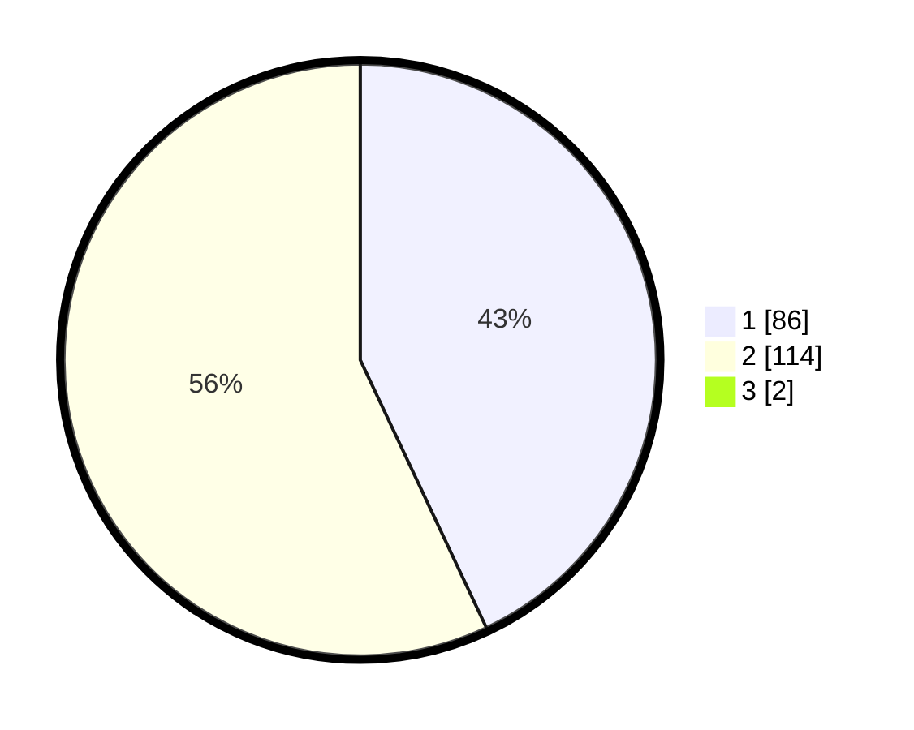

# Hasil

## Grafik

## Tabel

| No. | Nama Paslon    | Suara | Suara (raw) | Persentase |
|:--- |:-------------- | -----:| -----------:| ----------:|
| 1   | ANIES MUHAIMIN | 86    | [86][p-1]   | 42,57      |
| 2   | PRABOWO GIBRAN | 114   | [114][p-2]  | 56,44      |
| 3   | GANJAR MAHFUD  | 2     | [2][p-3]    | 0,99       |

[p-1]: https://github.com/gigit-pemilu/pemilu-2024-11-aceh/blob/main/pilpres/hitung-suara/sub/11-aceh/sub/08-aceh-utara/sub/18-langkahan/sub/2018-langkahan/sub/002-tps/sub/paslon-1.txt
[p-2]: https://github.com/gigit-pemilu/pemilu-2024-11-aceh/blob/main/pilpres/hitung-suara/sub/11-aceh/sub/08-aceh-utara/sub/18-langkahan/sub/2018-langkahan/sub/002-tps/sub/paslon-2.txt
[p-3]: https://github.com/gigit-pemilu/pemilu-2024-11-aceh/blob/main/pilpres/hitung-suara/sub/11-aceh/sub/08-aceh-utara/sub/18-langkahan/sub/2018-langkahan/sub/002-tps/sub/paslon-3.txt

## Foto C Plano

https://sirekap-obj-formc.kpu.go.id/b077/pemilu/ppwp/11/08/18/20/18/1108182018002-20240215-134709--8d46d923-9ee2-4393-b157-6634f8b61d03.jpg

https://sirekap-obj-formc.kpu.go.id/b077/pemilu/ppwp/11/08/18/20/18/1108182018002-20240215-135110--07513288-c697-4c6e-a47c-649b9483fda0.jpg

https://sirekap-obj-formc.kpu.go.id/b077/pemilu/ppwp/11/08/18/20/18/1108182018002-20240215-135346--554f307b-3bae-421d-9479-07de6c7a0061.jpg

## Metadata

| Key        | Value               |
| ---------- | ------------------- |
| Time Stamp | 2024-02-17 00:28:35 |

