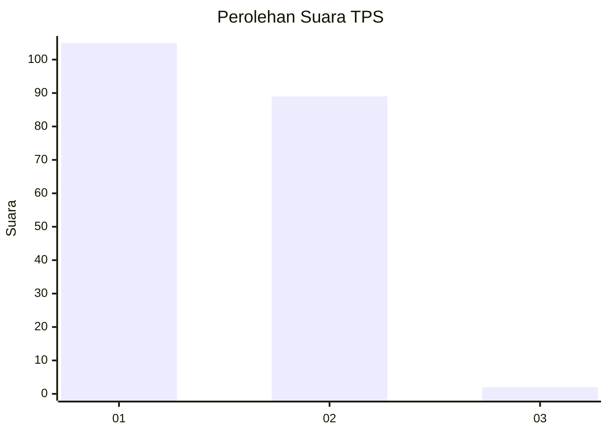
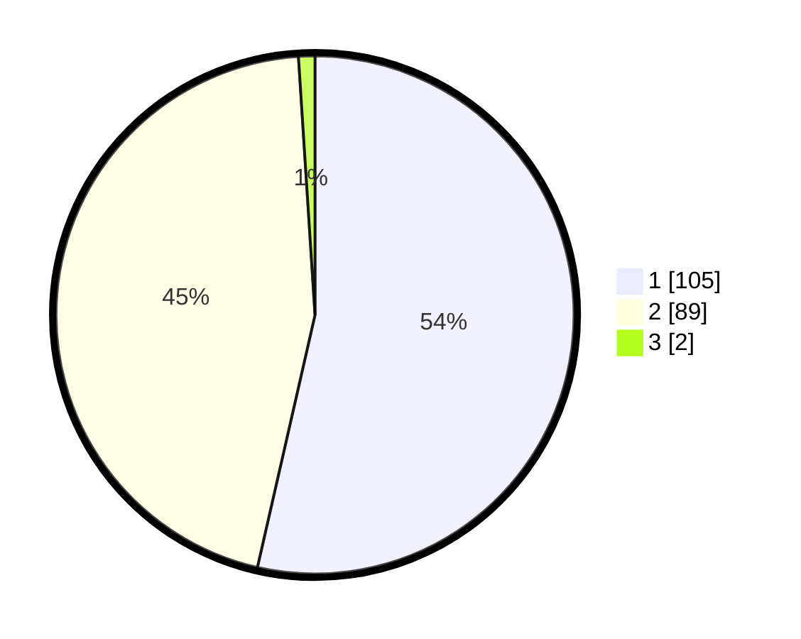

# Hasil

## Grafik

## Tabel

| No. | Nama Paslon    | Suara | Suara (raw) | Persentase |
|:--- |:-------------- | -----:| -----------:| ----------:|
| 1   | ANIES MUHAIMIN | 105   | [105][p-1]  | 53,57      |
| 2   | PRABOWO GIBRAN | 89    | [89][p-2]   | 45,41      |
| 3   | GANJAR MAHFUD  | 2     | [2][p-3]    | 1,02       |

[p-1]: https://github.com/gigit-pemilu/pemilu-2024-11-aceh/blob/main/pilpres/hitung-suara/sub/11-aceh/sub/08-aceh-utara/sub/18-langkahan/sub/2018-langkahan/sub/003-tps/sub/paslon-1.txt
[p-2]: https://github.com/gigit-pemilu/pemilu-2024-11-aceh/blob/main/pilpres/hitung-suara/sub/11-aceh/sub/08-aceh-utara/sub/18-langkahan/sub/2018-langkahan/sub/003-tps/sub/paslon-2.txt
[p-3]: https://github.com/gigit-pemilu/pemilu-2024-11-aceh/blob/main/pilpres/hitung-suara/sub/11-aceh/sub/08-aceh-utara/sub/18-langkahan/sub/2018-langkahan/sub/003-tps/sub/paslon-3.txt

## Foto C Plano

https://sirekap-obj-formc.kpu.go.id/69e8/pemilu/ppwp/11/08/18/20/18/1108182018003-20240215-133852--7751bf63-d03a-4c50-8d4d-d1896d5fc382.jpg

https://sirekap-obj-formc.kpu.go.id/69e8/pemilu/ppwp/11/08/18/20/18/1108182018003-20240215-133931--c0d72604-c950-4ed6-8fe8-f4bed26891be.jpg

https://sirekap-obj-formc.kpu.go.id/69e8/pemilu/ppwp/11/08/18/20/18/1108182018003-20240215-134002--39d768a0-c0eb-46db-b529-c7b768ccf3a4.jpg

## Metadata

| Key        | Value               |
| ---------- | ------------------- |
| Time Stamp | 2024-02-17 16:36:25 |

