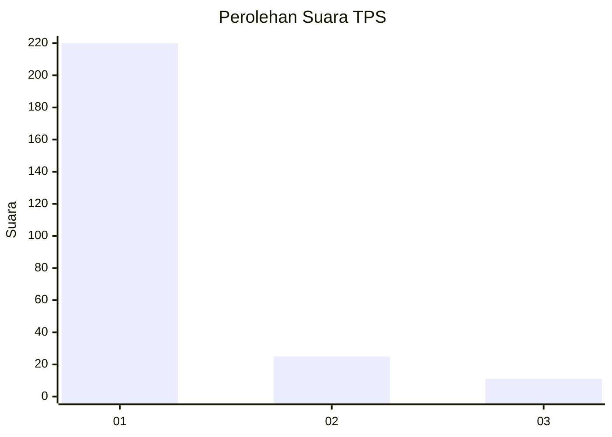
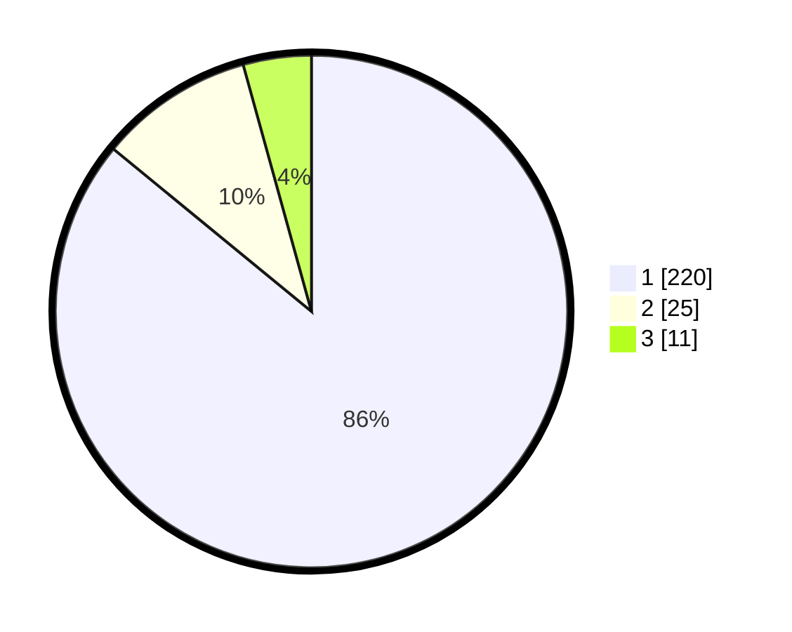

# Hasil

## Grafik

## Tabel

| No. | Nama Paslon    | Suara | Suara (raw) | Persentase |
|:--- |:-------------- | -----:| -----------:| ----------:|
| 1   | ANIES MUHAIMIN | 220   | [220][p-1]  | 85,94      |
| 2   | PRABOWO GIBRAN | 25    | [25][p-2]   | 9,77       |
| 3   | GANJAR MAHFUD  | 11    | [11][p-3]   | 4,30       |

[p-1]: https://github.com/gigit-pemilu/pemilu-2024-11-aceh/blob/main/pilpres/hitung-suara/sub/11-aceh/sub/08-aceh-utara/sub/18-langkahan/sub/2020-buket-linteung/sub/003-tps/sub/paslon-1.txt
[p-2]: https://github.com/gigit-pemilu/pemilu-2024-11-aceh/blob/main/pilpres/hitung-suara/sub/11-aceh/sub/08-aceh-utara/sub/18-langkahan/sub/2020-buket-linteung/sub/003-tps/sub/paslon-2.txt
[p-3]: https://github.com/gigit-pemilu/pemilu-2024-11-aceh/blob/main/pilpres/hitung-suara/sub/11-aceh/sub/08-aceh-utara/sub/18-langkahan/sub/2020-buket-linteung/sub/003-tps/sub/paslon-3.txt

## Foto C Plano

https://sirekap-obj-formc.kpu.go.id/8dbe/pemilu/ppwp/11/08/18/20/20/1108182020003-20240215-131520--c19128c8-0d77-4b27-89ca-d905b35cfa45.jpg

https://sirekap-obj-formc.kpu.go.id/8dbe/pemilu/ppwp/11/08/18/20/20/1108182020003-20240215-131608--c3b164ae-1b26-4794-ae4a-0d6a35c698c6.jpg

## Metadata

| Key        | Value               |
| ---------- | ------------------- |
| Time Stamp | 2024-02-17 00:30:00 |

