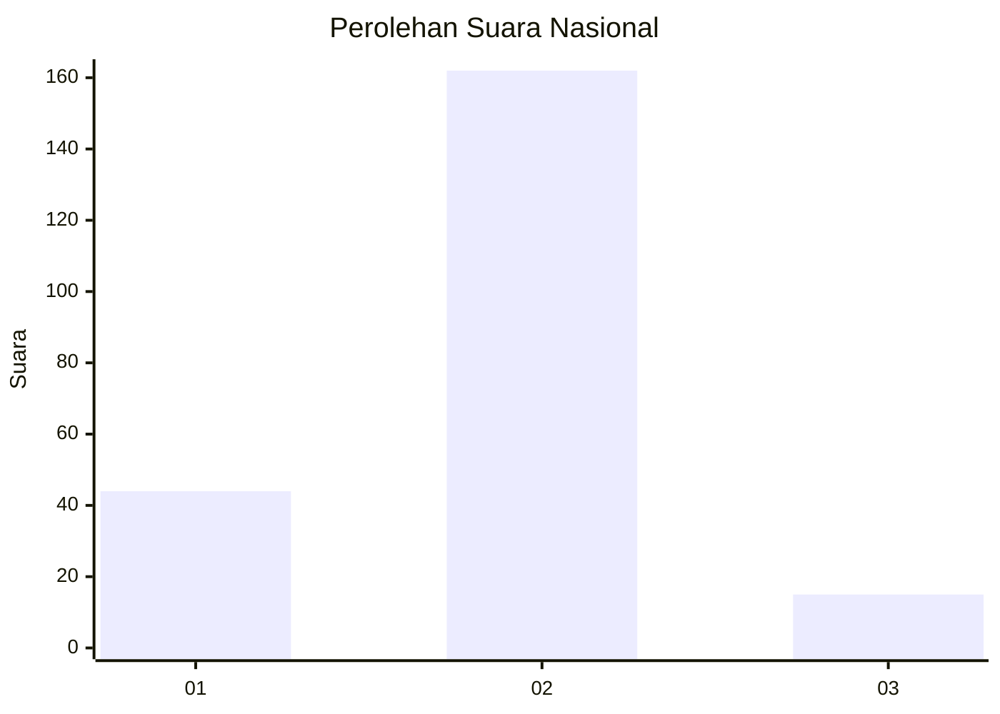
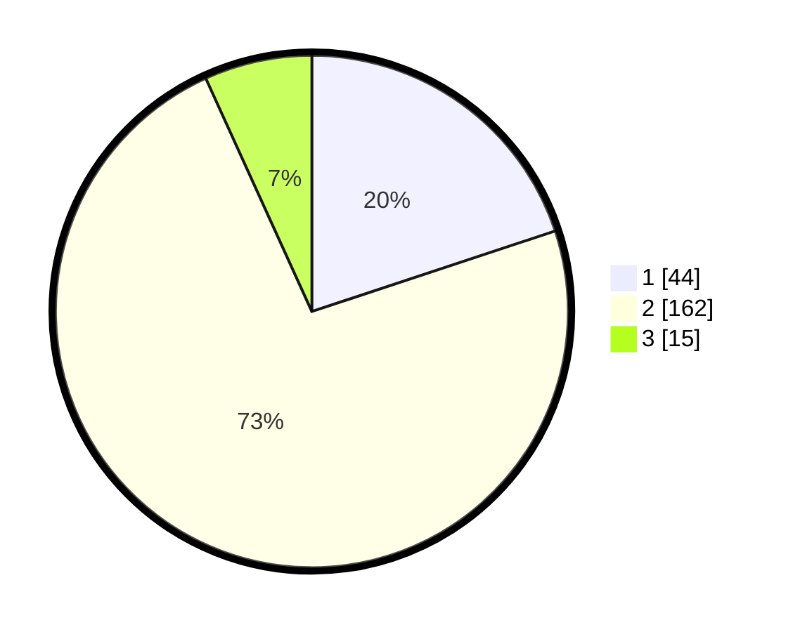

# Hasil

## Grafik

## Tabel

| No. | Nama Paslon    | Suara | Suara (raw) | Persentase |
|:--- |:-------------- | -----:| -----------:| ----------:|
| 1   | ANIES MUHAIMIN | 44    | [44][p-1]   | 19,91      |
| 2   | PRABOWO GIBRAN | 162   | [162][p-2]  | 73,30      |
| 3   | GANJAR MAHFUD  | 15    | [15][p-3]   | 6,79       |

[p-1]: https://github.com/gigit-pemilu/pemilu-2024/blob/main/pilpres/hitung-suara/sub/11-aceh/sub/08-aceh-utara/sub/18-langkahan/sub/2022-seureuke/sub/006-tps/sub/paslon-1.txt
[p-2]: https://github.com/gigit-pemilu/pemilu-2024/blob/main/pilpres/hitung-suara/sub/11-aceh/sub/08-aceh-utara/sub/18-langkahan/sub/2022-seureuke/sub/006-tps/sub/paslon-2.txt
[p-3]: https://github.com/gigit-pemilu/pemilu-2024/blob/main/pilpres/hitung-suara/sub/11-aceh/sub/08-aceh-utara/sub/18-langkahan/sub/2022-seureuke/sub/006-tps/sub/paslon-3.txt

## Foto C Plano

https://sirekap-obj-formc.kpu.go.id/ffd8/pemilu/ppwp/11/08/18/20/22/1108182022006-20240214-222929--10025244-6993-4602-b4a2-a00b1dec05ef.jpg

https://sirekap-obj-formc.kpu.go.id/ffd8/pemilu/ppwp/11/08/18/20/22/1108182022006-20240214-223101--532f18a4-2fbf-4b3f-b3c9-46628c6846b0.jpg

## Metadata

| Key        | Value               |
| ---------- | ------------------- |
| Time Stamp | 2024-02-17 19:00:04 |

