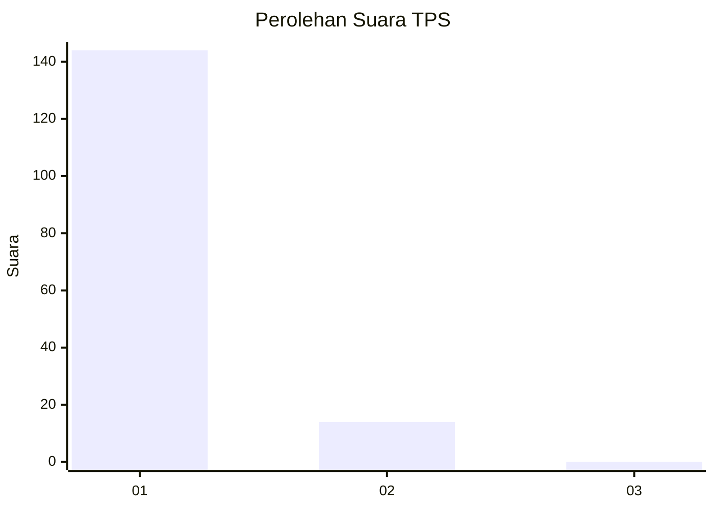
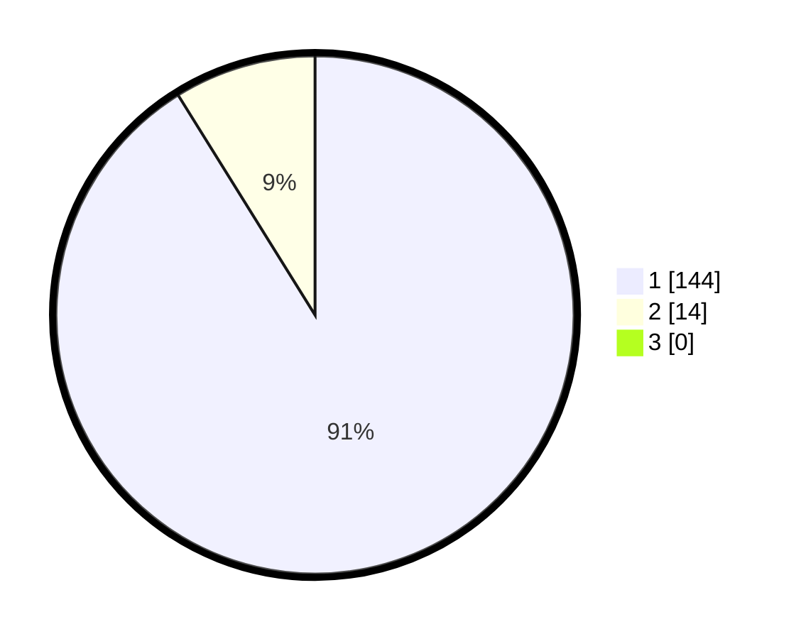

# Hasil

## Grafik

## Tabel

| No. | Nama Paslon    | Suara | Suara (raw) | Persentase |
|:--- |:-------------- | -----:| -----------:| ----------:|
| 1   | ANIES MUHAIMIN | 144   | [144][p-1]  | 91,14      |
| 2   | PRABOWO GIBRAN | 14    | [14][p-2]   | 8,86       |
| 3   | GANJAR MAHFUD  | 0     | [0][p-3]    | 0,00       |

[p-1]: https://github.com/gigit-pemilu/pemilu-2024-11-aceh/blob/main/pilpres/hitung-suara/sub/11-aceh/sub/08-aceh-utara/sub/19-baktiya-barat/sub/2001-keude-sampoiniet/sub/001-tps/sub/paslon-1.txt
[p-2]: https://github.com/gigit-pemilu/pemilu-2024-11-aceh/blob/main/pilpres/hitung-suara/sub/11-aceh/sub/08-aceh-utara/sub/19-baktiya-barat/sub/2001-keude-sampoiniet/sub/001-tps/sub/paslon-2.txt
[p-3]: https://github.com/gigit-pemilu/pemilu-2024-11-aceh/blob/main/pilpres/hitung-suara/sub/11-aceh/sub/08-aceh-utara/sub/19-baktiya-barat/sub/2001-keude-sampoiniet/sub/001-tps/sub/paslon-3.txt

## Foto C Plano

https://sirekap-obj-formc.kpu.go.id/449a/pemilu/ppwp/11/08/19/20/01/1108192001001-20240215-112941--f30828f7-f28f-41c7-b79b-9fa47df22a61.jpg

https://sirekap-obj-formc.kpu.go.id/449a/pemilu/ppwp/11/08/19/20/01/1108192001001-20240215-113227--671729e8-dc16-4050-a602-7165ff2013df.jpg

https://sirekap-obj-formc.kpu.go.id/449a/pemilu/ppwp/11/08/19/20/01/1108192001001-20240215-113426--6c83498a-81c7-46a9-a461-7ed942dee51a.jpg

## Metadata

| Key        | Value               |
| ---------- | ------------------- |
| Time Stamp | 2024-02-15 15:00:29 |

