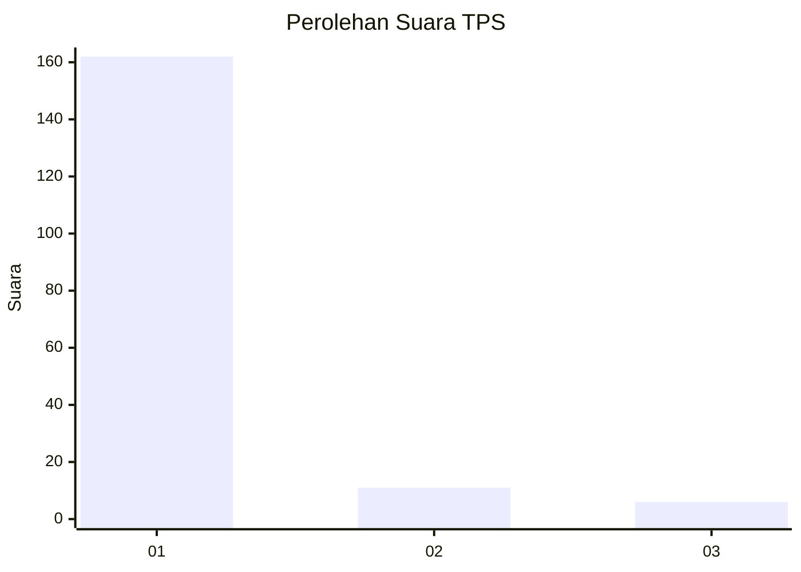
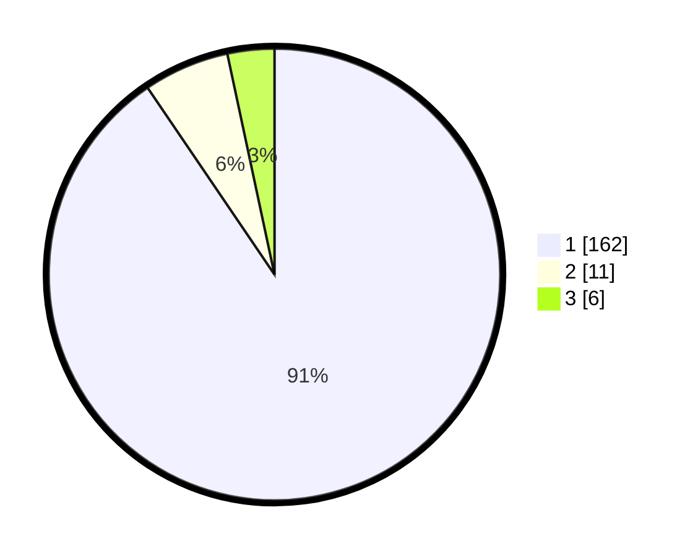

# Hasil

## Grafik

## Tabel

| No. | Nama Paslon    | Suara | Suara (raw) | Persentase |
|:--- |:-------------- | -----:| -----------:| ----------:|
| 1   | ANIES MUHAIMIN | 162   | [162][p-1]  | 90,50      |
| 2   | PRABOWO GIBRAN | 11    | [11][p-2]   | 6,15       |
| 3   | GANJAR MAHFUD  | 6     | [6][p-3]    | 3,35       |

[p-1]: https://github.com/gigit-pemilu/pemilu-2024-11-aceh/blob/main/pilpres/hitung-suara/sub/11-aceh/sub/08-aceh-utara/sub/19-baktiya-barat/sub/2002-lhok-iboh/sub/004-tps/sub/paslon-1.txt
[p-2]: https://github.com/gigit-pemilu/pemilu-2024-11-aceh/blob/main/pilpres/hitung-suara/sub/11-aceh/sub/08-aceh-utara/sub/19-baktiya-barat/sub/2002-lhok-iboh/sub/004-tps/sub/paslon-2.txt
[p-3]: https://github.com/gigit-pemilu/pemilu-2024-11-aceh/blob/main/pilpres/hitung-suara/sub/11-aceh/sub/08-aceh-utara/sub/19-baktiya-barat/sub/2002-lhok-iboh/sub/004-tps/sub/paslon-3.txt

## Foto C Plano

https://sirekap-obj-formc.kpu.go.id/d68a/pemilu/ppwp/11/08/19/20/02/1108192002004-20240215-002738--6a8da8af-34cf-4ea5-80e7-aa02a082166a.jpg

https://sirekap-obj-formc.kpu.go.id/d68a/pemilu/ppwp/11/08/19/20/02/1108192002004-20240215-003009--da827f98-9338-483b-8d0f-356d1bd56479.jpg

https://sirekap-obj-formc.kpu.go.id/d68a/pemilu/ppwp/11/08/19/20/02/1108192002004-20240215-003216--0411940d-973a-43d6-ba9f-1e8e18b1d177.jpg

## Metadata

| Key        | Value               |
| ---------- | ------------------- |
| Time Stamp | 2024-02-15 12:00:28 |

## DATA PEMILIH TETAP

Jumlah pemilih dalam DPT: **258**.
 * L: **132**.
 * P: **126**.

## DATA PENGGUNA HAK PILIH

Jumlah pengguna hak pilih dalam DPT: **180**.
 * L: **86**.
 * P: **94**.

Jumlah pengguna hak pilih dalam DPTb: **0**.
 * L: **0**.
 * P: **0**.

Jumlah pengguna hak pilih dalam DPK: **0**.
 * L: **0**.
 * P: **0**.

Jumlah pengguna hak pilih: **180**.
 * L: **86**.
 * P: **94**.

## JUMLAH SUARA SAH DAN TIDAK SAH

JUMLAH SELURUH SUARA SAH: **179**.

JUMLAH SUARA TIDAK SAH: **1**.

JUMLAH SELURUH SUARA SAH DAN SUARA TIDAK SAH: **180**.

