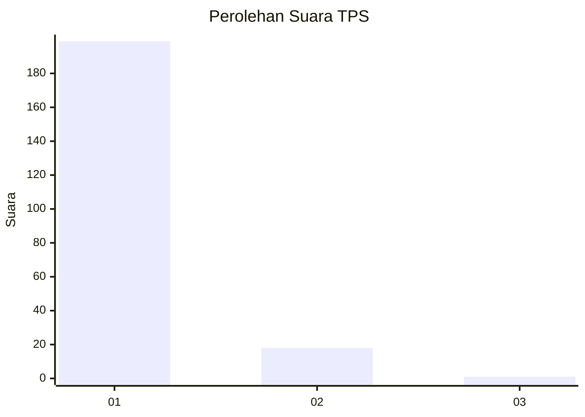
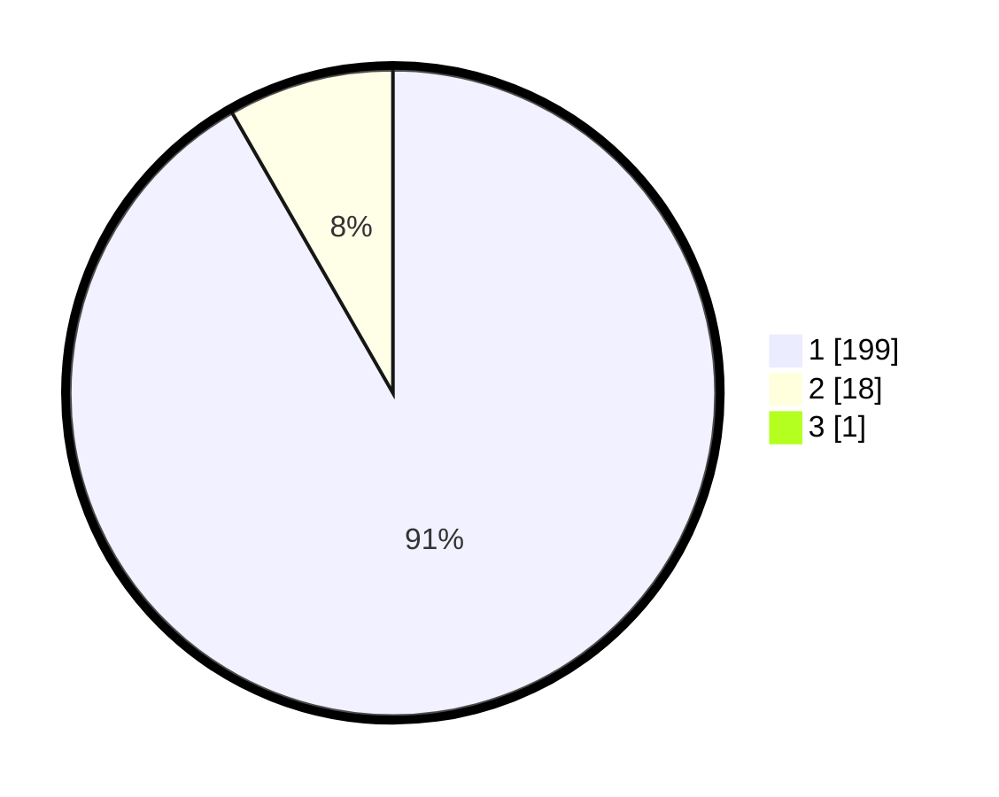

# Hasil

## Grafik

## Tabel

| No. | Nama Paslon    | Suara | Suara (raw) | Persentase |
|:--- |:-------------- | -----:| -----------:| ----------:|
| 1   | ANIES MUHAIMIN | 199   | [199][p-1]  | 91,28      |
| 2   | PRABOWO GIBRAN | 18    | [18][p-2]   | 8,26       |
| 3   | GANJAR MAHFUD  | 1     | [1][p-3]    | 0,46       |

[p-1]: https://github.com/gigit-pemilu/pemilu-2024-11-aceh/blob/main/pilpres/hitung-suara/sub/11-aceh/sub/08-aceh-utara/sub/19-baktiya-barat/sub/2004-lang-nibong/sub/002-tps/sub/paslon-1.txt
[p-2]: https://github.com/gigit-pemilu/pemilu-2024-11-aceh/blob/main/pilpres/hitung-suara/sub/11-aceh/sub/08-aceh-utara/sub/19-baktiya-barat/sub/2004-lang-nibong/sub/002-tps/sub/paslon-2.txt
[p-3]: https://github.com/gigit-pemilu/pemilu-2024-11-aceh/blob/main/pilpres/hitung-suara/sub/11-aceh/sub/08-aceh-utara/sub/19-baktiya-barat/sub/2004-lang-nibong/sub/002-tps/sub/paslon-3.txt

## Foto C Plano

https://sirekap-obj-formc.kpu.go.id/c9c6/pemilu/ppwp/11/08/19/20/04/1108192004002-20240215-101532--6c1dec51-2bb4-49dc-af48-47fef9830a9c.jpg

https://sirekap-obj-formc.kpu.go.id/c9c6/pemilu/ppwp/11/08/19/20/04/1108192004002-20240215-103711--45d4018a-5a54-44fb-bc23-1a29029e5182.jpg

https://sirekap-obj-formc.kpu.go.id/c9c6/pemilu/ppwp/11/08/19/20/04/1108192004002-20240215-101646--72ea71d6-65a7-421d-a7f4-76eb86037ad6.jpg

## Metadata

| Key        | Value               |
| ---------- | ------------------- |
| Time Stamp | 2024-02-17 00:28:35 |

