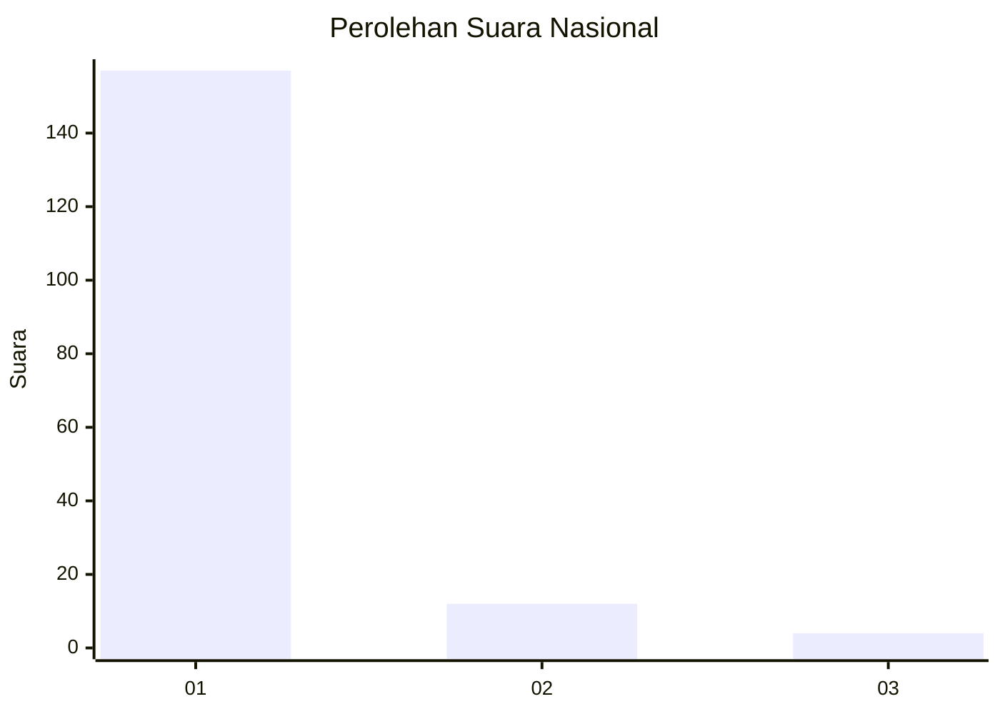
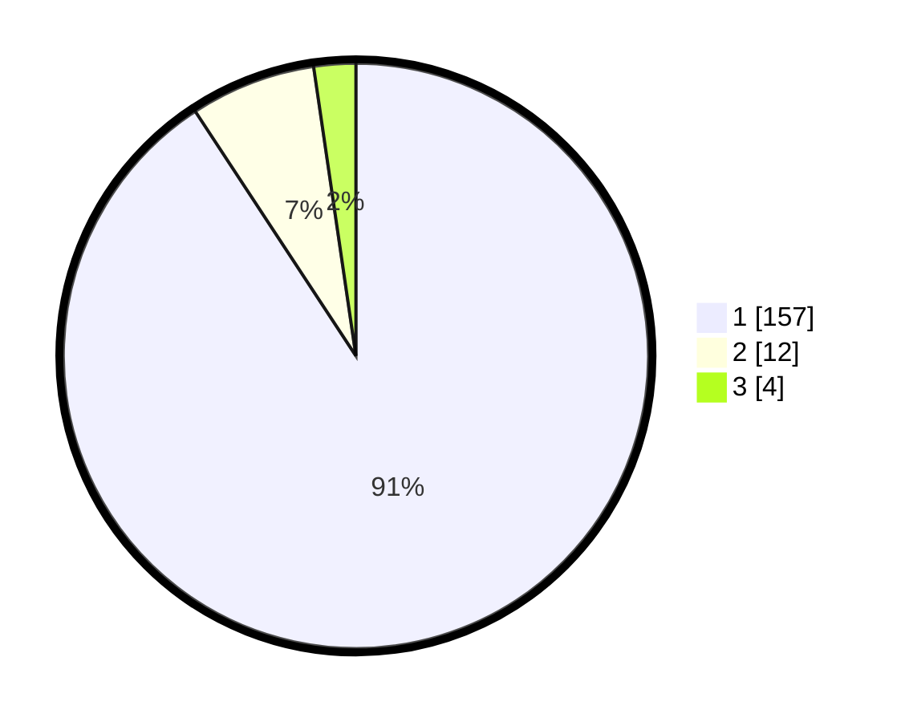

# Hasil

## Grafik

## Tabel

| No. | Nama Paslon    | Suara | Suara (raw) | Persentase |
|:--- |:-------------- | -----:| -----------:| ----------:|
| 1   | ANIES MUHAIMIN | 157   | [157][p-1]  | 90,75      |
| 2   | PRABOWO GIBRAN | 12    | [12][p-2]   | 6,94       |
| 3   | GANJAR MAHFUD  | 4     | [4][p-3]    | 2,31       |

[p-1]: https://github.com/gigit-pemilu/pemilu-2024/blob/main/pilpres/hitung-suara/sub/11-aceh/sub/08-aceh-utara/sub/19-baktiya-barat/sub/2006-singgah-mata/sub/001-tps/sub/paslon-1.txt
[p-2]: https://github.com/gigit-pemilu/pemilu-2024/blob/main/pilpres/hitung-suara/sub/11-aceh/sub/08-aceh-utara/sub/19-baktiya-barat/sub/2006-singgah-mata/sub/001-tps/sub/paslon-2.txt
[p-3]: https://github.com/gigit-pemilu/pemilu-2024/blob/main/pilpres/hitung-suara/sub/11-aceh/sub/08-aceh-utara/sub/19-baktiya-barat/sub/2006-singgah-mata/sub/001-tps/sub/paslon-3.txt

## Foto C Plano

https://sirekap-obj-formc.kpu.go.id/5222/pemilu/ppwp/11/08/19/20/06/1108192006001-20240215-153529--dd01c530-37a7-4fe4-b2fd-6052372d7f14.jpg

https://sirekap-obj-formc.kpu.go.id/5222/pemilu/ppwp/11/08/19/20/06/1108192006001-20240215-153618--21923716-91fa-4d0e-b1d6-2b1526f00f63.jpg

https://sirekap-obj-formc.kpu.go.id/5222/pemilu/ppwp/11/08/19/20/06/1108192006001-20240215-153703--294f049a-a180-4f53-a91a-78776b3017c2.jpg

## Metadata

| Key        | Value               |
| ---------- | ------------------- |
| Time Stamp | 2024-02-15 23:29:50 |

