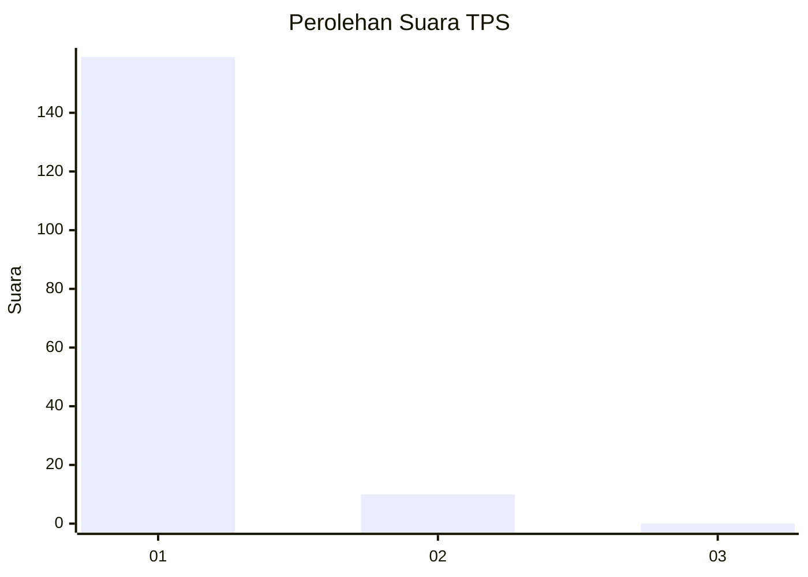
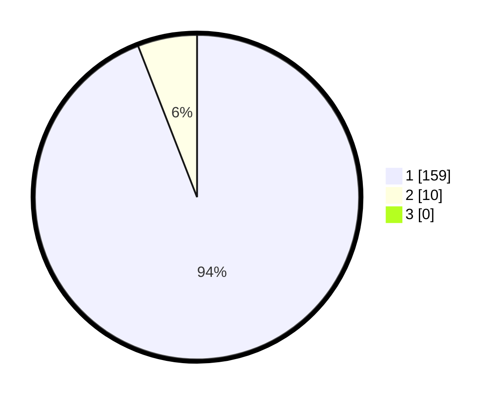

# Hasil

## Grafik

## Tabel

| No. | Nama Paslon    | Suara | Suara (raw) | Persentase |
|:--- |:-------------- | -----:| -----------:| ----------:|
| 1   | ANIES MUHAIMIN | 159   | [159][p-1]  | 94,08      |
| 2   | PRABOWO GIBRAN | 10    | [10][p-2]   | 5,92       |
| 3   | GANJAR MAHFUD  | 0     | [0][p-3]    | 0,00       |

[p-1]: https://github.com/gigit-pemilu/pemilu-2024-11-aceh/blob/main/pilpres/hitung-suara/sub/11-aceh/sub/08-aceh-utara/sub/19-baktiya-barat/sub/2006-singgah-mata/sub/002-tps/sub/paslon-1.txt
[p-2]: https://github.com/gigit-pemilu/pemilu-2024-11-aceh/blob/main/pilpres/hitung-suara/sub/11-aceh/sub/08-aceh-utara/sub/19-baktiya-barat/sub/2006-singgah-mata/sub/002-tps/sub/paslon-2.txt
[p-3]: https://github.com/gigit-pemilu/pemilu-2024-11-aceh/blob/main/pilpres/hitung-suara/sub/11-aceh/sub/08-aceh-utara/sub/19-baktiya-barat/sub/2006-singgah-mata/sub/002-tps/sub/paslon-3.txt

## Foto C Plano

https://sirekap-obj-formc.kpu.go.id/5a6f/pemilu/ppwp/11/08/19/20/06/1108192006002-20240215-165209--3a778fb1-2743-4539-afcb-49553adf103c.jpg

https://sirekap-obj-formc.kpu.go.id/5a6f/pemilu/ppwp/11/08/19/20/06/1108192006002-20240215-165823--5bc31df7-ef66-420d-a9a8-ccea74a6723f.jpg

https://sirekap-obj-formc.kpu.go.id/5a6f/pemilu/ppwp/11/08/19/20/06/1108192006002-20240215-170941--0d4e1e6d-4cba-486d-bea5-188f46606dbe.jpg

## Metadata

| Key        | Value               |
| ---------- | ------------------- |
| Time Stamp | 2024-02-24 22:31:28 |

