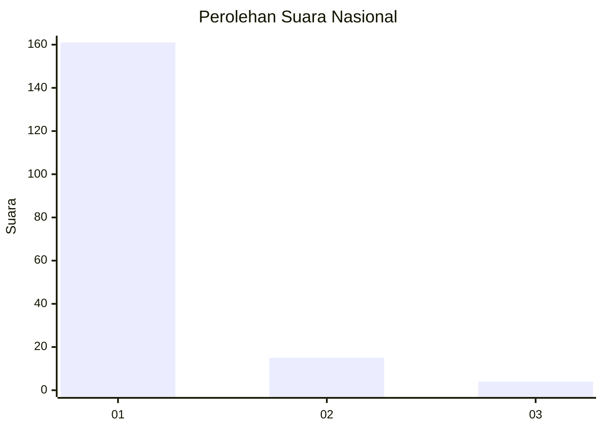
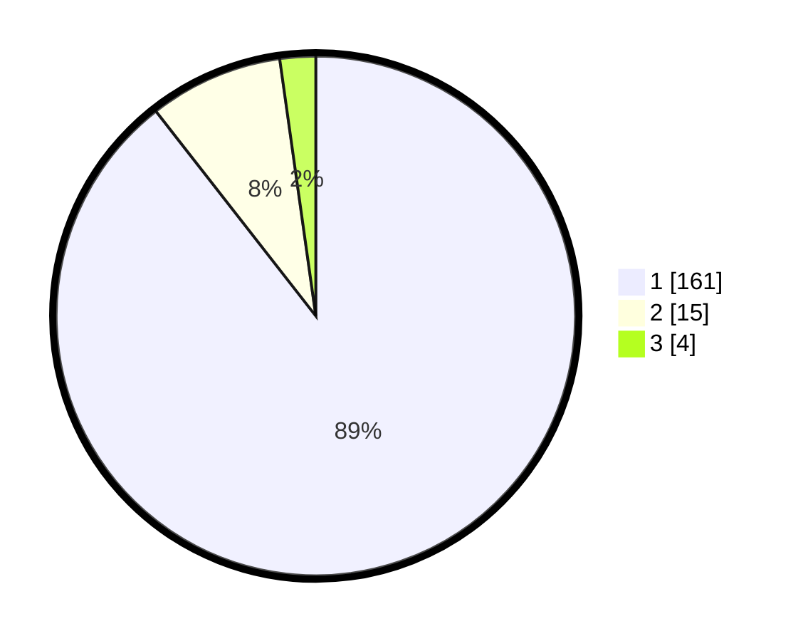

# Hasil

## Grafik

## Tabel

| No. | Nama Paslon    | Suara | Suara (raw) | Persentase |
|:--- |:-------------- | -----:| -----------:| ----------:|
| 1   | ANIES MUHAIMIN | 161   | [161][p-1]  | 89,44      |
| 2   | PRABOWO GIBRAN | 15    | [15][p-2]   | 8,33       |
| 3   | GANJAR MAHFUD  | 4     | [4][p-3]    | 2,22       |

[p-1]: https://github.com/gigit-pemilu/pemilu-2024/blob/main/pilpres/hitung-suara/sub/11-aceh/sub/08-aceh-utara/sub/19-baktiya-barat/sub/2006-singgah-mata/sub/004-tps/sub/paslon-1.txt
[p-2]: https://github.com/gigit-pemilu/pemilu-2024/blob/main/pilpres/hitung-suara/sub/11-aceh/sub/08-aceh-utara/sub/19-baktiya-barat/sub/2006-singgah-mata/sub/004-tps/sub/paslon-2.txt
[p-3]: https://github.com/gigit-pemilu/pemilu-2024/blob/main/pilpres/hitung-suara/sub/11-aceh/sub/08-aceh-utara/sub/19-baktiya-barat/sub/2006-singgah-mata/sub/004-tps/sub/paslon-3.txt

## Foto C Plano

https://sirekap-obj-formc.kpu.go.id/ecfe/pemilu/ppwp/11/08/19/20/06/1108192006004-20240215-160448--63ffa408-971a-4d79-9193-0aeaf692ac4a.jpg

https://sirekap-obj-formc.kpu.go.id/ecfe/pemilu/ppwp/11/08/19/20/06/1108192006004-20240215-160247--a31a0f10-f65a-478d-804f-e8ced354d9c7.jpg

https://sirekap-obj-formc.kpu.go.id/ecfe/pemilu/ppwp/11/08/19/20/06/1108192006004-20240215-161239--cdd6d968-96cf-4f73-9da4-cd8e3567a29f.jpg

## Metadata

| Key        | Value               |
| ---------- | ------------------- |
| Time Stamp | 2024-02-17 00:28:35 |

