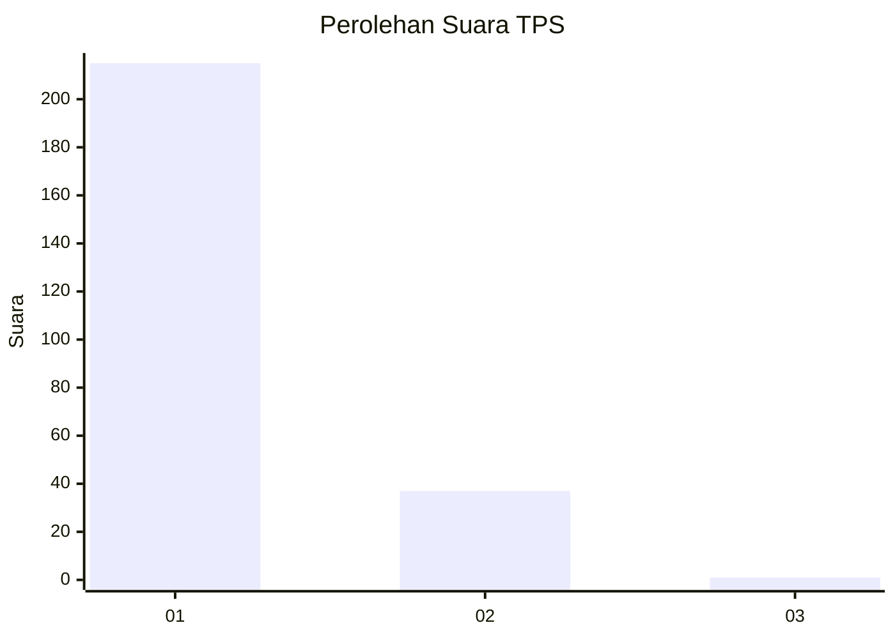
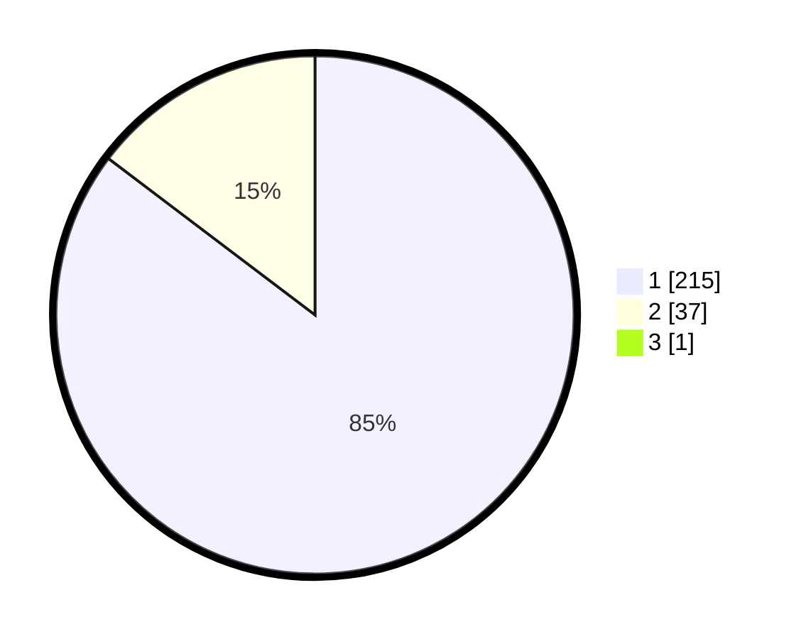

# Hasil

## Grafik

## Tabel

| No. | Nama Paslon    | Suara | Suara (raw) | Persentase |
|:--- |:-------------- | -----:| -----------:| ----------:|
| 1   | ANIES MUHAIMIN | 215   | [215][p-1]  | 84,98      |
| 2   | PRABOWO GIBRAN | 37    | [37][p-2]   | 14,62      |
| 3   | GANJAR MAHFUD  | 1     | [1][p-3]    | 0,40       |

[p-1]: https://github.com/gigit-pemilu/pemilu-2024-11-aceh/blob/main/pilpres/hitung-suara/sub/11-aceh/sub/08-aceh-utara/sub/19-baktiya-barat/sub/2007-matang-panyang/sub/002-tps/sub/paslon-1.txt
[p-2]: https://github.com/gigit-pemilu/pemilu-2024-11-aceh/blob/main/pilpres/hitung-suara/sub/11-aceh/sub/08-aceh-utara/sub/19-baktiya-barat/sub/2007-matang-panyang/sub/002-tps/sub/paslon-2.txt
[p-3]: https://github.com/gigit-pemilu/pemilu-2024-11-aceh/blob/main/pilpres/hitung-suara/sub/11-aceh/sub/08-aceh-utara/sub/19-baktiya-barat/sub/2007-matang-panyang/sub/002-tps/sub/paslon-3.txt

## Foto C Plano

https://sirekap-obj-formc.kpu.go.id/f98c/pemilu/ppwp/11/08/19/20/07/1108192007002-20240215-175052--8ba68cd0-bcde-41c5-ab08-05e9a6a33501.jpg

https://sirekap-obj-formc.kpu.go.id/f98c/pemilu/ppwp/11/08/19/20/07/1108192007002-20240216-002656--8fbb3d18-408a-4a7e-8dbb-c8626ec1b6a5.jpg

https://sirekap-obj-formc.kpu.go.id/f98c/pemilu/ppwp/11/08/19/20/07/1108192007002-20240215-175259--84048b6f-fc98-4664-8b01-5f5435d5866e.jpg

## Metadata

| Key        | Value               |
| ---------- | ------------------- |
| Time Stamp | 2024-02-17 00:28:35 |

