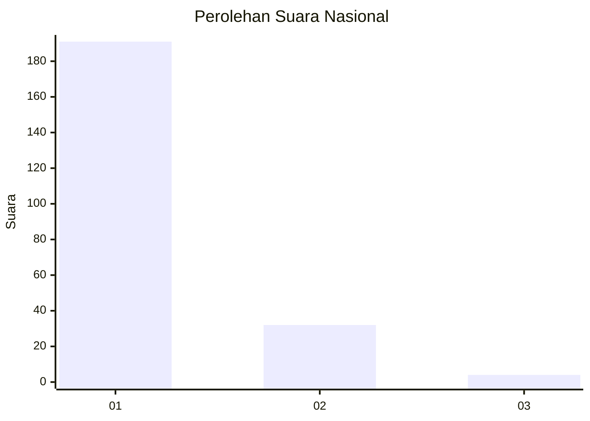
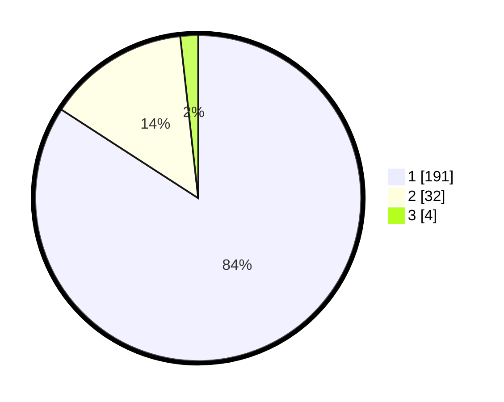

# Hasil

## Grafik

## Tabel

| No. | Nama Paslon    | Suara | Suara (raw) | Persentase |
|:--- |:-------------- | -----:| -----------:| ----------:|
| 1   | ANIES MUHAIMIN | 191   | [191][p-1]  | 84,14      |
| 2   | PRABOWO GIBRAN | 32    | [32][p-2]   | 14,10      |
| 3   | GANJAR MAHFUD  | 4     | [4][p-3]    | 1,76       |

[p-1]: https://github.com/gigit-pemilu/pemilu-2024/blob/main/pilpres/hitung-suara/sub/11-aceh/sub/08-aceh-utara/sub/19-baktiya-barat/sub/2007-matang-panyang/sub/003-tps/sub/paslon-1.txt
[p-2]: https://github.com/gigit-pemilu/pemilu-2024/blob/main/pilpres/hitung-suara/sub/11-aceh/sub/08-aceh-utara/sub/19-baktiya-barat/sub/2007-matang-panyang/sub/003-tps/sub/paslon-2.txt
[p-3]: https://github.com/gigit-pemilu/pemilu-2024/blob/main/pilpres/hitung-suara/sub/11-aceh/sub/08-aceh-utara/sub/19-baktiya-barat/sub/2007-matang-panyang/sub/003-tps/sub/paslon-3.txt

## Foto C Plano

https://sirekap-obj-formc.kpu.go.id/3e61/pemilu/ppwp/11/08/19/20/07/1108192007003-20240219-160530--fc550e5f-de25-4dee-90b2-cbefdddc0e23.jpg

https://sirekap-obj-formc.kpu.go.id/3e61/pemilu/ppwp/11/08/19/20/07/1108192007003-20240219-160620--70896e9f-93fb-480b-b2d4-faaebc151092.jpg

https://sirekap-obj-formc.kpu.go.id/3e61/pemilu/ppwp/11/08/19/20/07/1108192007003-20240219-160703--c0cf11ea-3e9c-4d6d-a13a-004376634e8c.jpg

## Metadata

| Key        | Value               |
| ---------- | ------------------- |
| Time Stamp | 2024-02-24 22:31:28 |

