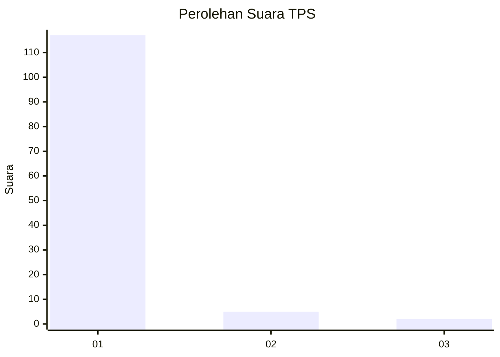
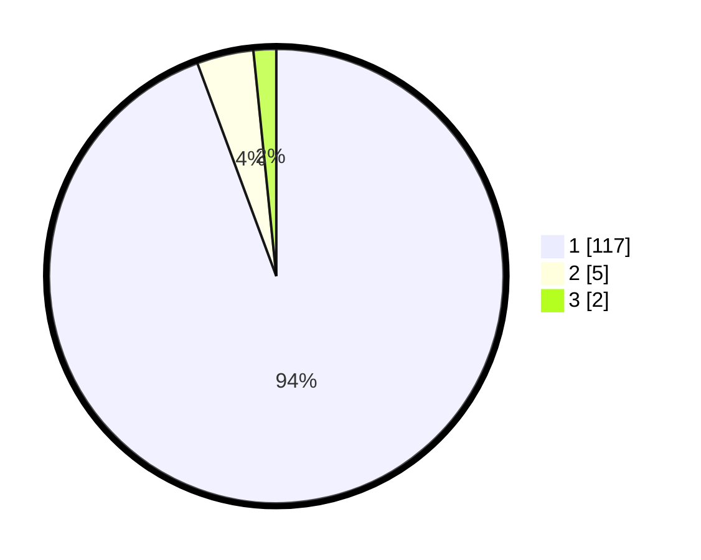

# Hasil

## Grafik

## Tabel

| No. | Nama Paslon    | Suara | Suara (raw) | Persentase |
|:--- |:-------------- | -----:| -----------:| ----------:|
| 1   | ANIES MUHAIMIN | 117   | [117][p-1]  | 94,35      |
| 2   | PRABOWO GIBRAN | 5     | [5][p-2]    | 4,03       |
| 3   | GANJAR MAHFUD  | 2     | [2][p-3]    | 1,61       |

[p-1]: https://github.com/gigit-pemilu/pemilu-2024-11-aceh/blob/main/pilpres/hitung-suara/sub/11-aceh/sub/08-aceh-utara/sub/19-baktiya-barat/sub/2009-matang-teungoh/sub/001-tps/sub/paslon-1.txt
[p-2]: https://github.com/gigit-pemilu/pemilu-2024-11-aceh/blob/main/pilpres/hitung-suara/sub/11-aceh/sub/08-aceh-utara/sub/19-baktiya-barat/sub/2009-matang-teungoh/sub/001-tps/sub/paslon-2.txt
[p-3]: https://github.com/gigit-pemilu/pemilu-2024-11-aceh/blob/main/pilpres/hitung-suara/sub/11-aceh/sub/08-aceh-utara/sub/19-baktiya-barat/sub/2009-matang-teungoh/sub/001-tps/sub/paslon-3.txt

## Foto C Plano

https://sirekap-obj-formc.kpu.go.id/1455/pemilu/ppwp/11/08/19/20/09/1108192009001-20240219-161145--05d43413-5d3a-44fd-9cb2-b9331d90b041.jpg

https://sirekap-obj-formc.kpu.go.id/1455/pemilu/ppwp/11/08/19/20/09/1108192009001-20240219-161244--6c511a10-6a8e-40e9-9194-436469c61555.jpg

https://sirekap-obj-formc.kpu.go.id/1455/pemilu/ppwp/11/08/19/20/09/1108192009001-20240219-161347--6b13e3bc-2174-4b81-8011-5484153cb95f.jpg

## Metadata

| Key        | Value               |
| ---------- | ------------------- |
| Time Stamp | 2024-02-24 22:31:28 |

