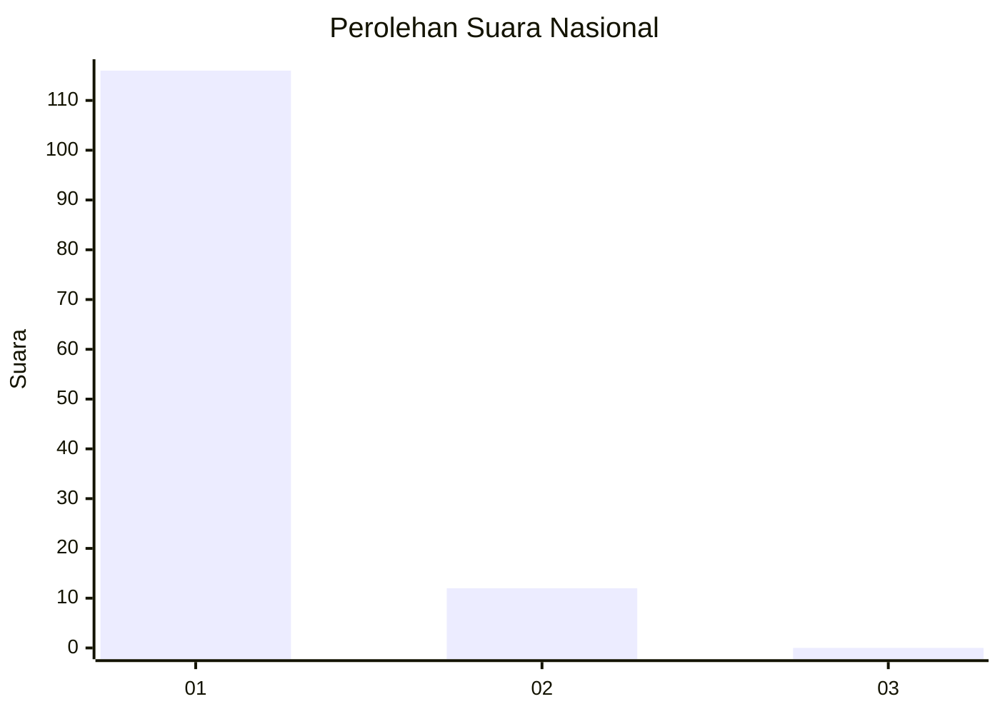
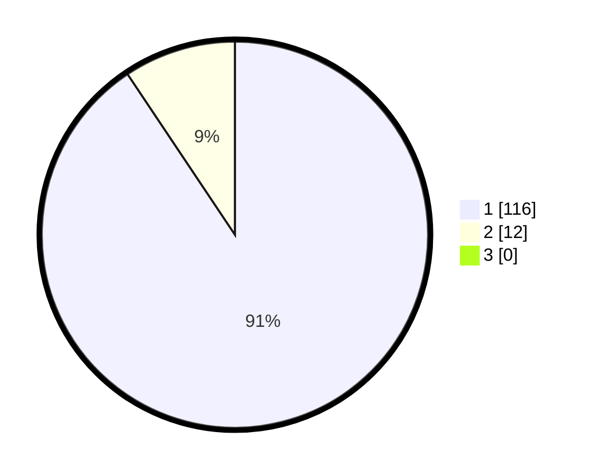

# Hasil

## Grafik

## Tabel

| No. | Nama Paslon    | Suara | Suara (raw) | Persentase |
|:--- |:-------------- | -----:| -----------:| ----------:|
| 1   | ANIES MUHAIMIN | 116   | [116][p-1]  | 90,63      |
| 2   | PRABOWO GIBRAN | 12    | [12][p-2]   | 9,38       |
| 3   | GANJAR MAHFUD  | 0     | [0][p-3]    | 0,00       |

[p-1]: https://github.com/gigit-pemilu/pemilu-2024/blob/main/pilpres/hitung-suara/sub/11-aceh/sub/08-aceh-utara/sub/19-baktiya-barat/sub/2009-matang-teungoh/sub/002-tps/sub/paslon-1.txt
[p-2]: https://github.com/gigit-pemilu/pemilu-2024/blob/main/pilpres/hitung-suara/sub/11-aceh/sub/08-aceh-utara/sub/19-baktiya-barat/sub/2009-matang-teungoh/sub/002-tps/sub/paslon-2.txt
[p-3]: https://github.com/gigit-pemilu/pemilu-2024/blob/main/pilpres/hitung-suara/sub/11-aceh/sub/08-aceh-utara/sub/19-baktiya-barat/sub/2009-matang-teungoh/sub/002-tps/sub/paslon-3.txt

## Foto C Plano

https://sirekap-obj-formc.kpu.go.id/3a2c/pemilu/ppwp/11/08/19/20/09/1108192009002-20240219-170213--24043e29-ba85-4686-b3e1-80a28cb7e93a.jpg

https://sirekap-obj-formc.kpu.go.id/3a2c/pemilu/ppwp/11/08/19/20/09/1108192009002-20240219-170328--9433603b-2b93-4136-8b4a-7c062e0fb2aa.jpg

https://sirekap-obj-formc.kpu.go.id/3a2c/pemilu/ppwp/11/08/19/20/09/1108192009002-20240219-170434--ffc71fe3-ed82-4bb8-9694-bc58cf2fa08c.jpg

## Metadata

| Key        | Value               |
| ---------- | ------------------- |
| Time Stamp | 2024-02-24 22:31:28 |

