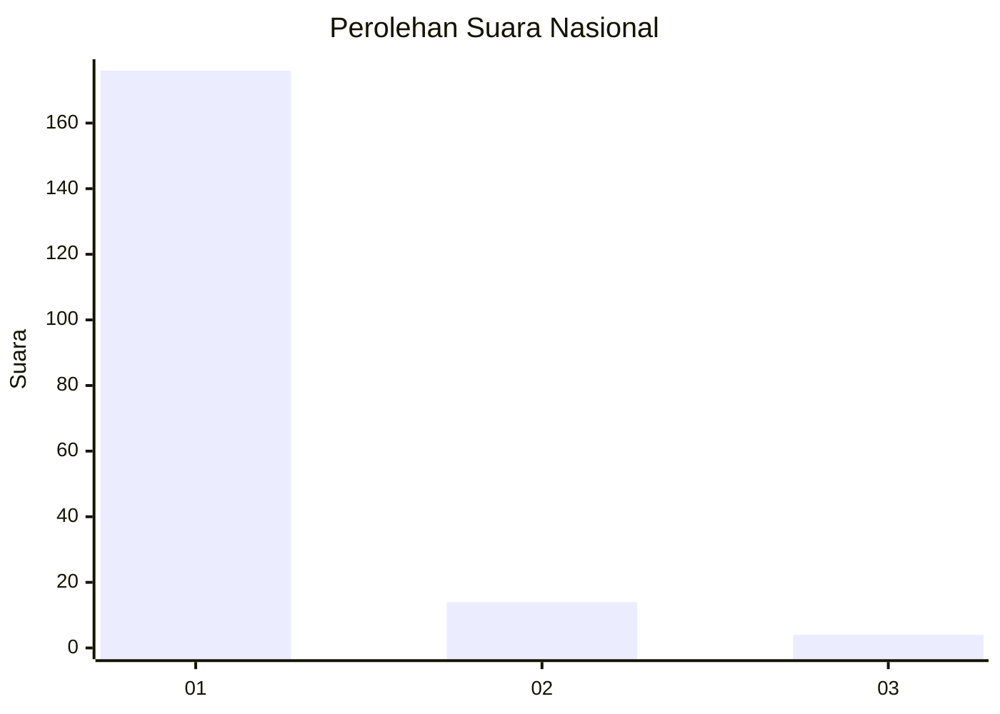
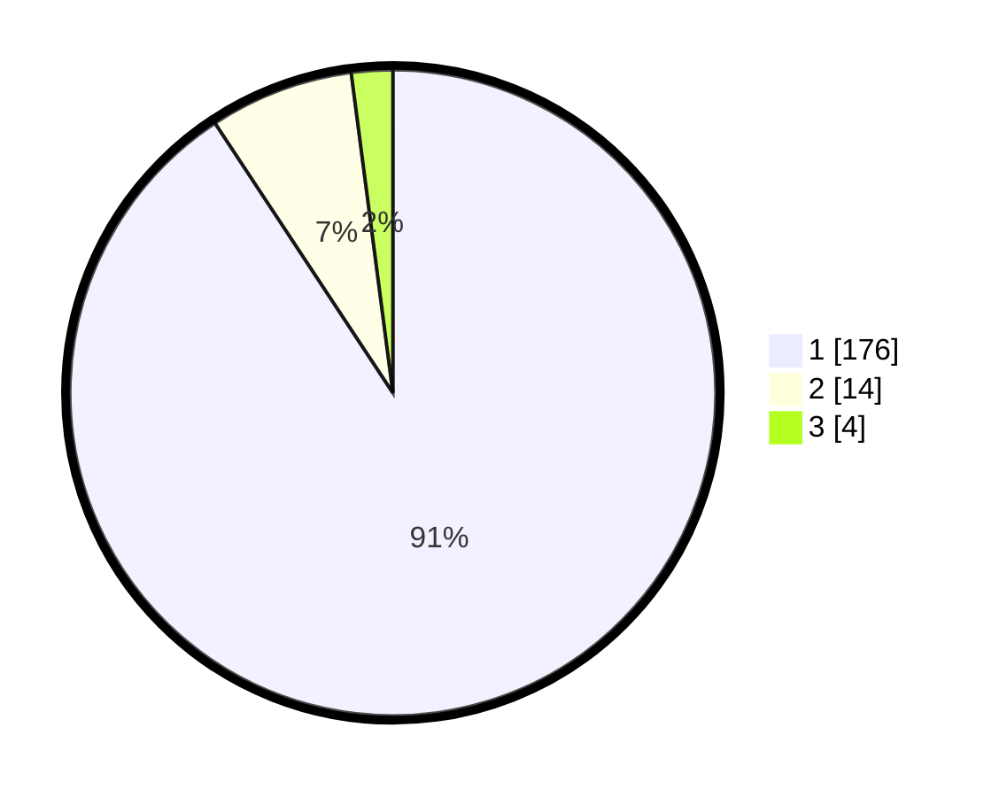

# Hasil

## Grafik

## Tabel

| No. | Nama Paslon    | Suara | Suara (raw) | Persentase |
|:--- |:-------------- | -----:| -----------:| ----------:|
| 1   | ANIES MUHAIMIN | 176   | [176][p-1]  | 90,72      |
| 2   | PRABOWO GIBRAN | 14    | [14][p-2]   | 7,22       |
| 3   | GANJAR MAHFUD  | 4     | [4][p-3]    | 2,06       |

[p-1]: https://github.com/gigit-pemilu/pemilu-2024/blob/main/pilpres/hitung-suara/sub/11-aceh/sub/08-aceh-utara/sub/19-baktiya-barat/sub/2011-cot-kupok/sub/001-tps/sub/paslon-1.txt
[p-2]: https://github.com/gigit-pemilu/pemilu-2024/blob/main/pilpres/hitung-suara/sub/11-aceh/sub/08-aceh-utara/sub/19-baktiya-barat/sub/2011-cot-kupok/sub/001-tps/sub/paslon-2.txt
[p-3]: https://github.com/gigit-pemilu/pemilu-2024/blob/main/pilpres/hitung-suara/sub/11-aceh/sub/08-aceh-utara/sub/19-baktiya-barat/sub/2011-cot-kupok/sub/001-tps/sub/paslon-3.txt

## Foto C Plano

https://sirekap-obj-formc.kpu.go.id/155c/pemilu/ppwp/11/08/19/20/11/1108192011001-20240214-220120--96e9207c-4bac-4fba-9ae4-edc405f481ec.jpg

https://sirekap-obj-formc.kpu.go.id/155c/pemilu/ppwp/11/08/19/20/11/1108192011001-20240214-220556--2b8d9f09-500c-444a-8218-ed46a93a58c5.jpg

https://sirekap-obj-formc.kpu.go.id/155c/pemilu/ppwp/11/08/19/20/11/1108192011001-20240214-220856--5514ca6a-ca27-4fc2-898d-59023eb8b606.jpg

## Metadata

| Key        | Value               |
| ---------- | ------------------- |
| Time Stamp | 2024-02-17 00:28:35 |

