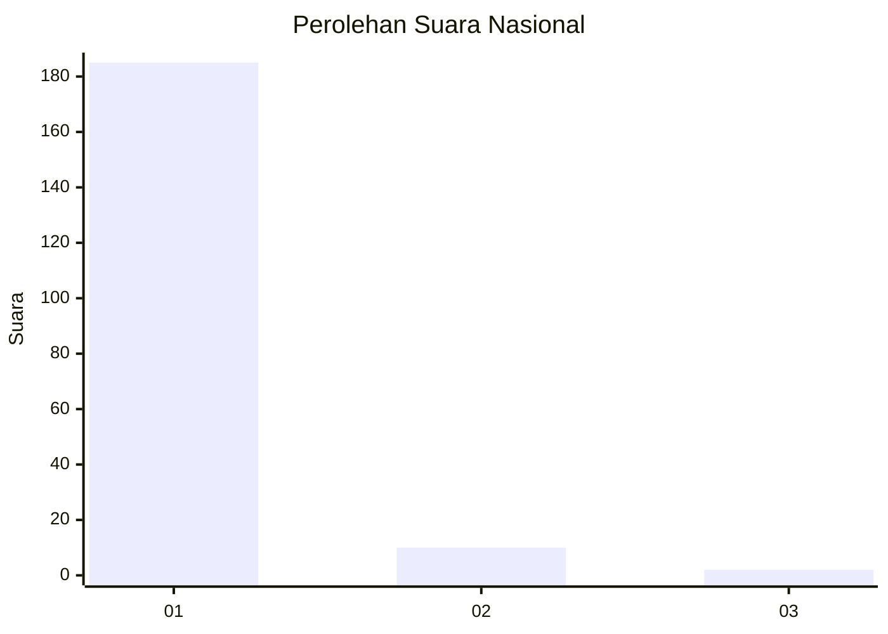
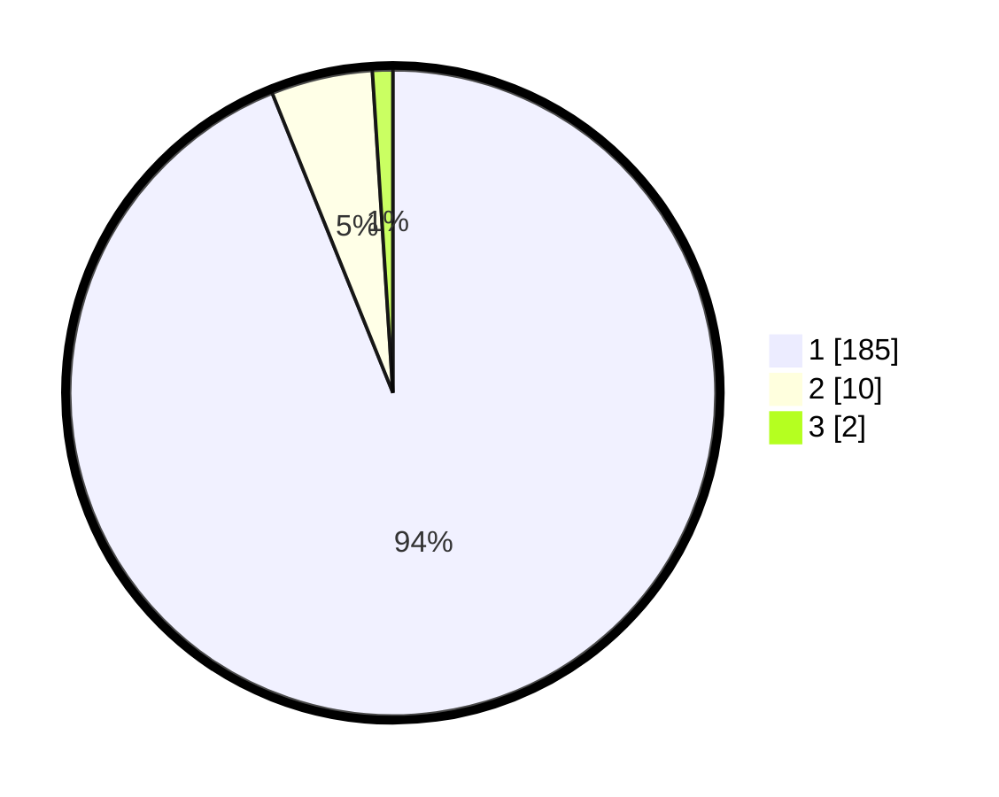

# Hasil

## Grafik

## Tabel

| No. | Nama Paslon    | Suara | Suara (raw) | Persentase |
|:--- |:-------------- | -----:| -----------:| ----------:|
| 1   | ANIES MUHAIMIN | 185   | [185][p-1]  | 93,91      |
| 2   | PRABOWO GIBRAN | 10    | [10][p-2]   | 5,08       |
| 3   | GANJAR MAHFUD  | 2     | [2][p-3]    | 1,02       |

[p-1]: https://github.com/gigit-pemilu/pemilu-2024/blob/main/pilpres/hitung-suara/sub/11-aceh/sub/08-aceh-utara/sub/19-baktiya-barat/sub/2011-cot-kupok/sub/002-tps/sub/paslon-1.txt
[p-2]: https://github.com/gigit-pemilu/pemilu-2024/blob/main/pilpres/hitung-suara/sub/11-aceh/sub/08-aceh-utara/sub/19-baktiya-barat/sub/2011-cot-kupok/sub/002-tps/sub/paslon-2.txt
[p-3]: https://github.com/gigit-pemilu/pemilu-2024/blob/main/pilpres/hitung-suara/sub/11-aceh/sub/08-aceh-utara/sub/19-baktiya-barat/sub/2011-cot-kupok/sub/002-tps/sub/paslon-3.txt

## Foto C Plano

https://sirekap-obj-formc.kpu.go.id/74a3/pemilu/ppwp/11/08/19/20/11/1108192011002-20240219-220443--7b7f180a-f5dd-4990-8291-a12ac1a601be.jpg

https://sirekap-obj-formc.kpu.go.id/74a3/pemilu/ppwp/11/08/19/20/11/1108192011002-20240219-220216--65a2a9fb-29bc-43ea-8df2-aa948affa5a8.jpg

https://sirekap-obj-formc.kpu.go.id/74a3/pemilu/ppwp/11/08/19/20/11/1108192011002-20240219-220631--fc3d08ca-3f49-47d8-b717-7a16df8feb03.jpg

## Metadata

| Key        | Value               |
| ---------- | ------------------- |
| Time Stamp | 2024-02-25 12:00:00 |

