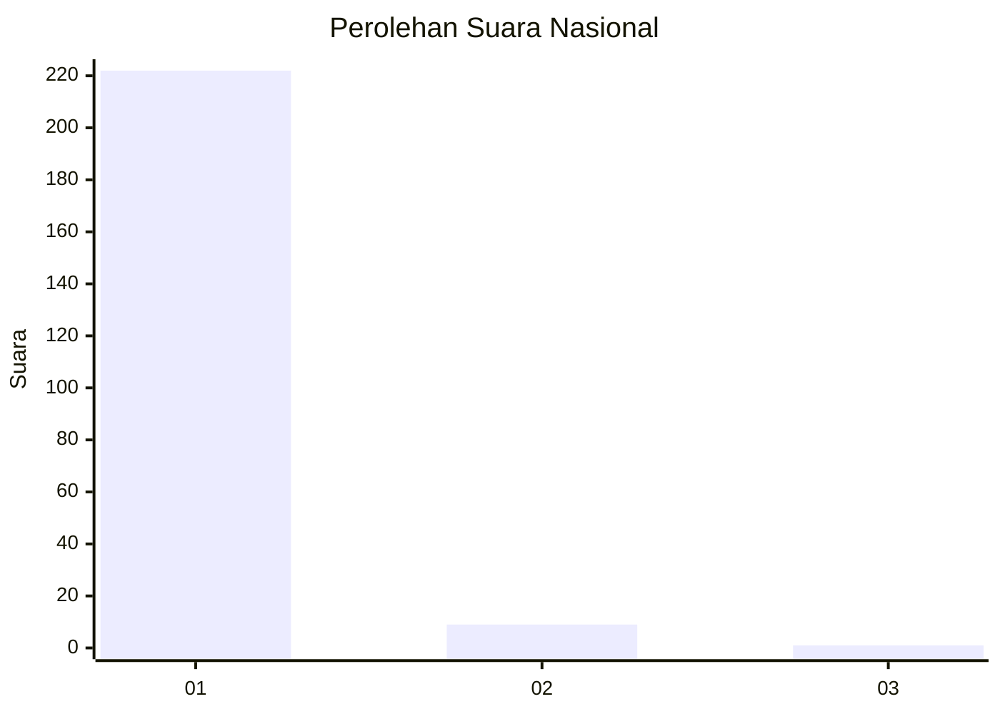
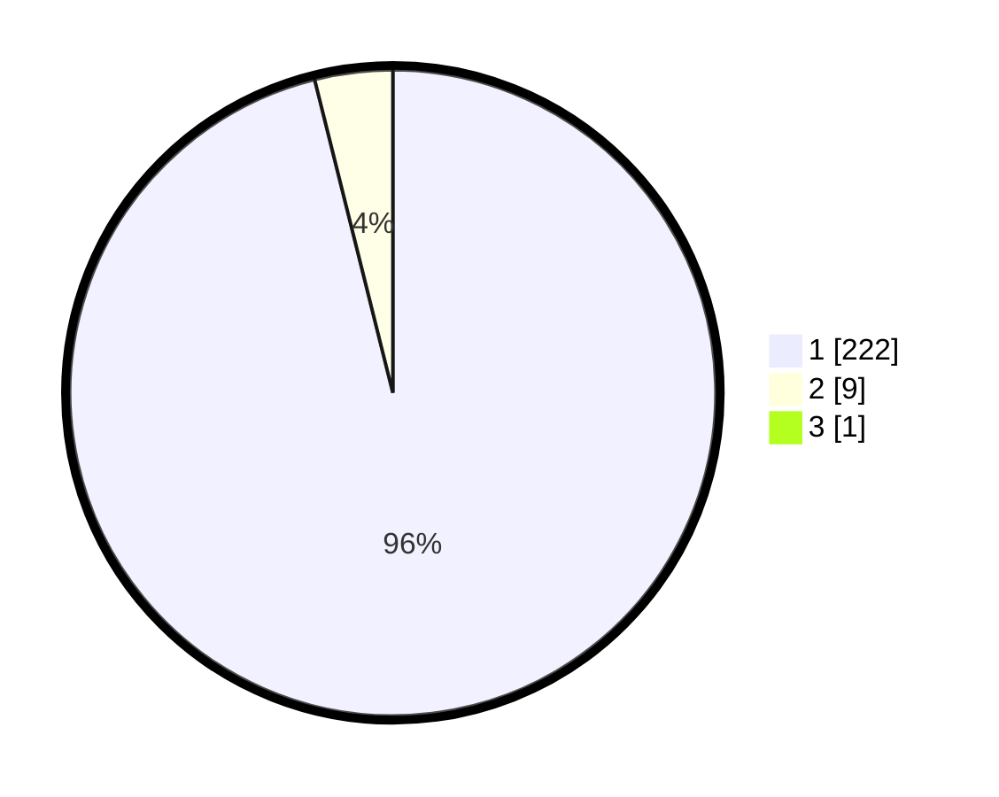

# Hasil

## Grafik

## Tabel

| No. | Nama Paslon    | Suara | Suara (raw) | Persentase |
|:--- |:-------------- | -----:| -----------:| ----------:|
| 1   | ANIES MUHAIMIN | 222   | [222][p-1]  | 95,69      |
| 2   | PRABOWO GIBRAN | 9     | [9][p-2]    | 3,88       |
| 3   | GANJAR MAHFUD  | 1     | [1][p-3]    | 0,43       |

[p-1]: https://github.com/gigit-pemilu/pemilu-2024/blob/main/pilpres/hitung-suara/sub/11-aceh/sub/08-aceh-utara/sub/19-baktiya-barat/sub/2012-matang-raya-blang-sialet/sub/001-tps/sub/paslon-1.txt
[p-2]: https://github.com/gigit-pemilu/pemilu-2024/blob/main/pilpres/hitung-suara/sub/11-aceh/sub/08-aceh-utara/sub/19-baktiya-barat/sub/2012-matang-raya-blang-sialet/sub/001-tps/sub/paslon-2.txt
[p-3]: https://github.com/gigit-pemilu/pemilu-2024/blob/main/pilpres/hitung-suara/sub/11-aceh/sub/08-aceh-utara/sub/19-baktiya-barat/sub/2012-matang-raya-blang-sialet/sub/001-tps/sub/paslon-3.txt

## Foto C Plano

https://sirekap-obj-formc.kpu.go.id/7b79/pemilu/ppwp/11/08/19/20/12/1108192012001-20240215-061450--de75abef-0ac4-4050-9a4b-e039cab9e57d.jpg

https://sirekap-obj-formc.kpu.go.id/7b79/pemilu/ppwp/11/08/19/20/12/1108192012001-20240215-061151--00fe9e2d-edd1-490b-a76e-151a6aaef106.jpg

https://sirekap-obj-formc.kpu.go.id/7b79/pemilu/ppwp/11/08/19/20/12/1108192012001-20240215-061539--ac16cc18-67c7-407a-910f-3a9c888fef17.jpg

## Metadata

| Key        | Value               |
| ---------- | ------------------- |
| Time Stamp | 2024-02-17 00:28:35 |

