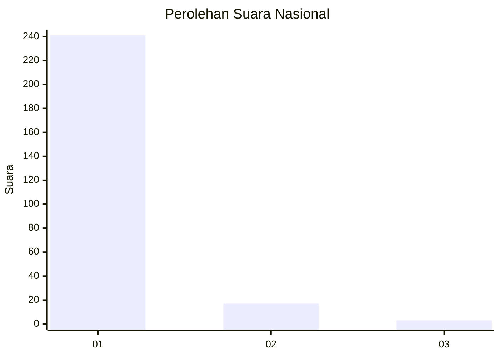
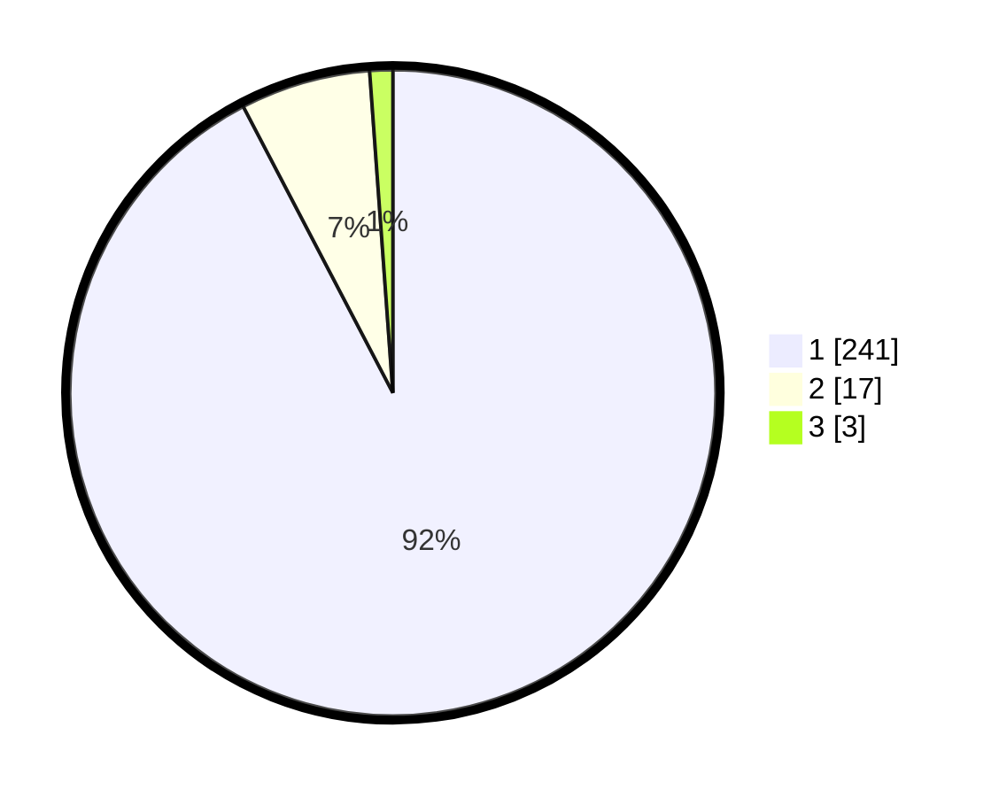

# Hasil

## Grafik

## Tabel

| No. | Nama Paslon    | Suara | Suara (raw) | Persentase |
|:--- |:-------------- | -----:| -----------:| ----------:|
| 1   | ANIES MUHAIMIN | 241   | [241][p-1]  | 92,34      |
| 2   | PRABOWO GIBRAN | 17    | [17][p-2]   | 6,51       |
| 3   | GANJAR MAHFUD  | 3     | [3][p-3]    | 1,15       |

[p-1]: https://github.com/gigit-pemilu/pemilu-2024/blob/main/pilpres/hitung-suara/sub/11-aceh/sub/08-aceh-utara/sub/19-baktiya-barat/sub/2012-matang-raya-blang-sialet/sub/002-tps/sub/paslon-1.txt
[p-2]: https://github.com/gigit-pemilu/pemilu-2024/blob/main/pilpres/hitung-suara/sub/11-aceh/sub/08-aceh-utara/sub/19-baktiya-barat/sub/2012-matang-raya-blang-sialet/sub/002-tps/sub/paslon-2.txt
[p-3]: https://github.com/gigit-pemilu/pemilu-2024/blob/main/pilpres/hitung-suara/sub/11-aceh/sub/08-aceh-utara/sub/19-baktiya-barat/sub/2012-matang-raya-blang-sialet/sub/002-tps/sub/paslon-3.txt

## Foto C Plano

https://sirekap-obj-formc.kpu.go.id/5d12/pemilu/ppwp/11/08/19/20/12/1108192012002-20240215-073024--cd7dec31-8ba3-4d28-b198-fd2a1a4fd506.jpg

https://sirekap-obj-formc.kpu.go.id/5d12/pemilu/ppwp/11/08/19/20/12/1108192012002-20240215-073518--51d13a06-d45c-4cad-9382-90095ea8111e.jpg

https://sirekap-obj-formc.kpu.go.id/5d12/pemilu/ppwp/11/08/19/20/12/1108192012002-20240215-073530--ed6dcea9-b47a-4151-95cf-e53800e7ca4a.jpg

## Metadata

| Key        | Value               |
| ---------- | ------------------- |
| Time Stamp | 2024-02-15 20:00:44 |

