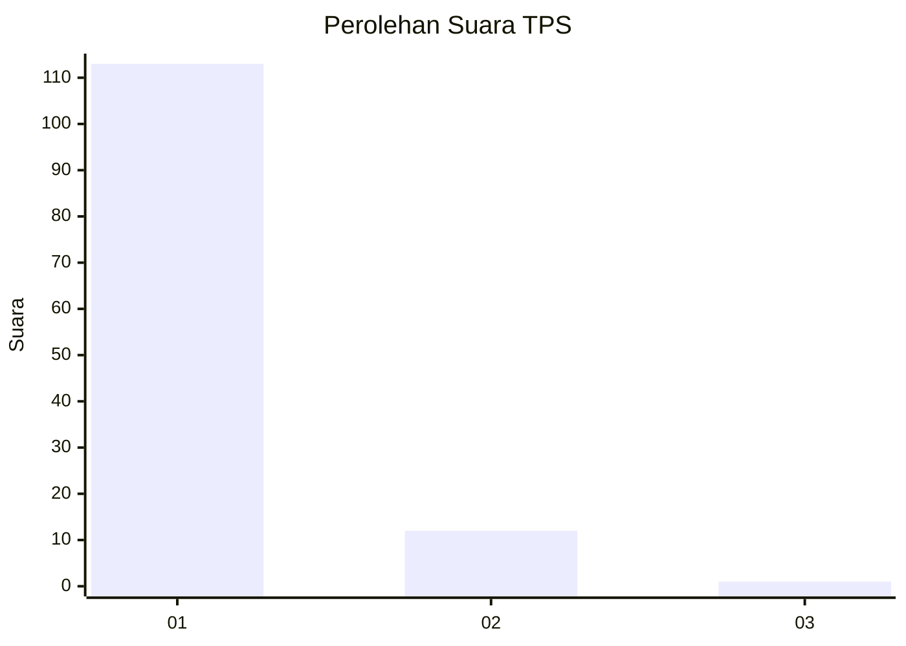
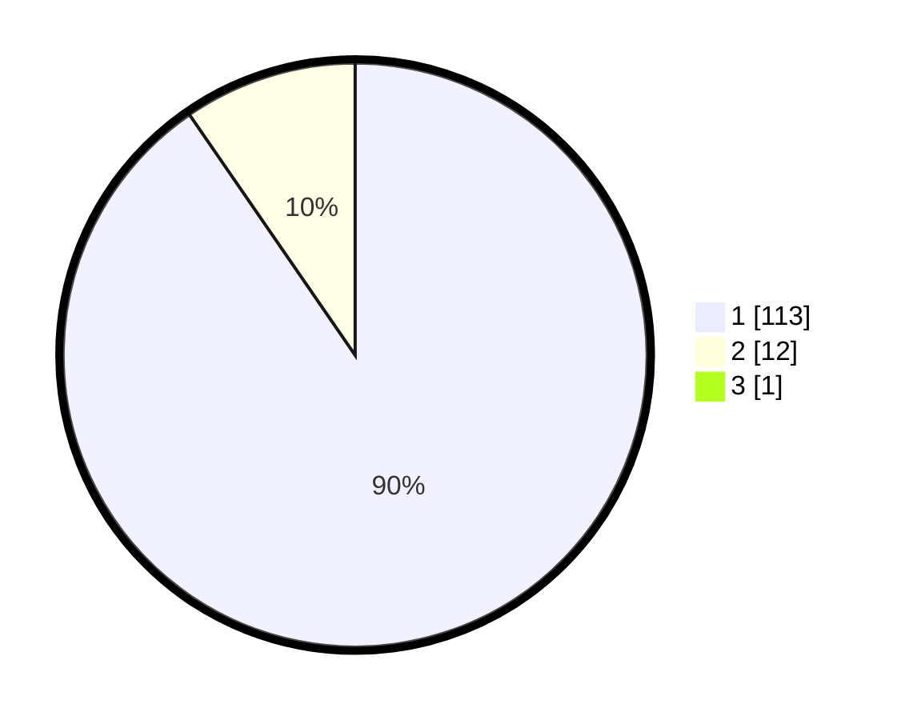

# Hasil

## Grafik

## Tabel

| No. | Nama Paslon    | Suara | Suara (raw) | Persentase |
|:--- |:-------------- | -----:| -----------:| ----------:|
| 1   | ANIES MUHAIMIN | 113   | [113][p-1]  | 89,68      |
| 2   | PRABOWO GIBRAN | 12    | [12][p-2]   | 9,52       |
| 3   | GANJAR MAHFUD  | 1     | [1][p-3]    | 0,79       |

[p-1]: https://github.com/gigit-pemilu/pemilu-2024-11-aceh/blob/main/pilpres/hitung-suara/sub/11-aceh/sub/08-aceh-utara/sub/19-baktiya-barat/sub/2013-pucok-alue-buket/sub/001-tps/sub/paslon-1.txt
[p-2]: https://github.com/gigit-pemilu/pemilu-2024-11-aceh/blob/main/pilpres/hitung-suara/sub/11-aceh/sub/08-aceh-utara/sub/19-baktiya-barat/sub/2013-pucok-alue-buket/sub/001-tps/sub/paslon-2.txt
[p-3]: https://github.com/gigit-pemilu/pemilu-2024-11-aceh/blob/main/pilpres/hitung-suara/sub/11-aceh/sub/08-aceh-utara/sub/19-baktiya-barat/sub/2013-pucok-alue-buket/sub/001-tps/sub/paslon-3.txt

## Foto C Plano

https://sirekap-obj-formc.kpu.go.id/72c1/pemilu/ppwp/11/08/19/20/13/1108192013001-20240215-084139--5c25371a-abe5-4168-8bb1-20ab55e2dccf.jpg

https://sirekap-obj-formc.kpu.go.id/72c1/pemilu/ppwp/11/08/19/20/13/1108192013001-20240215-084323--dc1e2723-e3ab-4130-9017-28e7a190b481.jpg

https://sirekap-obj-formc.kpu.go.id/72c1/pemilu/ppwp/11/08/19/20/13/1108192013001-20240215-084522--bf547f1a-f8c1-415a-934f-0fa2351d286b.jpg

## Metadata

| Key        | Value               |
| ---------- | ------------------- |
| Time Stamp | 2024-02-16 01:00:27 |

