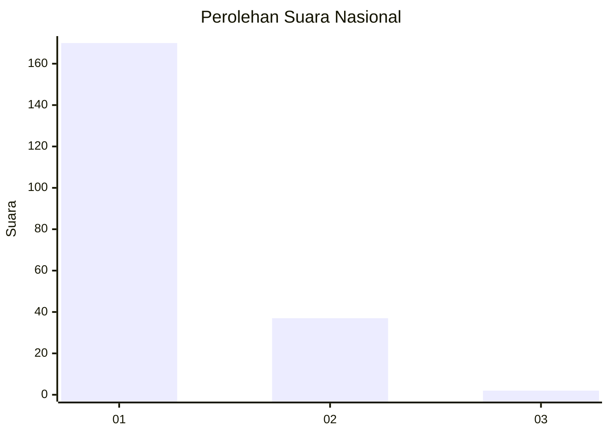
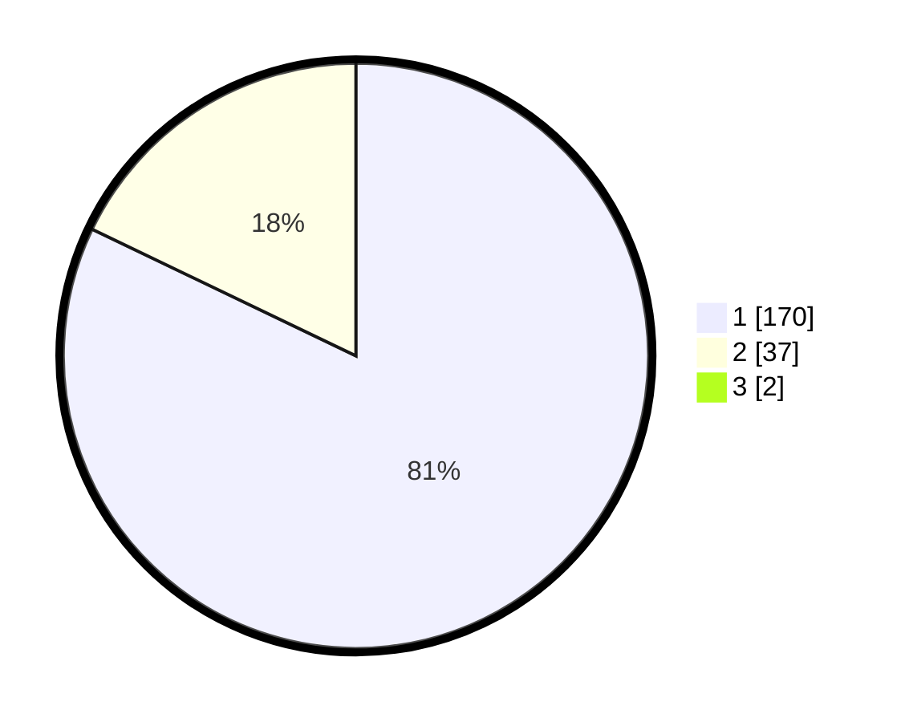

# Hasil

## Grafik

## Tabel

| No. | Nama Paslon    | Suara | Suara (raw) | Persentase |
|:--- |:-------------- | -----:| -----------:| ----------:|
| 1   | ANIES MUHAIMIN | 170   | [170][p-1]  | 81,34      |
| 2   | PRABOWO GIBRAN | 37    | [37][p-2]   | 17,70      |
| 3   | GANJAR MAHFUD  | 2     | [2][p-3]    | 0,96       |

[p-1]: https://github.com/gigit-pemilu/pemilu-2024/blob/main/pilpres/hitung-suara/sub/11-aceh/sub/08-aceh-utara/sub/19-baktiya-barat/sub/2014-matang-sijuek-timu/sub/003-tps/sub/paslon-1.txt
[p-2]: https://github.com/gigit-pemilu/pemilu-2024/blob/main/pilpres/hitung-suara/sub/11-aceh/sub/08-aceh-utara/sub/19-baktiya-barat/sub/2014-matang-sijuek-timu/sub/003-tps/sub/paslon-2.txt
[p-3]: https://github.com/gigit-pemilu/pemilu-2024/blob/main/pilpres/hitung-suara/sub/11-aceh/sub/08-aceh-utara/sub/19-baktiya-barat/sub/2014-matang-sijuek-timu/sub/003-tps/sub/paslon-3.txt

## Foto C Plano

https://sirekap-obj-formc.kpu.go.id/698f/pemilu/ppwp/11/08/19/20/14/1108192014003-20240220-185639--6d095768-0283-42e4-9338-9d1b892e56cb.jpg

https://sirekap-obj-formc.kpu.go.id/698f/pemilu/ppwp/11/08/19/20/14/1108192014003-20240220-185715--09dab2c3-2c4f-411a-93b8-f007acdb37fb.jpg

https://sirekap-obj-formc.kpu.go.id/698f/pemilu/ppwp/11/08/19/20/14/1108192014003-20240220-185731--a7cdfb4a-b020-4f58-90ac-4e21f980d039.jpg

## Metadata

| Key        | Value               |
| ---------- | ------------------- |
| Time Stamp | 2024-02-25 22:00:00 |

