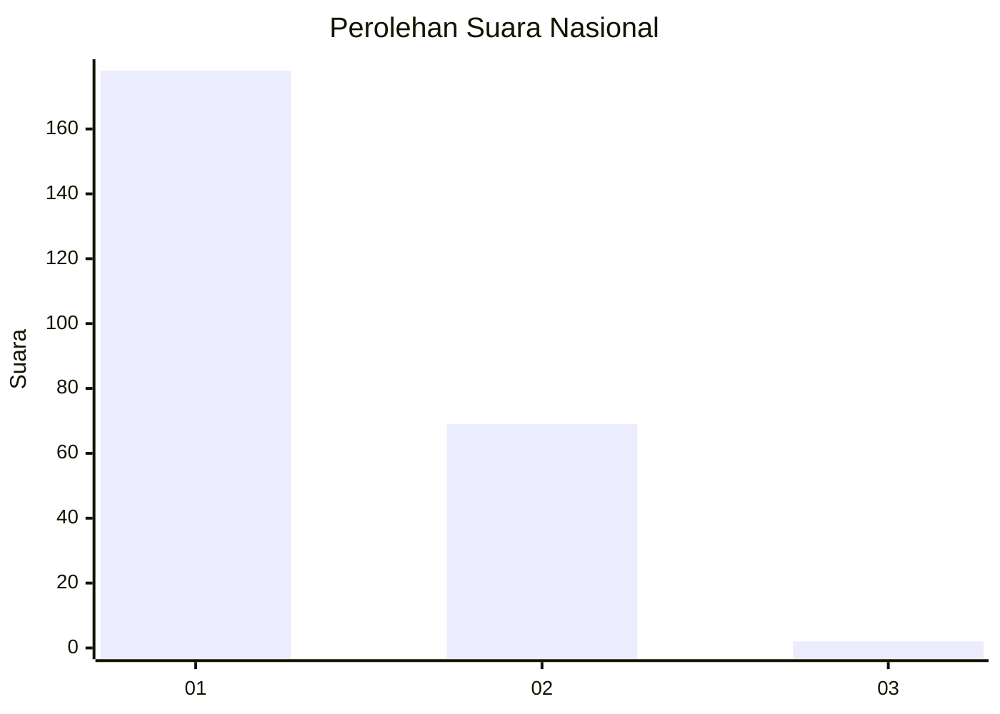
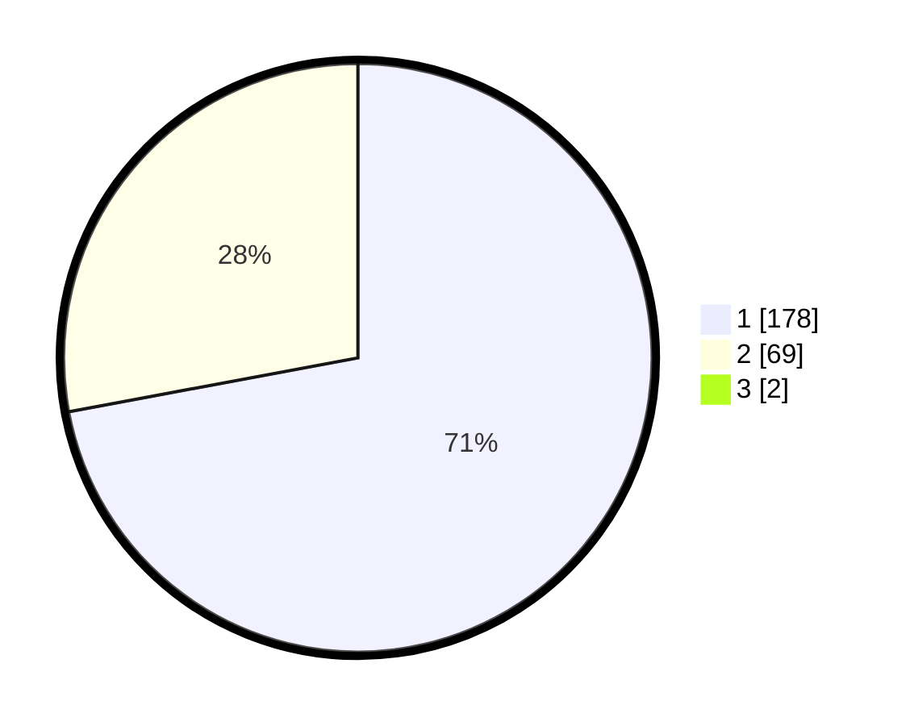

# Hasil

## Grafik

## Tabel

| No. | Nama Paslon    | Suara | Suara (raw) | Persentase |
|:--- |:-------------- | -----:| -----------:| ----------:|
| 1   | ANIES MUHAIMIN | 178   | [178][p-1]  | 71,49      |
| 2   | PRABOWO GIBRAN | 69    | [69][p-2]   | 27,71      |
| 3   | GANJAR MAHFUD  | 2     | [2][p-3]    | 0,80       |

[p-1]: https://github.com/gigit-pemilu/pemilu-2024/blob/main/pilpres/hitung-suara/sub/11-aceh/sub/08-aceh-utara/sub/19-baktiya-barat/sub/2014-matang-sijuek-timu/sub/004-tps/sub/paslon-1.txt
[p-2]: https://github.com/gigit-pemilu/pemilu-2024/blob/main/pilpres/hitung-suara/sub/11-aceh/sub/08-aceh-utara/sub/19-baktiya-barat/sub/2014-matang-sijuek-timu/sub/004-tps/sub/paslon-2.txt
[p-3]: https://github.com/gigit-pemilu/pemilu-2024/blob/main/pilpres/hitung-suara/sub/11-aceh/sub/08-aceh-utara/sub/19-baktiya-barat/sub/2014-matang-sijuek-timu/sub/004-tps/sub/paslon-3.txt

## Foto C Plano

https://sirekap-obj-formc.kpu.go.id/4b8a/pemilu/ppwp/11/08/19/20/14/1108192014004-20240215-154311--093df6c5-15b8-469b-9124-9ed07ae13589.jpg

https://sirekap-obj-formc.kpu.go.id/4b8a/pemilu/ppwp/11/08/19/20/14/1108192014004-20240215-154707--1a38e803-6617-44d3-9c61-01f18bf8068c.jpg

https://sirekap-obj-formc.kpu.go.id/4b8a/pemilu/ppwp/11/08/19/20/14/1108192014004-20240215-154924--1e686452-82fd-4e4c-abf0-c78bf73cc4b2.jpg

## Metadata

| Key        | Value               |
| ---------- | ------------------- |
| Time Stamp | 2024-02-17 00:28:35 |

