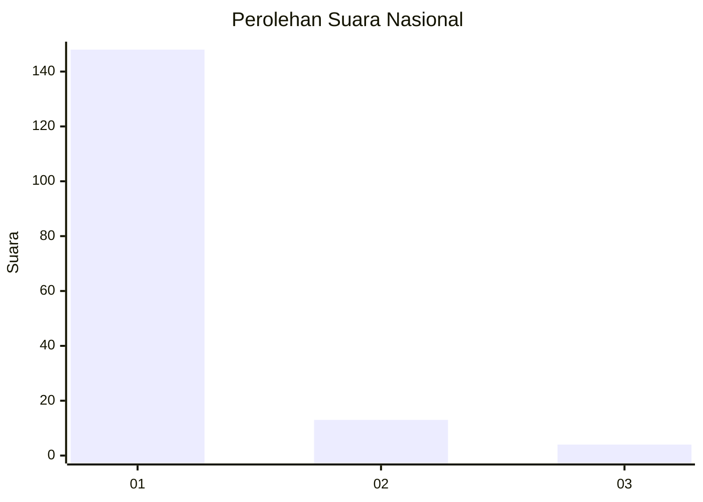
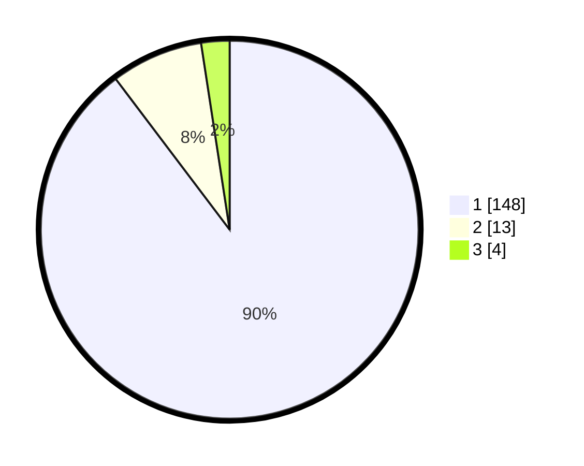

# Hasil

## Grafik

## Tabel

| No. | Nama Paslon    | Suara | Suara (raw) | Persentase |
|:--- |:-------------- | -----:| -----------:| ----------:|
| 1   | ANIES MUHAIMIN | 148   | [148][p-1]  | 89,70      |
| 2   | PRABOWO GIBRAN | 13    | [13][p-2]   | 7,88       |
| 3   | GANJAR MAHFUD  | 4     | [4][p-3]    | 2,42       |

[p-1]: https://github.com/gigit-pemilu/pemilu-2024/blob/main/pilpres/hitung-suara/sub/11-aceh/sub/08-aceh-utara/sub/19-baktiya-barat/sub/2014-matang-sijuek-timu/sub/005-tps/sub/paslon-1.txt
[p-2]: https://github.com/gigit-pemilu/pemilu-2024/blob/main/pilpres/hitung-suara/sub/11-aceh/sub/08-aceh-utara/sub/19-baktiya-barat/sub/2014-matang-sijuek-timu/sub/005-tps/sub/paslon-2.txt
[p-3]: https://github.com/gigit-pemilu/pemilu-2024/blob/main/pilpres/hitung-suara/sub/11-aceh/sub/08-aceh-utara/sub/19-baktiya-barat/sub/2014-matang-sijuek-timu/sub/005-tps/sub/paslon-3.txt

## Foto C Plano

https://sirekap-obj-formc.kpu.go.id/70f8/pemilu/ppwp/11/08/19/20/14/1108192014005-20240215-123502--4d042d78-91a9-4c93-95ce-6d56128702cd.jpg

https://sirekap-obj-formc.kpu.go.id/70f8/pemilu/ppwp/11/08/19/20/14/1108192014005-20240215-123608--7a9c1357-f31d-4a9f-8a0b-59512f6c64a4.jpg

https://sirekap-obj-formc.kpu.go.id/70f8/pemilu/ppwp/11/08/19/20/14/1108192014005-20240215-115925--db509468-ffa3-4796-adee-f86575b03fd1.jpg

## Metadata

| Key        | Value               |
| ---------- | ------------------- |
| Time Stamp | 2024-02-17 00:28:35 |

