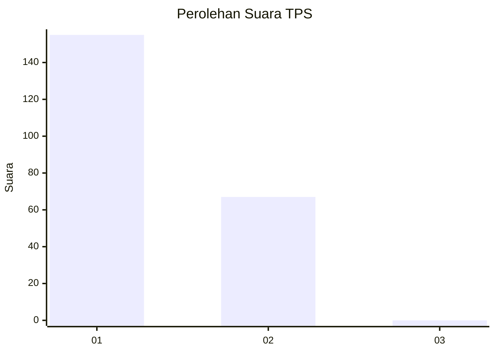
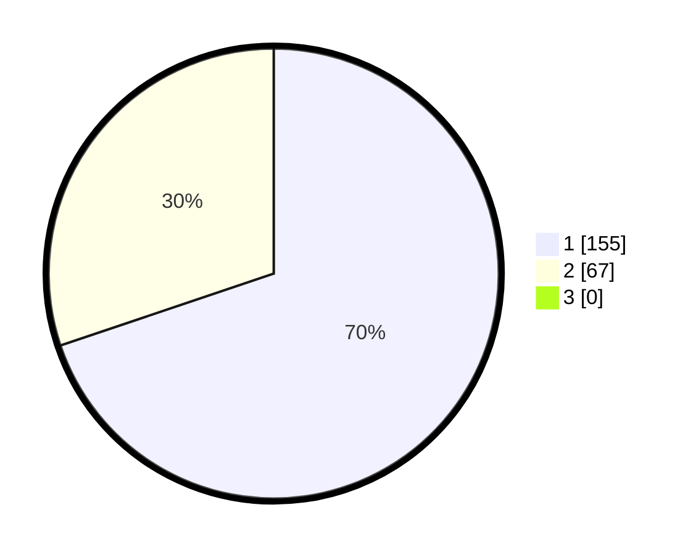

# Hasil

## Grafik

## Tabel

| No. | Nama Paslon    | Suara | Suara (raw) | Persentase |
|:--- |:-------------- | -----:| -----------:| ----------:|
| 1   | ANIES MUHAIMIN | 155   | [155][p-1]  | 69,82      |
| 2   | PRABOWO GIBRAN | 67    | [67][p-2]   | 30,18      |
| 3   | GANJAR MAHFUD  | 0     | [0][p-3]    | 0,00       |

[p-1]: https://github.com/gigit-pemilu/pemilu-2024-11-aceh/blob/main/pilpres/hitung-suara/sub/11-aceh/sub/08-aceh-utara/sub/19-baktiya-barat/sub/2015-matang-sijuek-teungoh/sub/002-tps/sub/paslon-1.txt
[p-2]: https://github.com/gigit-pemilu/pemilu-2024-11-aceh/blob/main/pilpres/hitung-suara/sub/11-aceh/sub/08-aceh-utara/sub/19-baktiya-barat/sub/2015-matang-sijuek-teungoh/sub/002-tps/sub/paslon-2.txt
[p-3]: https://github.com/gigit-pemilu/pemilu-2024-11-aceh/blob/main/pilpres/hitung-suara/sub/11-aceh/sub/08-aceh-utara/sub/19-baktiya-barat/sub/2015-matang-sijuek-teungoh/sub/002-tps/sub/paslon-3.txt

## Foto C Plano

https://sirekap-obj-formc.kpu.go.id/9495/pemilu/ppwp/11/08/19/20/15/1108192015002-20240220-223110--13493860-8547-48be-95e8-d91325d312c7.jpg

https://sirekap-obj-formc.kpu.go.id/9495/pemilu/ppwp/11/08/19/20/15/1108192015002-20240220-223249--bc1d8862-9421-4dfc-b519-83ced6072f2c.jpg

https://sirekap-obj-formc.kpu.go.id/9495/pemilu/ppwp/11/08/19/20/15/1108192015002-20240220-223421--0434ee69-ec7d-470c-939a-15e3442e8a1a.jpg

## Metadata

| Key        | Value               |
| ---------- | ------------------- |
| Time Stamp | 2024-02-25 11:00:00 |

