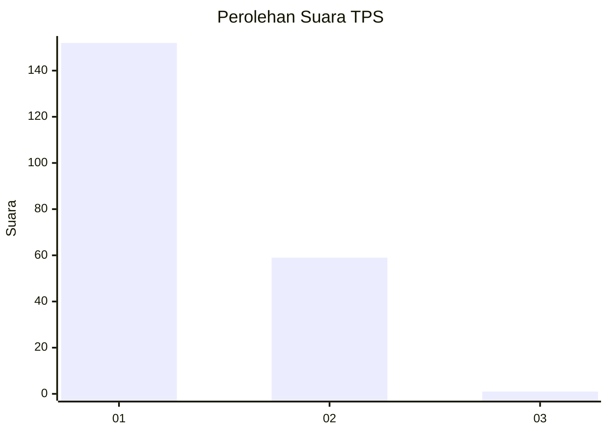
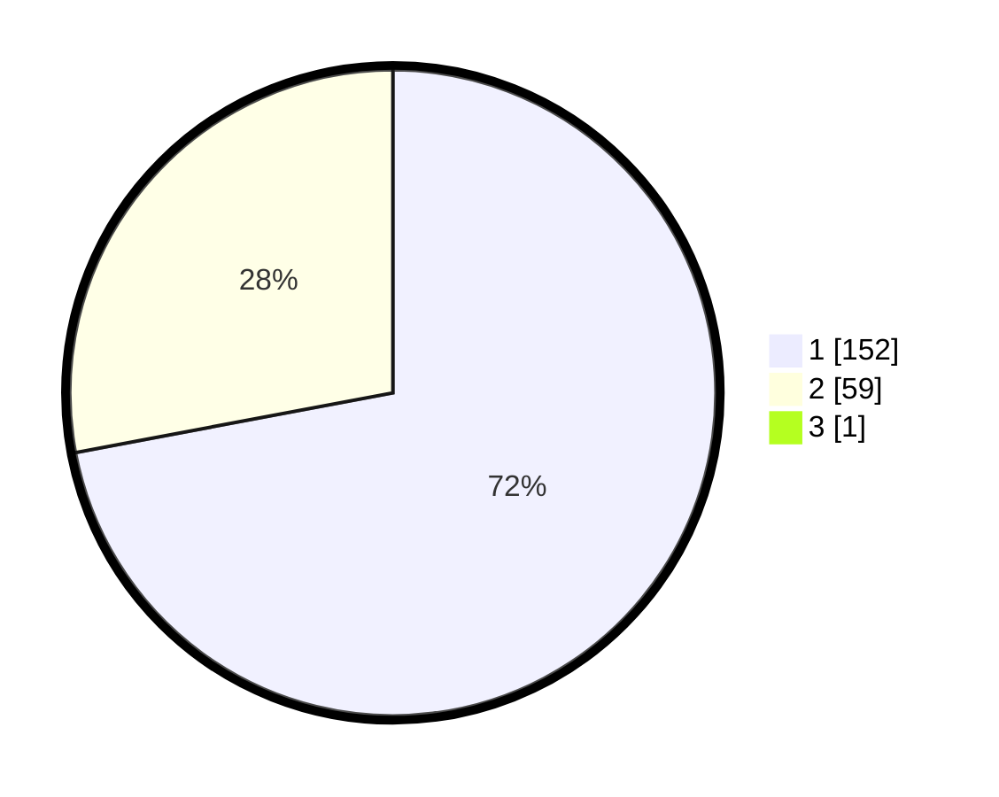

# Hasil

## Grafik

## Tabel

| No. | Nama Paslon    | Suara | Suara (raw) | Persentase |
|:--- |:-------------- | -----:| -----------:| ----------:|
| 1   | ANIES MUHAIMIN | 152   | [152][p-1]  | 71,70      |
| 2   | PRABOWO GIBRAN | 59    | [59][p-2]   | 27,83      |
| 3   | GANJAR MAHFUD  | 1     | [1][p-3]    | 0,47       |

[p-1]: https://github.com/gigit-pemilu/pemilu-2024-11-aceh/blob/main/pilpres/hitung-suara/sub/11-aceh/sub/08-aceh-utara/sub/19-baktiya-barat/sub/2016-matang-sijuek-barat/sub/003-tps/sub/paslon-1.txt
[p-2]: https://github.com/gigit-pemilu/pemilu-2024-11-aceh/blob/main/pilpres/hitung-suara/sub/11-aceh/sub/08-aceh-utara/sub/19-baktiya-barat/sub/2016-matang-sijuek-barat/sub/003-tps/sub/paslon-2.txt
[p-3]: https://github.com/gigit-pemilu/pemilu-2024-11-aceh/blob/main/pilpres/hitung-suara/sub/11-aceh/sub/08-aceh-utara/sub/19-baktiya-barat/sub/2016-matang-sijuek-barat/sub/003-tps/sub/paslon-3.txt

## Foto C Plano

https://sirekap-obj-formc.kpu.go.id/feeb/pemilu/ppwp/11/08/19/20/16/1108192016003-20240222-171924--04b0a61c-0459-446c-a683-ae87e87c1137.jpg

https://sirekap-obj-formc.kpu.go.id/feeb/pemilu/ppwp/11/08/19/20/16/1108192016003-20240215-095144--6c648ab9-a38a-446a-ab58-10992a243769.jpg

https://sirekap-obj-formc.kpu.go.id/feeb/pemilu/ppwp/11/08/19/20/16/1108192016003-20240215-095428--752d4a3e-433c-4d42-b88a-4703e57421c2.jpg

## Metadata

| Key        | Value               |
| ---------- | ------------------- |
| Time Stamp | 2024-02-22 18:00:00 |

