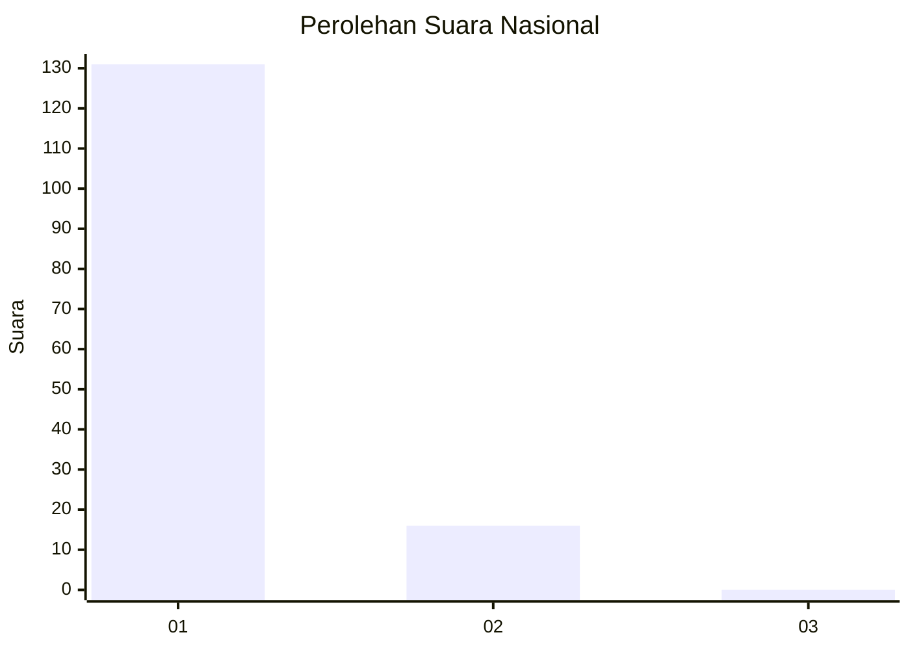
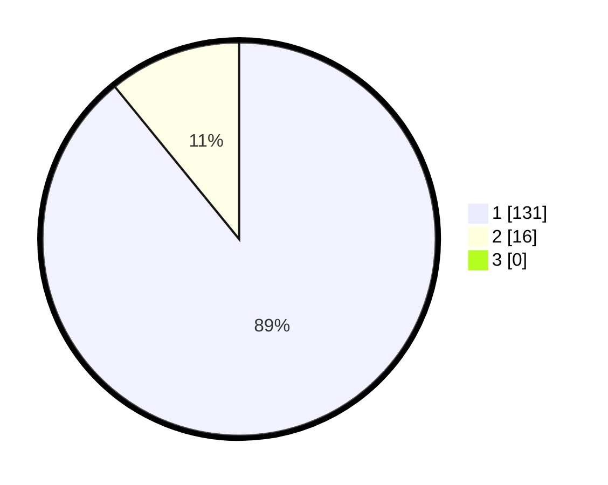

# Hasil

## Grafik

## Tabel

| No. | Nama Paslon    | Suara | Suara (raw) | Persentase |
|:--- |:-------------- | -----:| -----------:| ----------:|
| 1   | ANIES MUHAIMIN | 131   | [131][p-1]  | 89,12      |
| 2   | PRABOWO GIBRAN | 16    | [16][p-2]   | 10,88      |
| 3   | GANJAR MAHFUD  | 0     | [0][p-3]    | 0,00       |

[p-1]: https://github.com/gigit-pemilu/pemilu-2024/blob/main/pilpres/hitung-suara/sub/11-aceh/sub/08-aceh-utara/sub/19-baktiya-barat/sub/2019-meurandeh-paya/sub/001-tps/sub/paslon-1.txt
[p-2]: https://github.com/gigit-pemilu/pemilu-2024/blob/main/pilpres/hitung-suara/sub/11-aceh/sub/08-aceh-utara/sub/19-baktiya-barat/sub/2019-meurandeh-paya/sub/001-tps/sub/paslon-2.txt
[p-3]: https://github.com/gigit-pemilu/pemilu-2024/blob/main/pilpres/hitung-suara/sub/11-aceh/sub/08-aceh-utara/sub/19-baktiya-barat/sub/2019-meurandeh-paya/sub/001-tps/sub/paslon-3.txt

## Foto C Plano

https://sirekap-obj-formc.kpu.go.id/4574/pemilu/ppwp/11/08/19/20/19/1108192019001-20240215-110159--2ba7784f-6305-4f38-92cb-af9a07c5ed2a.jpg

https://sirekap-obj-formc.kpu.go.id/4574/pemilu/ppwp/11/08/19/20/19/1108192019001-20240215-110227--3f28abb6-c742-4bd1-a14b-579f7a717ee6.jpg

https://sirekap-obj-formc.kpu.go.id/4574/pemilu/ppwp/11/08/19/20/19/1108192019001-20240215-110251--a5cf4b77-ca43-4a79-9e0f-a7721f8a711e.jpg

## Metadata

| Key        | Value               |
| ---------- | ------------------- |
| Time Stamp | 2024-02-17 00:28:35 |

