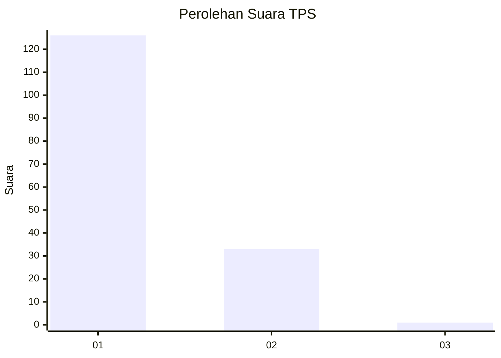
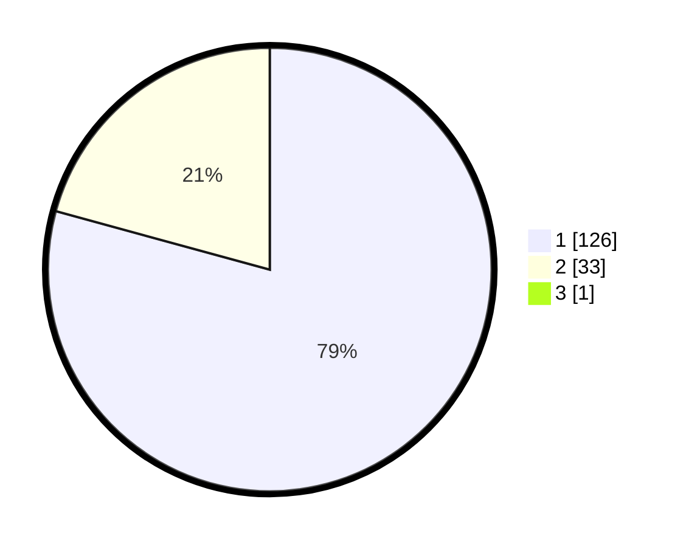

# Hasil

## Grafik

## Tabel

| No. | Nama Paslon    | Suara | Suara (raw) | Persentase |
|:--- |:-------------- | -----:| -----------:| ----------:|
| 1   | ANIES MUHAIMIN | 126   | [126][p-1]  | 78,75      |
| 2   | PRABOWO GIBRAN | 33    | [33][p-2]   | 20,63      |
| 3   | GANJAR MAHFUD  | 1     | [1][p-3]    | 0,63       |

[p-1]: https://github.com/gigit-pemilu/pemilu-2024-11-aceh/blob/main/pilpres/hitung-suara/sub/11-aceh/sub/08-aceh-utara/sub/19-baktiya-barat/sub/2019-meurandeh-paya/sub/002-tps/sub/paslon-1.txt
[p-2]: https://github.com/gigit-pemilu/pemilu-2024-11-aceh/blob/main/pilpres/hitung-suara/sub/11-aceh/sub/08-aceh-utara/sub/19-baktiya-barat/sub/2019-meurandeh-paya/sub/002-tps/sub/paslon-2.txt
[p-3]: https://github.com/gigit-pemilu/pemilu-2024-11-aceh/blob/main/pilpres/hitung-suara/sub/11-aceh/sub/08-aceh-utara/sub/19-baktiya-barat/sub/2019-meurandeh-paya/sub/002-tps/sub/paslon-3.txt

## Foto C Plano

https://sirekap-obj-formc.kpu.go.id/1cb1/pemilu/ppwp/11/08/19/20/19/1108192019002-20240215-092128--1b13adb0-d391-4c5c-95cb-fbceb0308735.jpg

https://sirekap-obj-formc.kpu.go.id/1cb1/pemilu/ppwp/11/08/19/20/19/1108192019002-20240215-092331--41bd842e-fcd7-4572-8d40-135f75d2a4ed.jpg

https://sirekap-obj-formc.kpu.go.id/1cb1/pemilu/ppwp/11/08/19/20/19/1108192019002-20240215-092559--201eeb7a-5952-4e59-b43f-463e203f2270.jpg

## Metadata

| Key        | Value               |
| ---------- | ------------------- |
| Time Stamp | 2024-02-28 19:00:00 |

