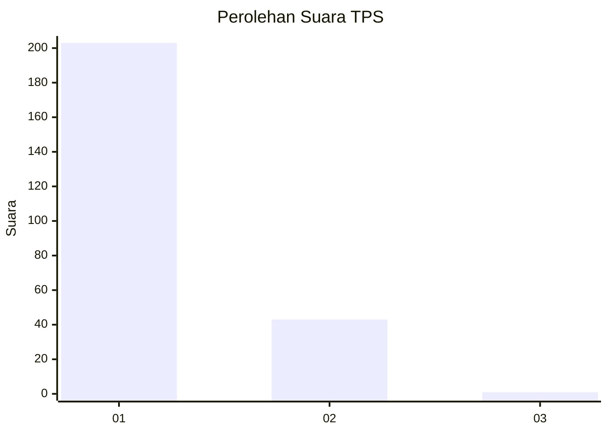
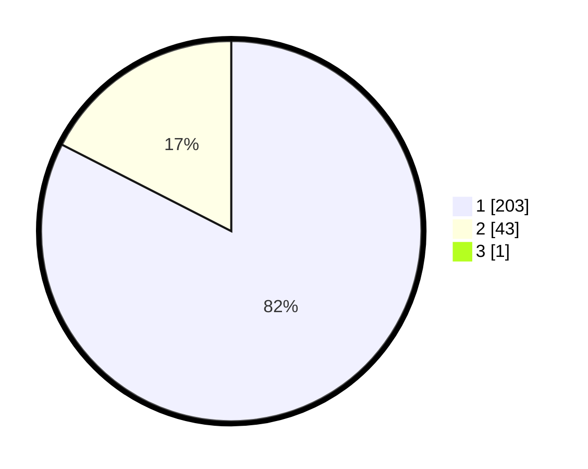

# Hasil

## Grafik

## Tabel

| No. | Nama Paslon    | Suara | Suara (raw) | Persentase |
|:--- |:-------------- | -----:| -----------:| ----------:|
| 1   | ANIES MUHAIMIN | 203   | [203][p-1]  | 82,19      |
| 2   | PRABOWO GIBRAN | 43    | [43][p-2]   | 17,41      |
| 3   | GANJAR MAHFUD  | 1     | [1][p-3]    | 0,40       |

[p-1]: https://github.com/gigit-pemilu/pemilu-2024-11-aceh/blob/main/pilpres/hitung-suara/sub/11-aceh/sub/08-aceh-utara/sub/19-baktiya-barat/sub/2021-matang-paya/sub/001-tps/sub/paslon-1.txt
[p-2]: https://github.com/gigit-pemilu/pemilu-2024-11-aceh/blob/main/pilpres/hitung-suara/sub/11-aceh/sub/08-aceh-utara/sub/19-baktiya-barat/sub/2021-matang-paya/sub/001-tps/sub/paslon-2.txt
[p-3]: https://github.com/gigit-pemilu/pemilu-2024-11-aceh/blob/main/pilpres/hitung-suara/sub/11-aceh/sub/08-aceh-utara/sub/19-baktiya-barat/sub/2021-matang-paya/sub/001-tps/sub/paslon-3.txt

## Foto C Plano

https://sirekap-obj-formc.kpu.go.id/7783/pemilu/ppwp/11/08/19/20/21/1108192021001-20240221-221812--e295eeef-3113-4b83-93fd-b876ef7399cd.jpg

https://sirekap-obj-formc.kpu.go.id/7783/pemilu/ppwp/11/08/19/20/21/1108192021001-20240221-221940--f6fcca14-ef23-4d98-9a0b-a30a829d09bc.jpg

https://sirekap-obj-formc.kpu.go.id/7783/pemilu/ppwp/11/08/19/20/21/1108192021001-20240221-222116--ba3f423a-0a20-4939-a897-04042f458ef7.jpg

## Metadata

| Key        | Value               |
| ---------- | ------------------- |
| Time Stamp | 2024-02-24 22:31:28 |

