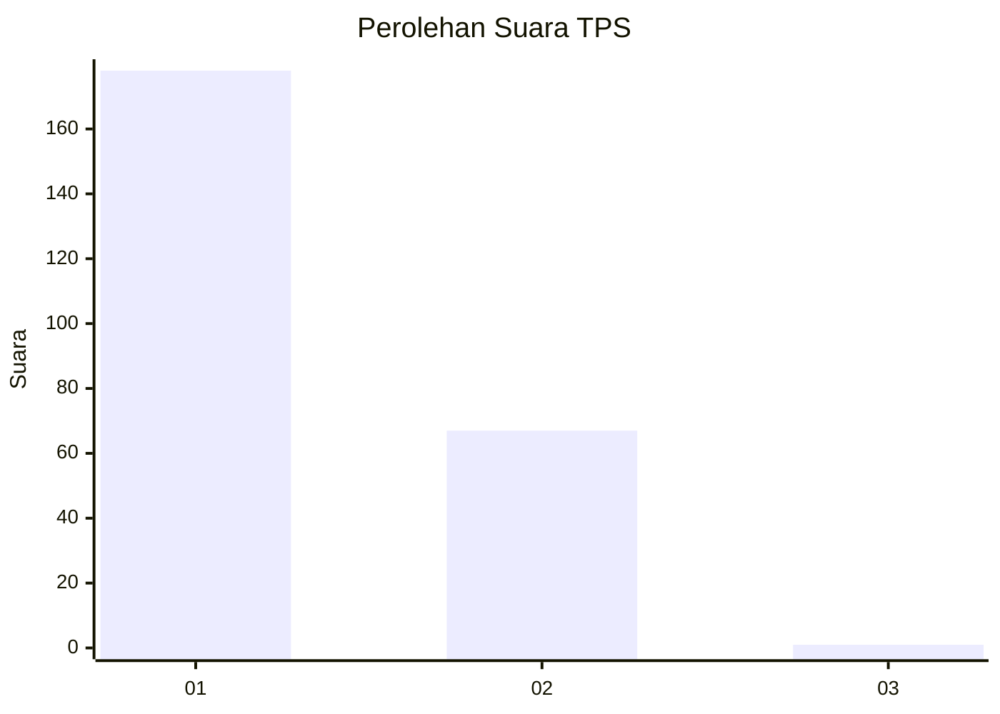
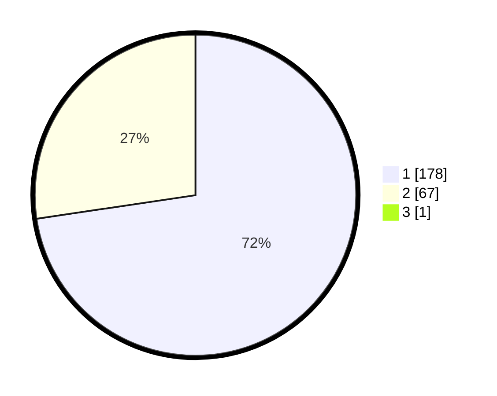

# Hasil

## Grafik

## Tabel

| No. | Nama Paslon    | Suara | Suara (raw) | Persentase |
|:--- |:-------------- | -----:| -----------:| ----------:|
| 1   | ANIES MUHAIMIN | 178   | [178][p-1]  | 72,36      |
| 2   | PRABOWO GIBRAN | 67    | [67][p-2]   | 27,24      |
| 3   | GANJAR MAHFUD  | 1     | [1][p-3]    | 0,41       |

[p-1]: https://github.com/gigit-pemilu/pemilu-2024-11-aceh/blob/main/pilpres/hitung-suara/sub/11-aceh/sub/08-aceh-utara/sub/19-baktiya-barat/sub/2021-matang-paya/sub/002-tps/sub/paslon-1.txt
[p-2]: https://github.com/gigit-pemilu/pemilu-2024-11-aceh/blob/main/pilpres/hitung-suara/sub/11-aceh/sub/08-aceh-utara/sub/19-baktiya-barat/sub/2021-matang-paya/sub/002-tps/sub/paslon-2.txt
[p-3]: https://github.com/gigit-pemilu/pemilu-2024-11-aceh/blob/main/pilpres/hitung-suara/sub/11-aceh/sub/08-aceh-utara/sub/19-baktiya-barat/sub/2021-matang-paya/sub/002-tps/sub/paslon-3.txt

## Foto C Plano

https://sirekap-obj-formc.kpu.go.id/bab3/pemilu/ppwp/11/08/19/20/21/1108192021002-20240222-003043--8cd782fa-3034-425c-806d-c09a1ef396de.jpg

https://sirekap-obj-formc.kpu.go.id/bab3/pemilu/ppwp/11/08/19/20/21/1108192021002-20240222-003158--490b3d1d-c088-4f65-ae78-124524d7f26d.jpg

https://sirekap-obj-formc.kpu.go.id/bab3/pemilu/ppwp/11/08/19/20/21/1108192021002-20240222-003729--d4f08afc-2997-4cd6-ad71-d11d31efdca3.jpg

## Metadata

| Key        | Value               |
| ---------- | ------------------- |
| Time Stamp | 2024-02-25 14:00:00 |

