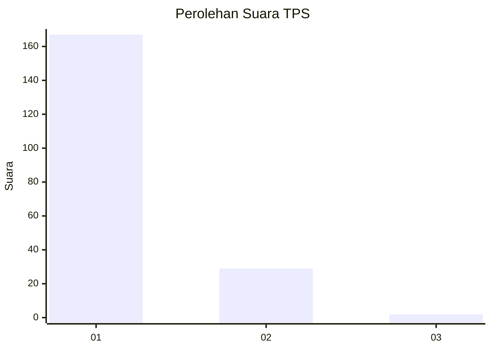
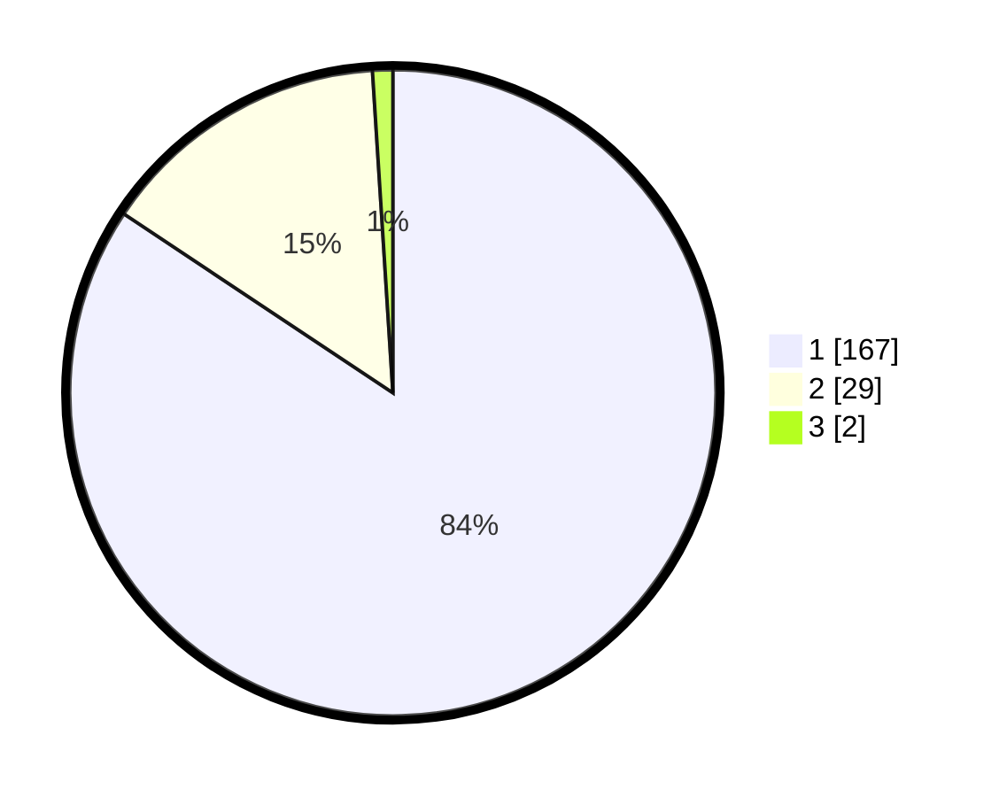

# Hasil

## Grafik

## Tabel

| No. | Nama Paslon    | Suara | Suara (raw) | Persentase |
|:--- |:-------------- | -----:| -----------:| ----------:|
| 1   | ANIES MUHAIMIN | 167   | [167][p-1]  | 84,34      |
| 2   | PRABOWO GIBRAN | 29    | [29][p-2]   | 14,65      |
| 3   | GANJAR MAHFUD  | 2     | [2][p-3]    | 1,01       |

[p-1]: https://github.com/gigit-pemilu/pemilu-2024-11-aceh/blob/main/pilpres/hitung-suara/sub/11-aceh/sub/08-aceh-utara/sub/19-baktiya-barat/sub/2022-lhok-euncien/sub/001-tps/sub/paslon-1.txt
[p-2]: https://github.com/gigit-pemilu/pemilu-2024-11-aceh/blob/main/pilpres/hitung-suara/sub/11-aceh/sub/08-aceh-utara/sub/19-baktiya-barat/sub/2022-lhok-euncien/sub/001-tps/sub/paslon-2.txt
[p-3]: https://github.com/gigit-pemilu/pemilu-2024-11-aceh/blob/main/pilpres/hitung-suara/sub/11-aceh/sub/08-aceh-utara/sub/19-baktiya-barat/sub/2022-lhok-euncien/sub/001-tps/sub/paslon-3.txt

## Foto C Plano

https://sirekap-obj-formc.kpu.go.id/1ad2/pemilu/ppwp/11/08/19/20/22/1108192022001-20240215-060538--3a99589c-cb99-40a7-b9d6-007cc5f64912.jpg

https://sirekap-obj-formc.kpu.go.id/1ad2/pemilu/ppwp/11/08/19/20/22/1108192022001-20240215-042607--1bd38f6a-e872-4ac0-af62-45814df7f3b3.jpg

https://sirekap-obj-formc.kpu.go.id/1ad2/pemilu/ppwp/11/08/19/20/22/1108192022001-20240215-042447--fcd2ee5b-68bd-406c-aeb8-09c02505835d.jpg

## Metadata

| Key        | Value               |
| ---------- | ------------------- |
| Time Stamp | 2024-02-17 00:28:35 |

