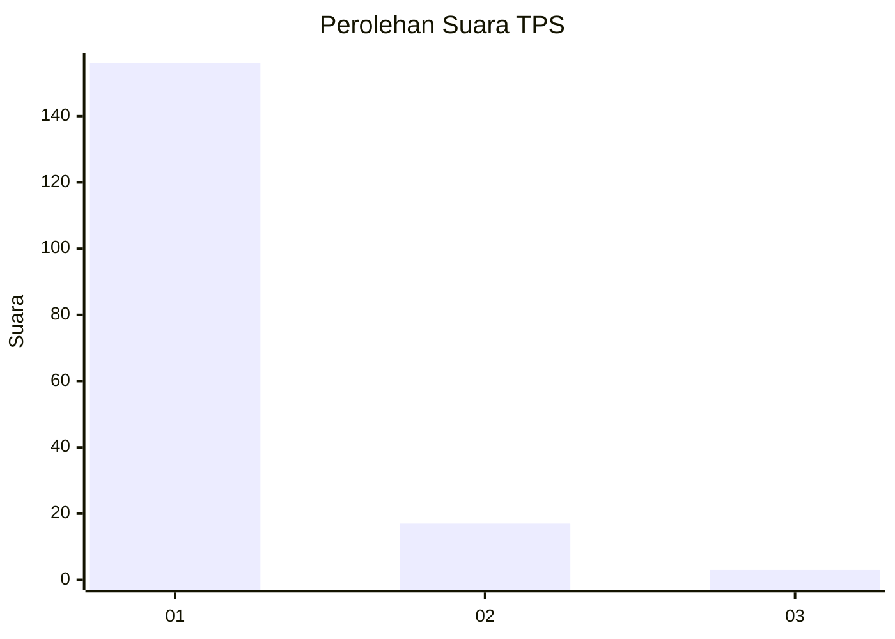
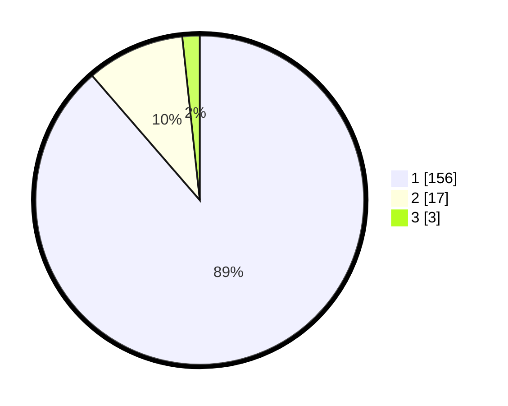

# Hasil

## Grafik

## Tabel

| No. | Nama Paslon    | Suara | Suara (raw) | Persentase |
|:--- |:-------------- | -----:| -----------:| ----------:|
| 1   | ANIES MUHAIMIN | 156   | [156][p-1]  | 88,64      |
| 2   | PRABOWO GIBRAN | 17    | [17][p-2]   | 9,66       |
| 3   | GANJAR MAHFUD  | 3     | [3][p-3]    | 1,70       |

[p-1]: https://github.com/gigit-pemilu/pemilu-2024-11-aceh/blob/main/pilpres/hitung-suara/sub/11-aceh/sub/08-aceh-utara/sub/20-paya-bakong/sub/2005-buket-guru/sub/001-tps/sub/paslon-1.txt
[p-2]: https://github.com/gigit-pemilu/pemilu-2024-11-aceh/blob/main/pilpres/hitung-suara/sub/11-aceh/sub/08-aceh-utara/sub/20-paya-bakong/sub/2005-buket-guru/sub/001-tps/sub/paslon-2.txt
[p-3]: https://github.com/gigit-pemilu/pemilu-2024-11-aceh/blob/main/pilpres/hitung-suara/sub/11-aceh/sub/08-aceh-utara/sub/20-paya-bakong/sub/2005-buket-guru/sub/001-tps/sub/paslon-3.txt

## Foto C Plano

https://sirekap-obj-formc.kpu.go.id/4d41/pemilu/ppwp/11/08/20/20/05/1108202005001-20240215-132646--4e620953-79e6-4b03-83dd-bc30b880a30f.jpg

https://sirekap-obj-formc.kpu.go.id/4d41/pemilu/ppwp/11/08/20/20/05/1108202005001-20240215-132826--6eda7a4a-40ec-4ab8-9c14-57521dde7e8f.jpg

https://sirekap-obj-formc.kpu.go.id/4d41/pemilu/ppwp/11/08/20/20/05/1108202005001-20240215-133035--73ed3d36-481e-471f-a5c0-b52474fd52dc.jpg

## Metadata

| Key        | Value               |
| ---------- | ------------------- |
| Time Stamp | 2024-02-15 19:00:26 |

