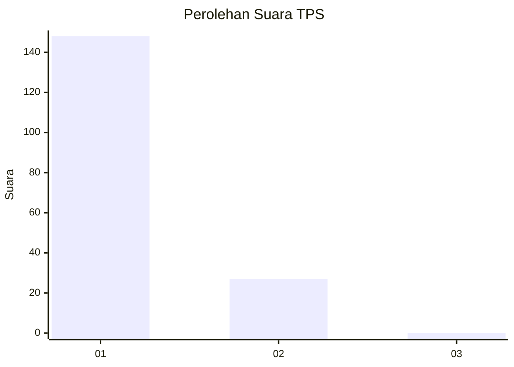
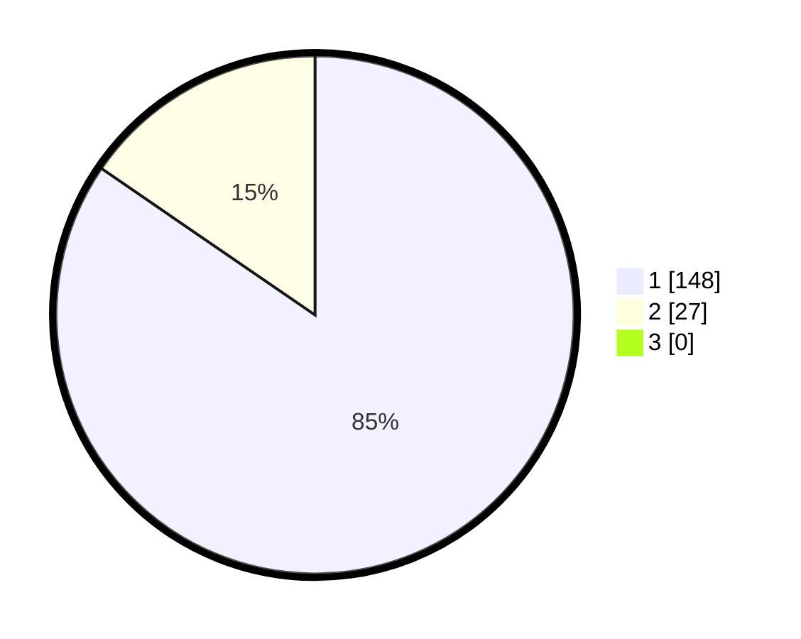

# Hasil

## Grafik

## Tabel

| No. | Nama Paslon    | Suara | Suara (raw) | Persentase |
|:--- |:-------------- | -----:| -----------:| ----------:|
| 1   | ANIES MUHAIMIN | 148   | [148][p-1]  | 84,57      |
| 2   | PRABOWO GIBRAN | 27    | [27][p-2]   | 15,43      |
| 3   | GANJAR MAHFUD  | 0     | [0][p-3]    | 0,00       |

[p-1]: https://github.com/gigit-pemilu/pemilu-2024-11-aceh/blob/main/pilpres/hitung-suara/sub/11-aceh/sub/08-aceh-utara/sub/20-paya-bakong/sub/2005-buket-guru/sub/002-tps/sub/paslon-1.txt
[p-2]: https://github.com/gigit-pemilu/pemilu-2024-11-aceh/blob/main/pilpres/hitung-suara/sub/11-aceh/sub/08-aceh-utara/sub/20-paya-bakong/sub/2005-buket-guru/sub/002-tps/sub/paslon-2.txt
[p-3]: https://github.com/gigit-pemilu/pemilu-2024-11-aceh/blob/main/pilpres/hitung-suara/sub/11-aceh/sub/08-aceh-utara/sub/20-paya-bakong/sub/2005-buket-guru/sub/002-tps/sub/paslon-3.txt

## Foto C Plano

https://sirekap-obj-formc.kpu.go.id/1214/pemilu/ppwp/11/08/20/20/05/1108202005002-20240215-114000--63c8a908-2948-4393-b286-cdb5e4b6c35d.jpg

https://sirekap-obj-formc.kpu.go.id/1214/pemilu/ppwp/11/08/20/20/05/1108202005002-20240215-112322--311ad9cd-caae-42be-955d-1ebd596ae096.jpg

## Metadata

| Key        | Value               |
| ---------- | ------------------- |
| Time Stamp | 2024-02-17 00:28:35 |

