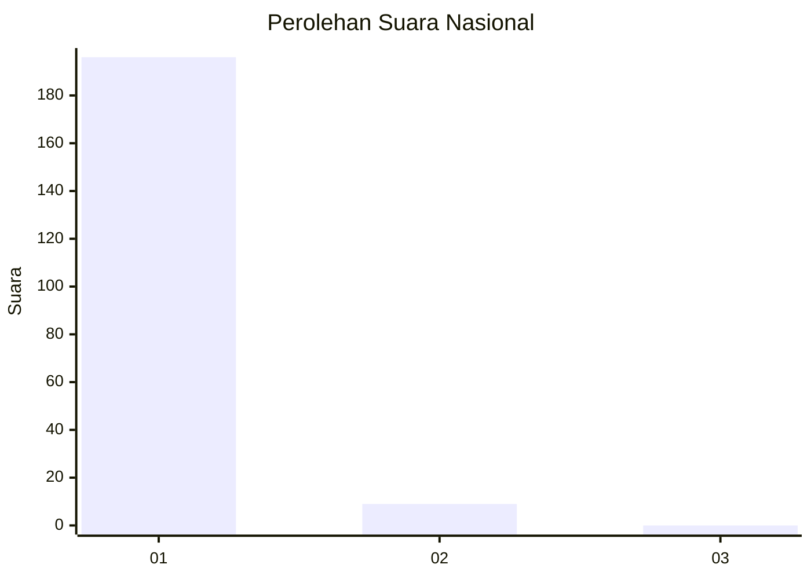
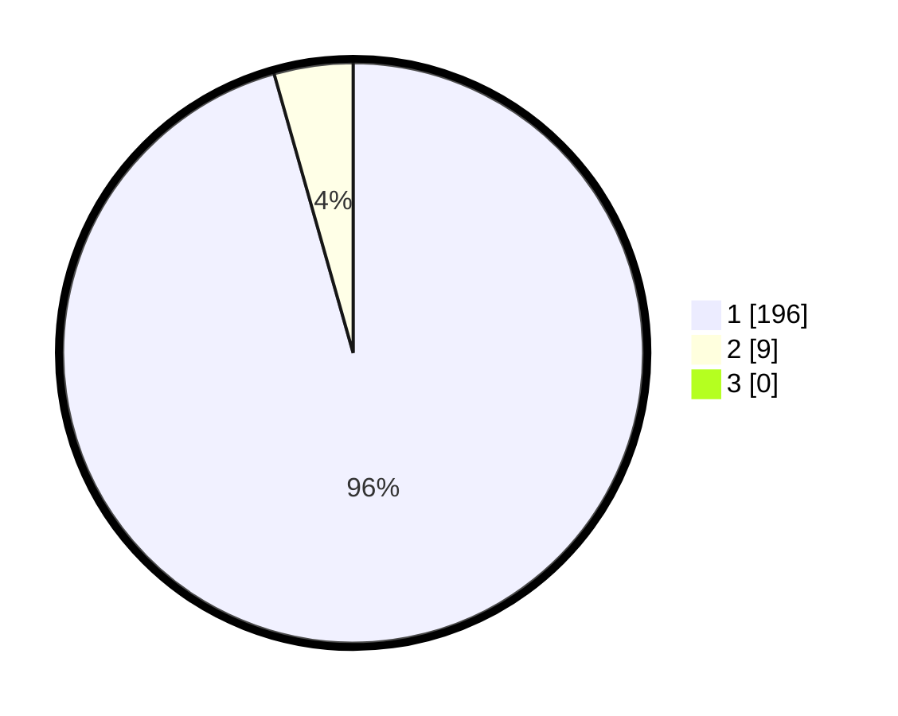

# Hasil

## Grafik

## Tabel

| No. | Nama Paslon    | Suara | Suara (raw) | Persentase |
|:--- |:-------------- | -----:| -----------:| ----------:|
| 1   | ANIES MUHAIMIN | 196   | [196][p-1]  | 95,61      |
| 2   | PRABOWO GIBRAN | 9     | [9][p-2]    | 4,39       |
| 3   | GANJAR MAHFUD  | 0     | [0][p-3]    | 0,00       |

[p-1]: https://github.com/gigit-pemilu/pemilu-2024/blob/main/pilpres/hitung-suara/sub/11-aceh/sub/08-aceh-utara/sub/20-paya-bakong/sub/2007-alue-lhok/sub/001-tps/sub/paslon-1.txt
[p-2]: https://github.com/gigit-pemilu/pemilu-2024/blob/main/pilpres/hitung-suara/sub/11-aceh/sub/08-aceh-utara/sub/20-paya-bakong/sub/2007-alue-lhok/sub/001-tps/sub/paslon-2.txt
[p-3]: https://github.com/gigit-pemilu/pemilu-2024/blob/main/pilpres/hitung-suara/sub/11-aceh/sub/08-aceh-utara/sub/20-paya-bakong/sub/2007-alue-lhok/sub/001-tps/sub/paslon-3.txt

## Foto C Plano

https://sirekap-obj-formc.kpu.go.id/a057/pemilu/ppwp/11/08/20/20/07/1108202007001-20240215-111810--0d8c7d48-56e1-446f-a026-fa580ce5d241.jpg

https://sirekap-obj-formc.kpu.go.id/a057/pemilu/ppwp/11/08/20/20/07/1108202007001-20240215-110259--d3c46700-4efa-4857-ac66-2d03cbc7d435.jpg

https://sirekap-obj-formc.kpu.go.id/a057/pemilu/ppwp/11/08/20/20/07/1108202007001-20240215-110536--1e638d7b-4c6b-40b7-a7c8-80c5cce49c12.jpg

## Metadata

| Key        | Value               |
| ---------- | ------------------- |
| Time Stamp | 2024-02-17 00:28:35 |

