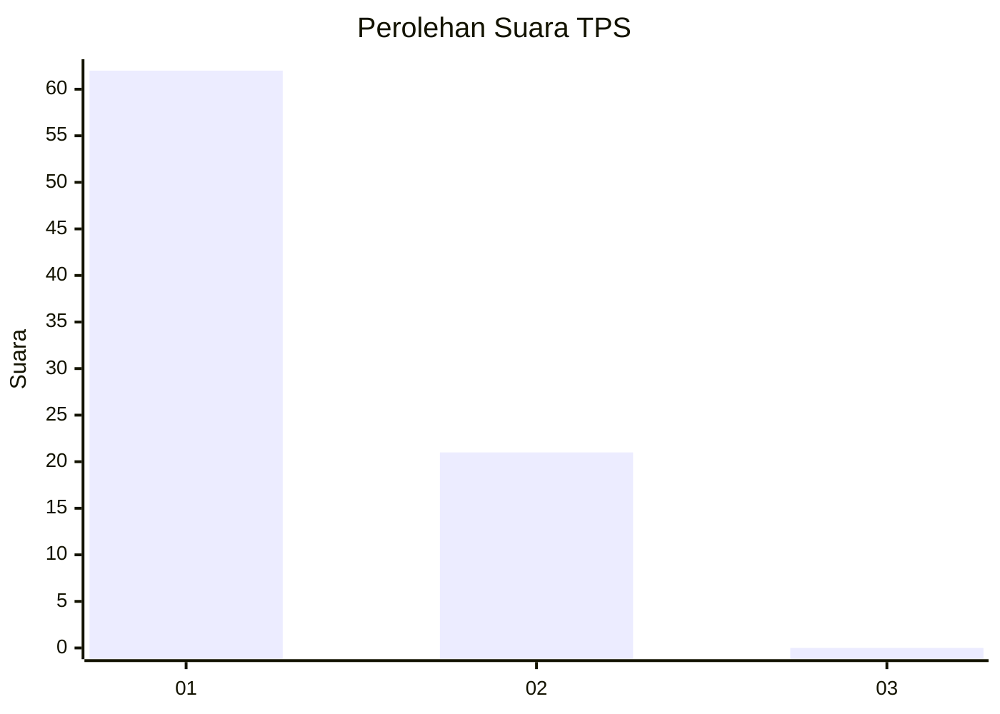
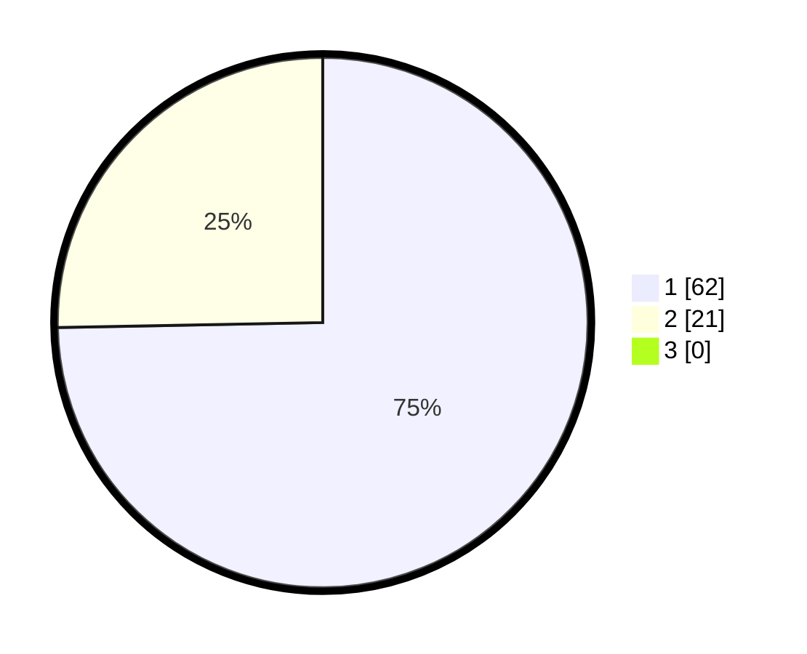

# Hasil

## Grafik

## Tabel

| No. | Nama Paslon    | Suara | Suara (raw) | Persentase |
|:--- |:-------------- | -----:| -----------:| ----------:|
| 1   | ANIES MUHAIMIN | 62    | [62][p-1]   | 74,70      |
| 2   | PRABOWO GIBRAN | 21    | [21][p-2]   | 25,30      |
| 3   | GANJAR MAHFUD  | 0     | [0][p-3]    | 0,00       |

[p-1]: https://github.com/gigit-pemilu/pemilu-2024-11-aceh/blob/main/pilpres/hitung-suara/sub/11-aceh/sub/08-aceh-utara/sub/20-paya-bakong/sub/2010-kebon-pirak/sub/001-tps/sub/paslon-1.txt
[p-2]: https://github.com/gigit-pemilu/pemilu-2024-11-aceh/blob/main/pilpres/hitung-suara/sub/11-aceh/sub/08-aceh-utara/sub/20-paya-bakong/sub/2010-kebon-pirak/sub/001-tps/sub/paslon-2.txt
[p-3]: https://github.com/gigit-pemilu/pemilu-2024-11-aceh/blob/main/pilpres/hitung-suara/sub/11-aceh/sub/08-aceh-utara/sub/20-paya-bakong/sub/2010-kebon-pirak/sub/001-tps/sub/paslon-3.txt

## Foto C Plano

https://sirekap-obj-formc.kpu.go.id/72db/pemilu/ppwp/11/08/20/20/10/1108202010001-20240215-213915--35f007de-1ce7-421f-aa66-9bb9ca521707.jpg

https://sirekap-obj-formc.kpu.go.id/72db/pemilu/ppwp/11/08/20/20/10/1108202010001-20240214-202359--b954c813-ad3a-4196-90af-8ee38353492b.jpg

https://sirekap-obj-formc.kpu.go.id/72db/pemilu/ppwp/11/08/20/20/10/1108202010001-20240214-202546--852e8801-8cb0-45d6-a996-d3f6c59af957.jpg

## Metadata

| Key        | Value               |
| ---------- | ------------------- |
| Time Stamp | 2024-02-15 22:00:27 |

## DATA PEMILIH TETAP

Jumlah pemilih dalam DPT: **112**.
 * L: **60**.
 * P: **52**.

## DATA PENGGUNA HAK PILIH

Jumlah pengguna hak pilih dalam DPT: **83**.
 * L: **45**.
 * P: **38**.

Jumlah pengguna hak pilih dalam DPTb: **1**.
 * L: **1**.
 * P: **0**.

Jumlah pengguna hak pilih dalam DPK: **0**.
 * L: **0**.
 * P: **0**.

Jumlah pengguna hak pilih: **84**.
 * L: **46**.
 * P: **38**.

## JUMLAH SUARA SAH DAN TIDAK SAH

JUMLAH SELURUH SUARA SAH: **83**.

JUMLAH SUARA TIDAK SAH: **1**.

JUMLAH SELURUH SUARA SAH DAN SUARA TIDAK SAH: **84**.

