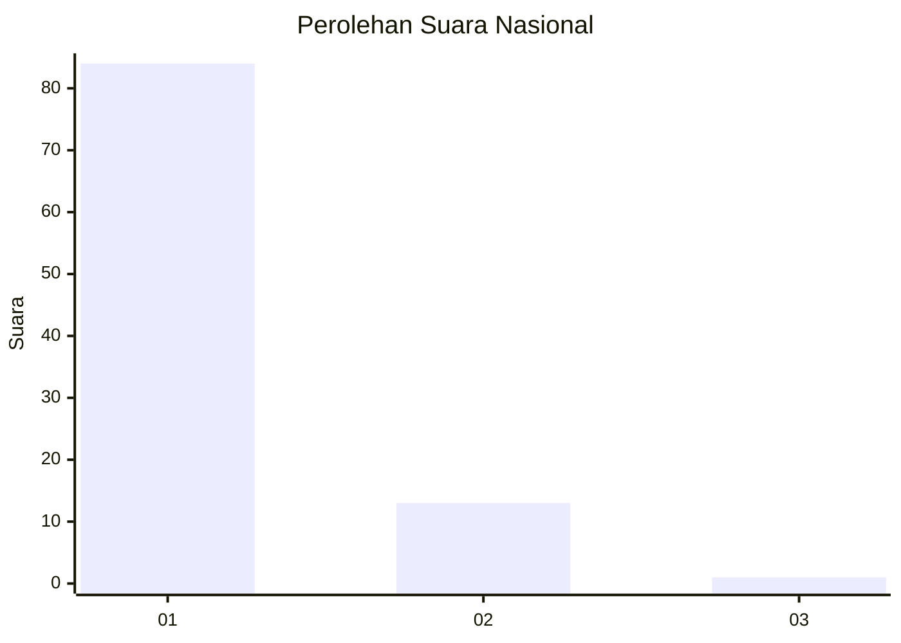
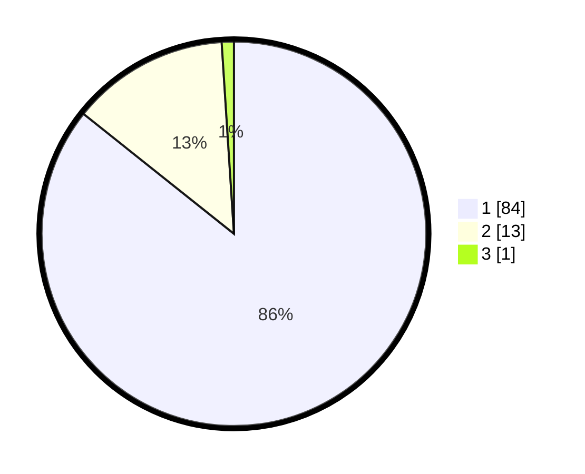

# Hasil

## Grafik

## Tabel

| No. | Nama Paslon    | Suara | Suara (raw) | Persentase |
|:--- |:-------------- | -----:| -----------:| ----------:|
| 1   | ANIES MUHAIMIN | 84    | [84][p-1]   | 85,71      |
| 2   | PRABOWO GIBRAN | 13    | [13][p-2]   | 13,27      |
| 3   | GANJAR MAHFUD  | 1     | [1][p-3]    | 1,02       |

[p-1]: https://github.com/gigit-pemilu/pemilu-2024/blob/main/pilpres/hitung-suara/sub/11-aceh/sub/08-aceh-utara/sub/20-paya-bakong/sub/2011-alue-leukot/sub/001-tps/sub/paslon-1.txt
[p-2]: https://github.com/gigit-pemilu/pemilu-2024/blob/main/pilpres/hitung-suara/sub/11-aceh/sub/08-aceh-utara/sub/20-paya-bakong/sub/2011-alue-leukot/sub/001-tps/sub/paslon-2.txt
[p-3]: https://github.com/gigit-pemilu/pemilu-2024/blob/main/pilpres/hitung-suara/sub/11-aceh/sub/08-aceh-utara/sub/20-paya-bakong/sub/2011-alue-leukot/sub/001-tps/sub/paslon-3.txt

## Foto C Plano

https://sirekap-obj-formc.kpu.go.id/e887/pemilu/ppwp/11/08/20/20/11/1108202011001-20240216-132233--b19864e2-0f43-492f-9e3d-8fc0310ce7ea.jpg

https://sirekap-obj-formc.kpu.go.id/e887/pemilu/ppwp/11/08/20/20/11/1108202011001-20240216-132235--c9118f9d-e963-4ba3-8819-7f2a49890834.jpg

https://sirekap-obj-formc.kpu.go.id/e887/pemilu/ppwp/11/08/20/20/11/1108202011001-20240216-132234--077be872-6c47-4551-a26e-ff63d11bd9b4.jpg

## Metadata

| Key        | Value               |
| ---------- | ------------------- |
| Time Stamp | 2024-02-17 01:00:00 |

## DATA PEMILIH TETAP

Jumlah pemilih dalam DPT: **116**.
 * L: **59**.
 * P: **57**.

## DATA PENGGUNA HAK PILIH

Jumlah pengguna hak pilih dalam DPT: **95**.
 * L: **41**.
 * P: **54**.

Jumlah pengguna hak pilih dalam DPTb: **6**.
 * L: **3**.
 * P: **3**.

Jumlah pengguna hak pilih dalam DPK: **2**.
 * L: **1**.
 * P: **1**.

Jumlah pengguna hak pilih: **103**.
 * L: **45**.
 * P: **58**.

## JUMLAH SUARA SAH DAN TIDAK SAH

JUMLAH SELURUH SUARA SAH: **98**.

JUMLAH SUARA TIDAK SAH: **5**.

JUMLAH SELURUH SUARA SAH DAN SUARA TIDAK SAH: **103**.

