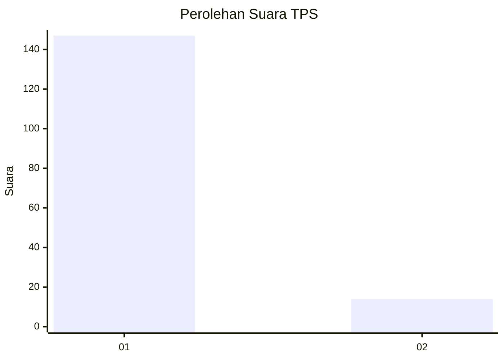
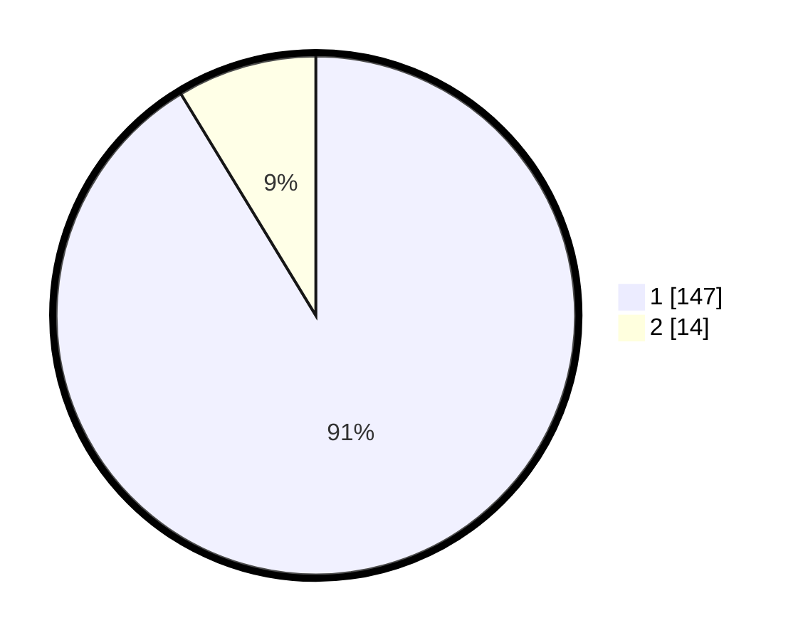

# Hasil

## Grafik

## Tabel

| No. | Nama Paslon    | Suara | Suara (raw) | Persentase |
|:--- |:-------------- | -----:| -----------:| ----------:|
| 1   | ANIES MUHAIMIN | 147   | [147][p-1]  | 91,30      |
| 2   | PRABOWO GIBRAN | 14    | [14][p-2]   | 8,70       |

[p-1]: https://github.com/gigit-pemilu/pemilu-2024-11-aceh/blob/main/pilpres/hitung-suara/sub/11-aceh/sub/08-aceh-utara/sub/20-paya-bakong/sub/2029-matang-panyang/sub/002-tps/sub/paslon-1.txt
[p-2]: https://github.com/gigit-pemilu/pemilu-2024-11-aceh/blob/main/pilpres/hitung-suara/sub/11-aceh/sub/08-aceh-utara/sub/20-paya-bakong/sub/2029-matang-panyang/sub/002-tps/sub/paslon-2.txt
[p-3]: https://github.com/gigit-pemilu/pemilu-2024-11-aceh/blob/main/pilpres/hitung-suara/sub/11-aceh/sub/08-aceh-utara/sub/20-paya-bakong/sub/2029-matang-panyang/sub/002-tps/sub/paslon-3.txt

## Foto C Plano

https://sirekap-obj-formc.kpu.go.id/c877/pemilu/ppwp/11/08/20/20/29/1108202029002-20240215-065146--2c61b141-15e7-476c-bb84-147d15cf91f1.jpg

https://sirekap-obj-formc.kpu.go.id/c877/pemilu/ppwp/11/08/20/20/29/1108202029002-20240215-153319--4ffaa45a-b678-4b29-aebc-a5de5ae7d951.jpg

https://sirekap-obj-formc.kpu.go.id/c877/pemilu/ppwp/11/08/20/20/29/1108202029002-20240215-100153--4e37fa55-a25c-4d6f-a895-48079236dbc0.jpg

## Metadata

| Key        | Value               |
| ---------- | ------------------- |
| Time Stamp | 2024-02-17 16:00:02 |

