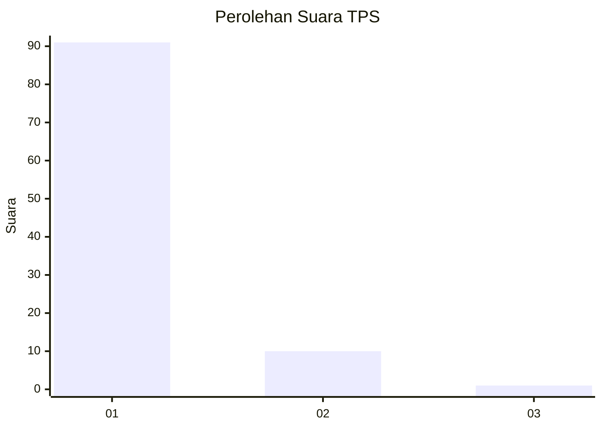
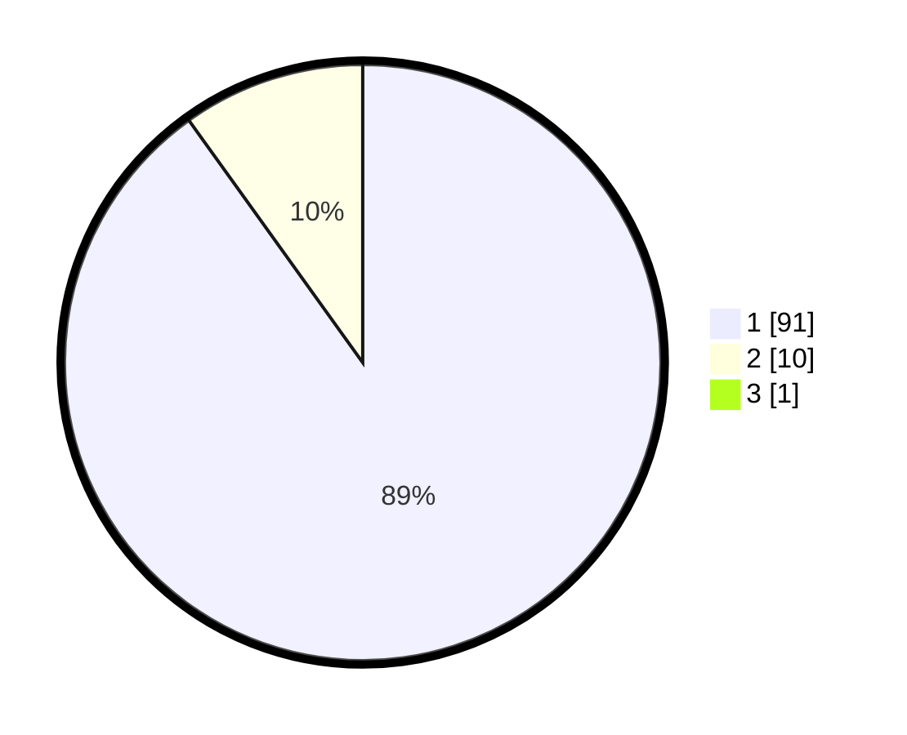

# Hasil

## Grafik

## Tabel

| No. | Nama Paslon    | Suara | Suara (raw) | Persentase |
|:--- |:-------------- | -----:| -----------:| ----------:|
| 1   | ANIES MUHAIMIN | 91    | [91][p-1]   | 89,22      |
| 2   | PRABOWO GIBRAN | 10    | [10][p-2]   | 9,80       |
| 3   | GANJAR MAHFUD  | 1     | [1][p-3]    | 0,98       |

[p-1]: https://github.com/gigit-pemilu/pemilu-2024-11-aceh/blob/main/pilpres/hitung-suara/sub/11-aceh/sub/08-aceh-utara/sub/21-nibong/sub/2003-keude-nibong/sub/001-tps/sub/paslon-1.txt
[p-2]: https://github.com/gigit-pemilu/pemilu-2024-11-aceh/blob/main/pilpres/hitung-suara/sub/11-aceh/sub/08-aceh-utara/sub/21-nibong/sub/2003-keude-nibong/sub/001-tps/sub/paslon-2.txt
[p-3]: https://github.com/gigit-pemilu/pemilu-2024-11-aceh/blob/main/pilpres/hitung-suara/sub/11-aceh/sub/08-aceh-utara/sub/21-nibong/sub/2003-keude-nibong/sub/001-tps/sub/paslon-3.txt

## Foto C Plano

https://sirekap-obj-formc.kpu.go.id/d36d/pemilu/ppwp/11/08/21/20/03/1108212003001-20240217-175258--c558cff5-d7b4-4afe-a879-51e540863afc.jpg

https://sirekap-obj-formc.kpu.go.id/d36d/pemilu/ppwp/11/08/21/20/03/1108212003001-20240215-023033--31c87df1-5a16-4424-be66-27ef1e41de2f.jpg

https://sirekap-obj-formc.kpu.go.id/d36d/pemilu/ppwp/11/08/21/20/03/1108212003001-20240215-023115--cff42248-c622-47f2-9e8d-ae6349ade368.jpg

## Metadata

| Key        | Value               |
| ---------- | ------------------- |
| Time Stamp | 2024-02-17 18:00:00 |

## DATA PEMILIH TETAP

Jumlah pemilih dalam DPT: **105**.
 * L: **51**.
 * P: **54**.

## DATA PENGGUNA HAK PILIH

Jumlah pengguna hak pilih dalam DPT: **105**.
 * L: **51**.
 * P: **54**.

Jumlah pengguna hak pilih dalam DPTb: **1**.
 * L: **1**.
 * P: **0**.

Jumlah pengguna hak pilih dalam DPK: **0**.
 * L: **0**.
 * P: **0**.

Jumlah pengguna hak pilih: **106**.
 * L: **52**.
 * P: **54**.

## JUMLAH SUARA SAH DAN TIDAK SAH

JUMLAH SELURUH SUARA SAH: **102**.

JUMLAH SUARA TIDAK SAH: **1**.

JUMLAH SELURUH SUARA SAH DAN SUARA TIDAK SAH: **103**.

