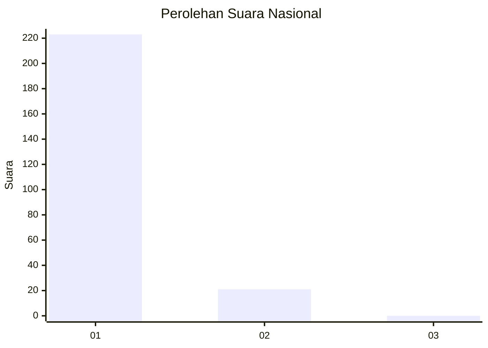
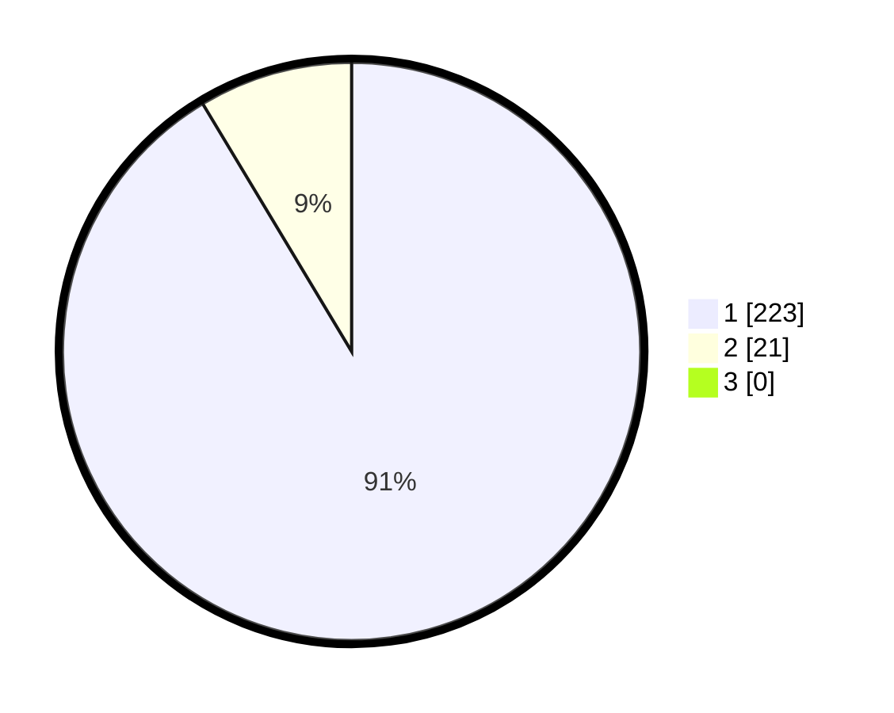

# Hasil

## Grafik

## Tabel

| No. | Nama Paslon    | Suara | Suara (raw) | Persentase |
|:--- |:-------------- | -----:| -----------:| ----------:|
| 1   | ANIES MUHAIMIN | 223   | [223][p-1]  | 91,39      |
| 2   | PRABOWO GIBRAN | 21    | [21][p-2]   | 8,61       |
| 3   | GANJAR MAHFUD  | 0     | [0][p-3]    | 0,00       |

[p-1]: https://github.com/gigit-pemilu/pemilu-2024/blob/main/pilpres/hitung-suara/sub/11-aceh/sub/08-aceh-utara/sub/21-nibong/sub/2006-sumbok-rayeuk/sub/002-tps/sub/paslon-1.txt
[p-2]: https://github.com/gigit-pemilu/pemilu-2024/blob/main/pilpres/hitung-suara/sub/11-aceh/sub/08-aceh-utara/sub/21-nibong/sub/2006-sumbok-rayeuk/sub/002-tps/sub/paslon-2.txt
[p-3]: https://github.com/gigit-pemilu/pemilu-2024/blob/main/pilpres/hitung-suara/sub/11-aceh/sub/08-aceh-utara/sub/21-nibong/sub/2006-sumbok-rayeuk/sub/002-tps/sub/paslon-3.txt

## Foto C Plano

https://sirekap-obj-formc.kpu.go.id/4bed/pemilu/ppwp/11/08/21/20/06/1108212006002-20240215-081708--81b43e64-db04-44ee-bf24-51b94a07dbad.jpg

https://sirekap-obj-formc.kpu.go.id/4bed/pemilu/ppwp/11/08/21/20/06/1108212006002-20240215-081810--fd14c480-1aca-4019-beac-7e823e16321f.jpg

https://sirekap-obj-formc.kpu.go.id/4bed/pemilu/ppwp/11/08/21/20/06/1108212006002-20240215-081900--e289fc3b-00fb-411d-9fee-e77d66ecff28.jpg

## Metadata

| Key        | Value               |
| ---------- | ------------------- |
| Time Stamp | 2024-02-15 16:00:26 |

