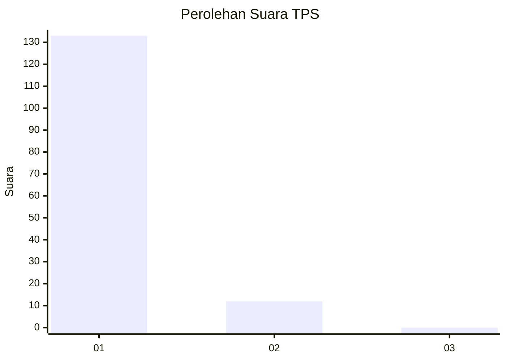
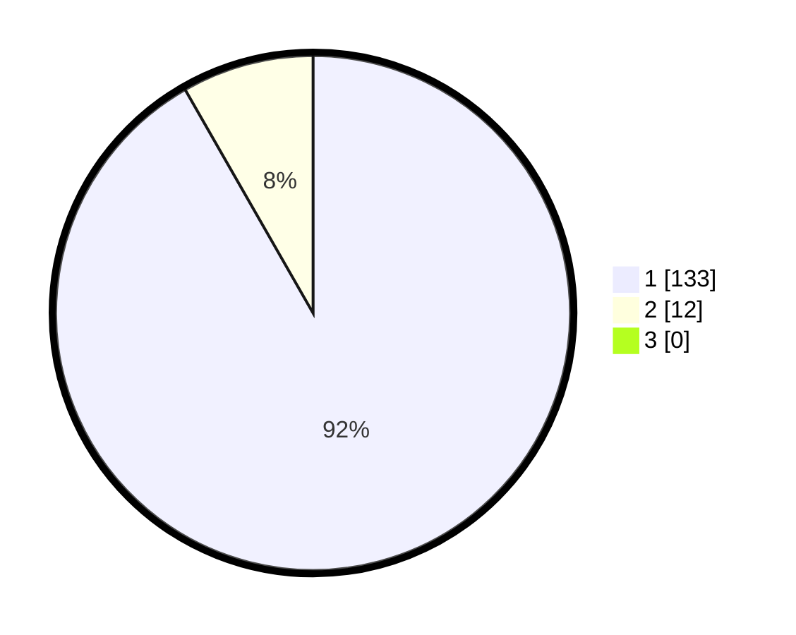

# Hasil

## Grafik

## Tabel

| No. | Nama Paslon    | Suara | Suara (raw) | Persentase |
|:--- |:-------------- | -----:| -----------:| ----------:|
| 1   | ANIES MUHAIMIN | 133   | [133][p-1]  | 91,72      |
| 2   | PRABOWO GIBRAN | 12    | [12][p-2]   | 8,28       |
| 3   | GANJAR MAHFUD  | 0     | [0][p-3]    | 0,00       |

[p-1]: https://github.com/gigit-pemilu/pemilu-2024-11-aceh/blob/main/pilpres/hitung-suara/sub/11-aceh/sub/08-aceh-utara/sub/21-nibong/sub/2009-mamplam/sub/002-tps/sub/paslon-1.txt
[p-2]: https://github.com/gigit-pemilu/pemilu-2024-11-aceh/blob/main/pilpres/hitung-suara/sub/11-aceh/sub/08-aceh-utara/sub/21-nibong/sub/2009-mamplam/sub/002-tps/sub/paslon-2.txt
[p-3]: https://github.com/gigit-pemilu/pemilu-2024-11-aceh/blob/main/pilpres/hitung-suara/sub/11-aceh/sub/08-aceh-utara/sub/21-nibong/sub/2009-mamplam/sub/002-tps/sub/paslon-3.txt

## Foto C Plano

https://sirekap-obj-formc.kpu.go.id/fb7d/pemilu/ppwp/11/08/21/20/09/1108212009002-20240220-153546--50de1047-d701-4c35-9799-973e92fdd987.jpg

https://sirekap-obj-formc.kpu.go.id/fb7d/pemilu/ppwp/11/08/21/20/09/1108212009002-20240215-092158--ba277c8a-835e-45d8-8cec-e123922bb52a.jpg

https://sirekap-obj-formc.kpu.go.id/fb7d/pemilu/ppwp/11/08/21/20/09/1108212009002-20240215-092236--37a26dd6-ede0-4d80-8c06-0b77e14febb8.jpg

## Metadata

| Key        | Value               |
| ---------- | ------------------- |
| Time Stamp | 2024-02-20 16:00:00 |

