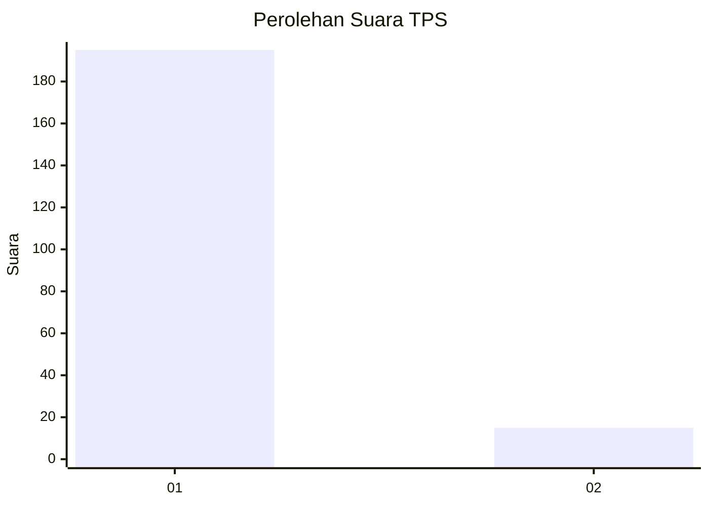
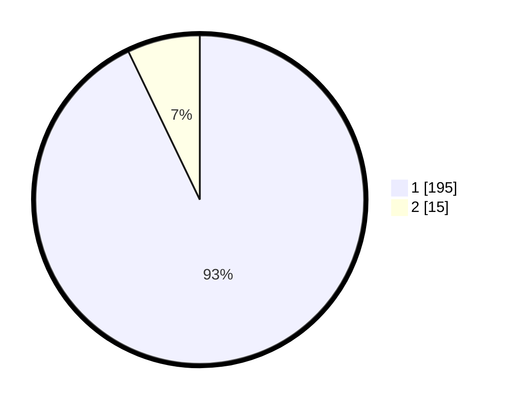

# Hasil

## Grafik

## Tabel

| No. | Nama Paslon    | Suara | Suara (raw) | Persentase |
|:--- |:-------------- | -----:| -----------:| ----------:|
| 1   | ANIES MUHAIMIN | 195   | [195][p-1]  | 92,86      |
| 2   | PRABOWO GIBRAN | 15    | [15][p-2]   | 7,14       |

[p-1]: https://github.com/gigit-pemilu/pemilu-2024-11-aceh/blob/main/pilpres/hitung-suara/sub/11-aceh/sub/08-aceh-utara/sub/21-nibong/sub/2012-ranto/sub/002-tps/sub/paslon-1.txt
[p-2]: https://github.com/gigit-pemilu/pemilu-2024-11-aceh/blob/main/pilpres/hitung-suara/sub/11-aceh/sub/08-aceh-utara/sub/21-nibong/sub/2012-ranto/sub/002-tps/sub/paslon-2.txt
[p-3]: https://github.com/gigit-pemilu/pemilu-2024-11-aceh/blob/main/pilpres/hitung-suara/sub/11-aceh/sub/08-aceh-utara/sub/21-nibong/sub/2012-ranto/sub/002-tps/sub/paslon-3.txt

## Foto C Plano

https://sirekap-obj-formc.kpu.go.id/321a/pemilu/ppwp/11/08/21/20/12/1108212012002-20240214-220547--e76dd377-2385-492e-86c0-0a4fe08f3afc.jpg

https://sirekap-obj-formc.kpu.go.id/321a/pemilu/ppwp/11/08/21/20/12/1108212012002-20240214-220851--9935a1fd-95d2-46d5-962c-26e5f0ef6b9e.jpg

https://sirekap-obj-formc.kpu.go.id/321a/pemilu/ppwp/11/08/21/20/12/1108212012002-20240214-221148--4af672d6-3172-42a9-bef8-475e6e09147b.jpg

## Metadata

| Key        | Value               |
| ---------- | ------------------- |
| Time Stamp | 2024-02-17 16:00:02 |

