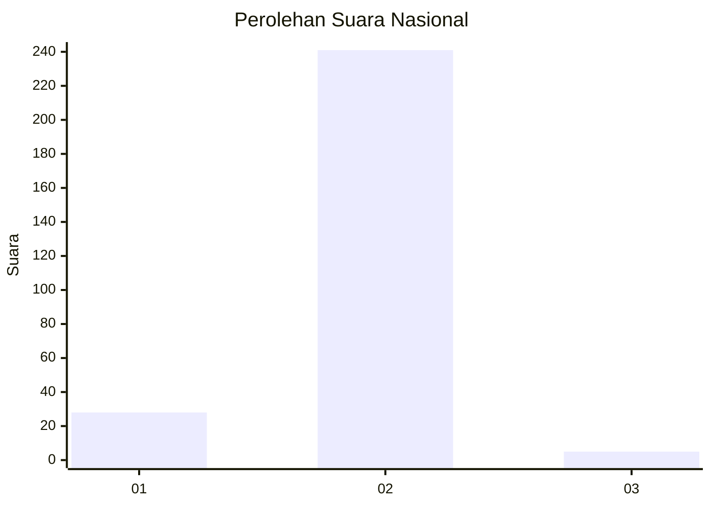
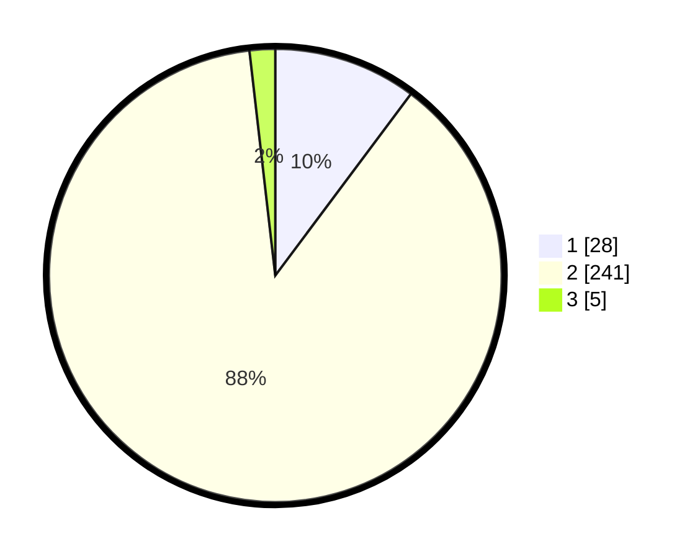

# Hasil

## Grafik

## Tabel

| No. | Nama Paslon    | Suara | Suara (raw) | Persentase |
|:--- |:-------------- | -----:| -----------:| ----------:|
| 1   | ANIES MUHAIMIN | 28    | [28][p-1]   | 10,22      |
| 2   | PRABOWO GIBRAN | 241   | [241][p-2]  | 87,96      |
| 3   | GANJAR MAHFUD  | 5     | [5][p-3]    | 1,82       |

[p-1]: https://github.com/gigit-pemilu/pemilu-2024/blob/main/pilpres/hitung-suara/sub/11-aceh/sub/08-aceh-utara/sub/22-simpang-kramat/sub/2001-keude-simpang-empat/sub/001-tps/sub/paslon-1.txt
[p-2]: https://github.com/gigit-pemilu/pemilu-2024/blob/main/pilpres/hitung-suara/sub/11-aceh/sub/08-aceh-utara/sub/22-simpang-kramat/sub/2001-keude-simpang-empat/sub/001-tps/sub/paslon-2.txt
[p-3]: https://github.com/gigit-pemilu/pemilu-2024/blob/main/pilpres/hitung-suara/sub/11-aceh/sub/08-aceh-utara/sub/22-simpang-kramat/sub/2001-keude-simpang-empat/sub/001-tps/sub/paslon-3.txt

## Foto C Plano

https://sirekap-obj-formc.kpu.go.id/73b0/pemilu/ppwp/11/08/22/20/01/1108222001001-20240216-155146--24ee83c3-ca58-40af-bc2b-1ab674ffdbe1.jpg

https://sirekap-obj-formc.kpu.go.id/73b0/pemilu/ppwp/11/08/22/20/01/1108222001001-20240216-155147--3847e2c0-9ba8-4f17-bd1b-2dcb3703640d.jpg

https://sirekap-obj-formc.kpu.go.id/73b0/pemilu/ppwp/11/08/22/20/01/1108222001001-20240216-155147--577c33d9-2e51-4bd3-9185-0e7e7604ffb2.jpg

## Metadata

| Key        | Value               |
| ---------- | ------------------- |
| Time Stamp | 2024-02-17 16:00:02 |

## DATA PEMILIH TETAP

Jumlah pemilih dalam DPT: **286**.
 * L: **140**.
 * P: **146**.

## DATA PENGGUNA HAK PILIH

Jumlah pengguna hak pilih dalam DPT: **281**.
 * L: **138**.
 * P: **143**.

Jumlah pengguna hak pilih dalam DPTb: **0**.
 * L: **0**.
 * P: **0**.

Jumlah pengguna hak pilih dalam DPK: **0**.
 * L: **0**.
 * P: **0**.

Jumlah pengguna hak pilih: **281**.
 * L: **138**.
 * P: **143**.

## JUMLAH SUARA SAH DAN TIDAK SAH

JUMLAH SELURUH SUARA SAH: **274**.

JUMLAH SUARA TIDAK SAH: **7**.

JUMLAH SELURUH SUARA SAH DAN SUARA TIDAK SAH: **281**.

