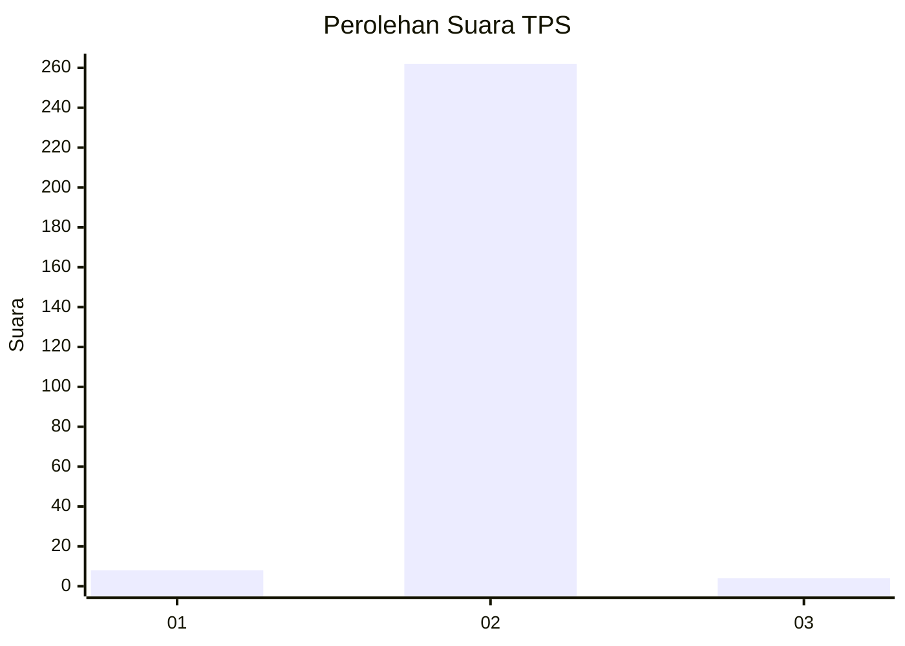
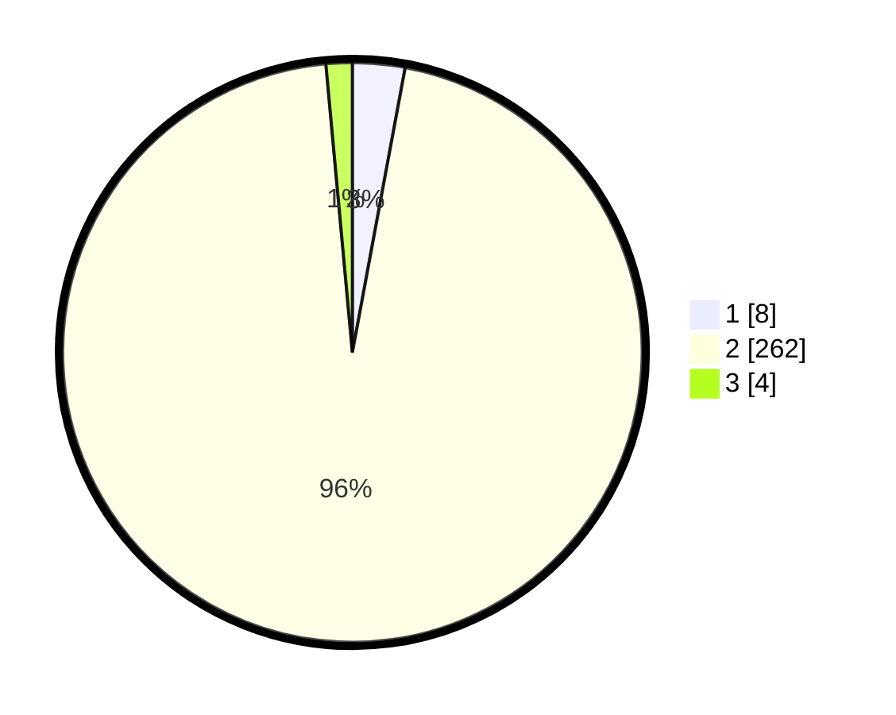

# Hasil

## Grafik

## Tabel

| No. | Nama Paslon    | Suara | Suara (raw) | Persentase |
|:--- |:-------------- | -----:| -----------:| ----------:|
| 1   | ANIES MUHAIMIN | 8     | [8][p-1]    | 2,92       |
| 2   | PRABOWO GIBRAN | 262   | [262][p-2]  | 95,62      |
| 3   | GANJAR MAHFUD  | 4     | [4][p-3]    | 1,46       |

[p-1]: https://github.com/gigit-pemilu/pemilu-2024-11-aceh/blob/main/pilpres/hitung-suara/sub/11-aceh/sub/08-aceh-utara/sub/22-simpang-kramat/sub/2001-keude-simpang-empat/sub/002-tps/sub/paslon-1.txt
[p-2]: https://github.com/gigit-pemilu/pemilu-2024-11-aceh/blob/main/pilpres/hitung-suara/sub/11-aceh/sub/08-aceh-utara/sub/22-simpang-kramat/sub/2001-keude-simpang-empat/sub/002-tps/sub/paslon-2.txt
[p-3]: https://github.com/gigit-pemilu/pemilu-2024-11-aceh/blob/main/pilpres/hitung-suara/sub/11-aceh/sub/08-aceh-utara/sub/22-simpang-kramat/sub/2001-keude-simpang-empat/sub/002-tps/sub/paslon-3.txt

## Foto C Plano

https://sirekap-obj-formc.kpu.go.id/236b/pemilu/ppwp/11/08/22/20/01/1108222001002-20240216-150010--14c4d46a-006f-4e2a-a9c6-d674bb61718f.jpg

https://sirekap-obj-formc.kpu.go.id/236b/pemilu/ppwp/11/08/22/20/01/1108222001002-20240216-150010--97891b13-1e05-4bf0-a2b8-1852e3eb30d1.jpg

https://sirekap-obj-formc.kpu.go.id/236b/pemilu/ppwp/11/08/22/20/01/1108222001002-20240214-233855--18ed0546-06fb-4ff6-b0e8-fedef05acf8f.jpg

## Metadata

| Key        | Value               |
| ---------- | ------------------- |
| Time Stamp | 2024-02-17 16:00:02 |

## DATA PEMILIH TETAP

Jumlah pemilih dalam DPT: **282**.
 * L: **136**.
 * P: **146**.

## DATA PENGGUNA HAK PILIH

Jumlah pengguna hak pilih dalam DPT: **276**.
 * L: **134**.
 * P: **142**.

Jumlah pengguna hak pilih dalam DPTb: **0**.
 * L: **0**.
 * P: **0**.

Jumlah pengguna hak pilih dalam DPK: **0**.
 * L: **0**.
 * P: **0**.

Jumlah pengguna hak pilih: **276**.
 * L: **134**.
 * P: **142**.

## JUMLAH SUARA SAH DAN TIDAK SAH

JUMLAH SELURUH SUARA SAH: **274**.

JUMLAH SUARA TIDAK SAH: **2**.

JUMLAH SELURUH SUARA SAH DAN SUARA TIDAK SAH: **276**.

