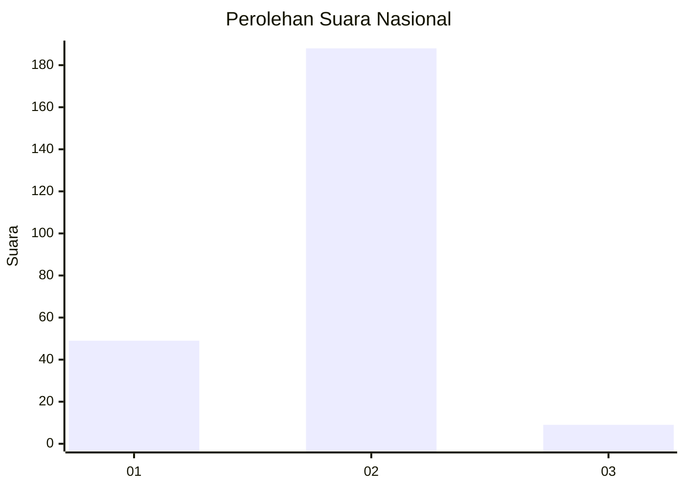
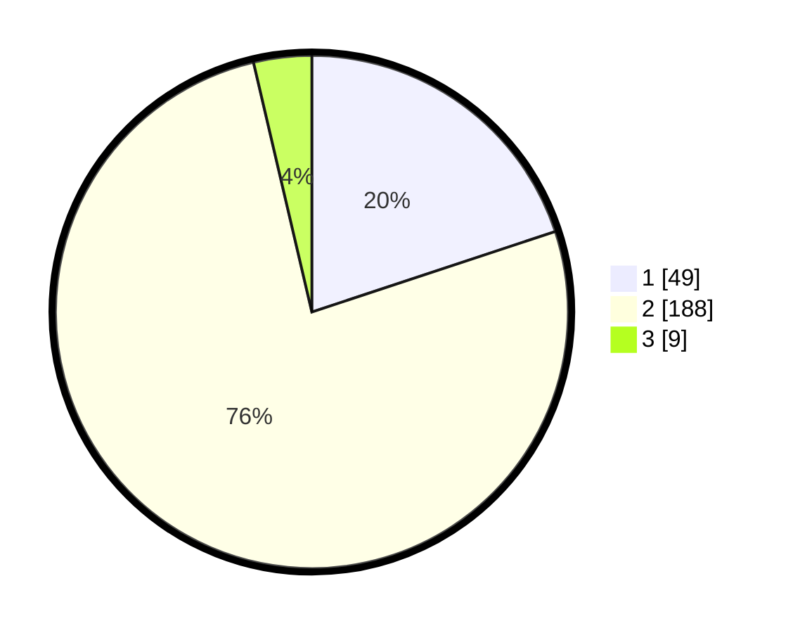

# Hasil

## Grafik

## Tabel

| No. | Nama Paslon    | Suara | Suara (raw) | Persentase |
|:--- |:-------------- | -----:| -----------:| ----------:|
| 1   | ANIES MUHAIMIN | 49    | [49][p-1]   | 19,92      |
| 2   | PRABOWO GIBRAN | 188   | [188][p-2]  | 76,42      |
| 3   | GANJAR MAHFUD  | 9     | [9][p-3]    | 3,66       |

[p-1]: https://github.com/gigit-pemilu/pemilu-2024/blob/main/pilpres/hitung-suara/sub/11-aceh/sub/08-aceh-utara/sub/22-simpang-kramat/sub/2015-pase-sentosa/sub/002-tps/sub/paslon-1.txt
[p-2]: https://github.com/gigit-pemilu/pemilu-2024/blob/main/pilpres/hitung-suara/sub/11-aceh/sub/08-aceh-utara/sub/22-simpang-kramat/sub/2015-pase-sentosa/sub/002-tps/sub/paslon-2.txt
[p-3]: https://github.com/gigit-pemilu/pemilu-2024/blob/main/pilpres/hitung-suara/sub/11-aceh/sub/08-aceh-utara/sub/22-simpang-kramat/sub/2015-pase-sentosa/sub/002-tps/sub/paslon-3.txt

## Foto C Plano

https://sirekap-obj-formc.kpu.go.id/1194/pemilu/ppwp/11/08/22/20/15/1108222015002-20240215-003439--c70bd3b1-aa47-45f6-9a16-7510ef324fec.jpg

https://sirekap-obj-formc.kpu.go.id/1194/pemilu/ppwp/11/08/22/20/15/1108222015002-20240215-023823--dfa937de-d256-492f-a25f-e6e83d2d1b96.jpg

https://sirekap-obj-formc.kpu.go.id/1194/pemilu/ppwp/11/08/22/20/15/1108222015002-20240215-003610--f525fb07-9c77-4661-9a91-7167d04b0a57.jpg

## Metadata

| Key        | Value               |
| ---------- | ------------------- |
| Time Stamp | 2024-02-15 19:00:26 |

