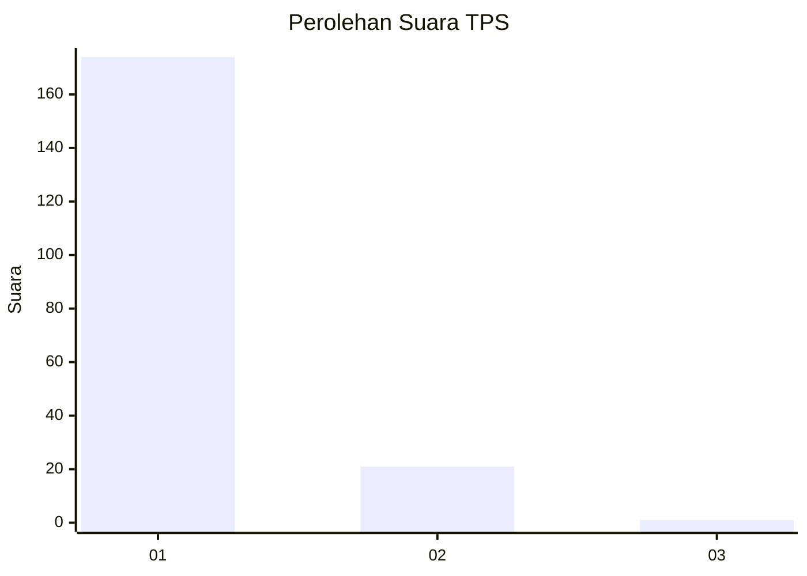
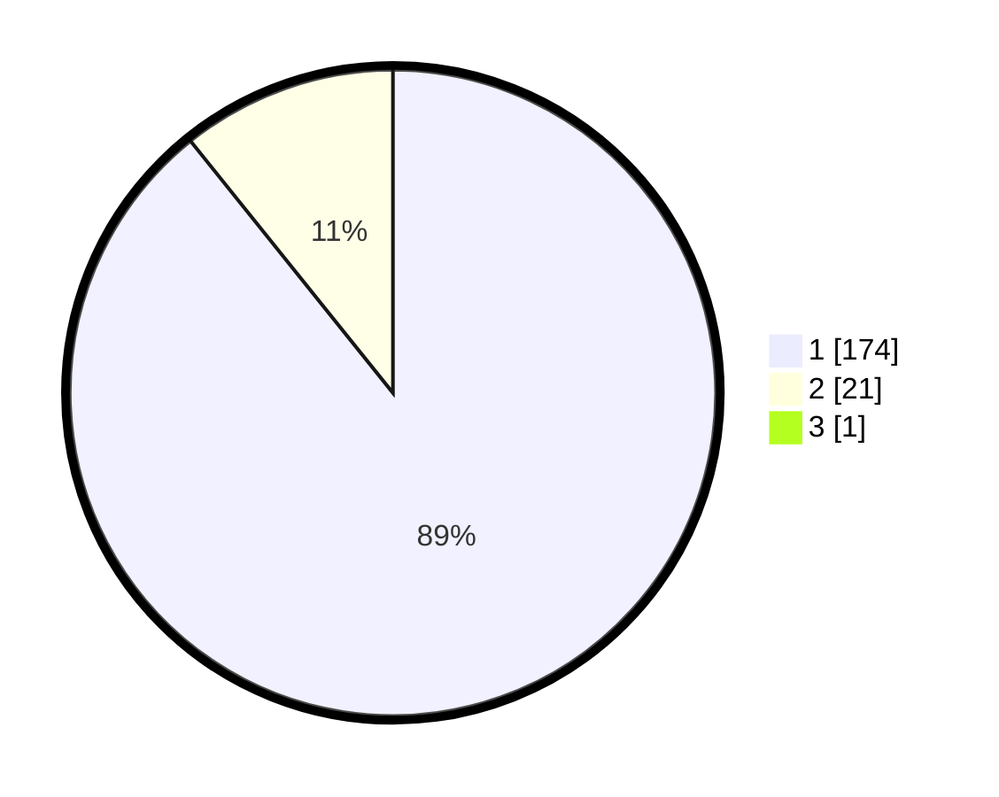

# Hasil

## Grafik

## Tabel

| No. | Nama Paslon    | Suara | Suara (raw) | Persentase |
|:--- |:-------------- | -----:| -----------:| ----------:|
| 1   | ANIES MUHAIMIN | 174   | [174][p-1]  | 88,78      |
| 2   | PRABOWO GIBRAN | 21    | [21][p-2]   | 10,71      |
| 3   | GANJAR MAHFUD  | 1     | [1][p-3]    | 0,51       |

[p-1]: https://github.com/gigit-pemilu/pemilu-2024-11-aceh/blob/main/pilpres/hitung-suara/sub/11-aceh/sub/08-aceh-utara/sub/23-lapang/sub/2010-kuala-kereuto/sub/002-tps/sub/paslon-1.txt
[p-2]: https://github.com/gigit-pemilu/pemilu-2024-11-aceh/blob/main/pilpres/hitung-suara/sub/11-aceh/sub/08-aceh-utara/sub/23-lapang/sub/2010-kuala-kereuto/sub/002-tps/sub/paslon-2.txt
[p-3]: https://github.com/gigit-pemilu/pemilu-2024-11-aceh/blob/main/pilpres/hitung-suara/sub/11-aceh/sub/08-aceh-utara/sub/23-lapang/sub/2010-kuala-kereuto/sub/002-tps/sub/paslon-3.txt

## Foto C Plano

https://sirekap-obj-formc.kpu.go.id/4121/pemilu/ppwp/11/08/23/20/10/1108232010002-20240222-111450--2e3e79f7-7877-411f-a121-965bb47dfb77.jpg

https://sirekap-obj-formc.kpu.go.id/4121/pemilu/ppwp/11/08/23/20/10/1108232010002-20240222-111826--4972422f-213c-4411-8c98-66bc37bbf354.jpg

https://sirekap-obj-formc.kpu.go.id/4121/pemilu/ppwp/11/08/23/20/10/1108232010002-20240222-111951--93db5954-2a1e-46db-b6fe-1fa5ea4b63b2.jpg

## Metadata

| Key        | Value               |
| ---------- | ------------------- |
| Time Stamp | 2024-02-24 22:31:28 |

