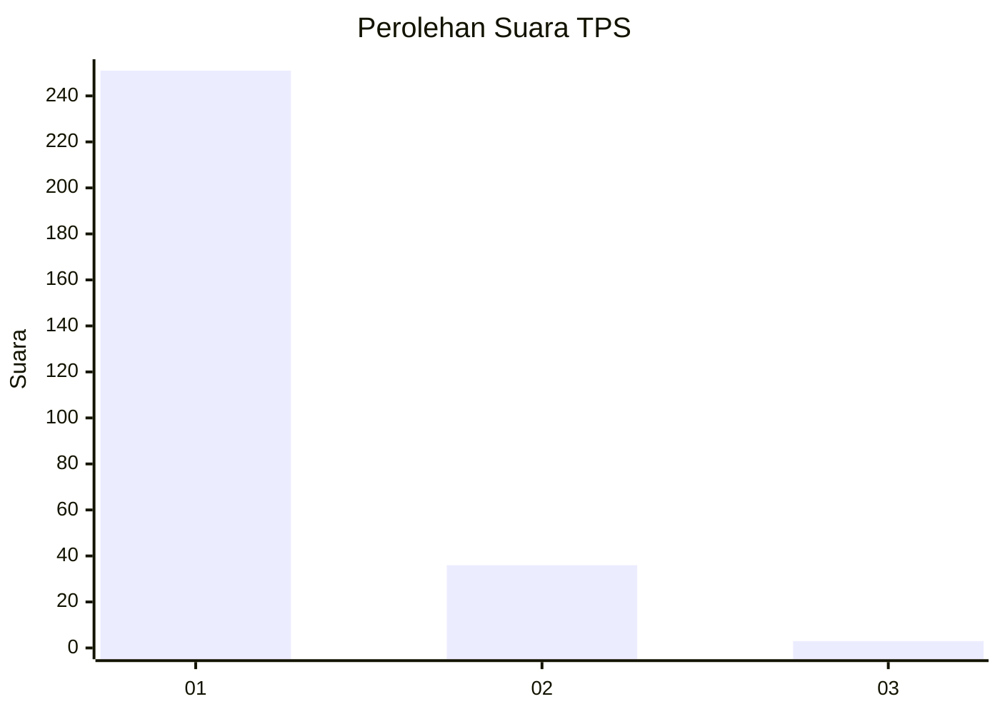
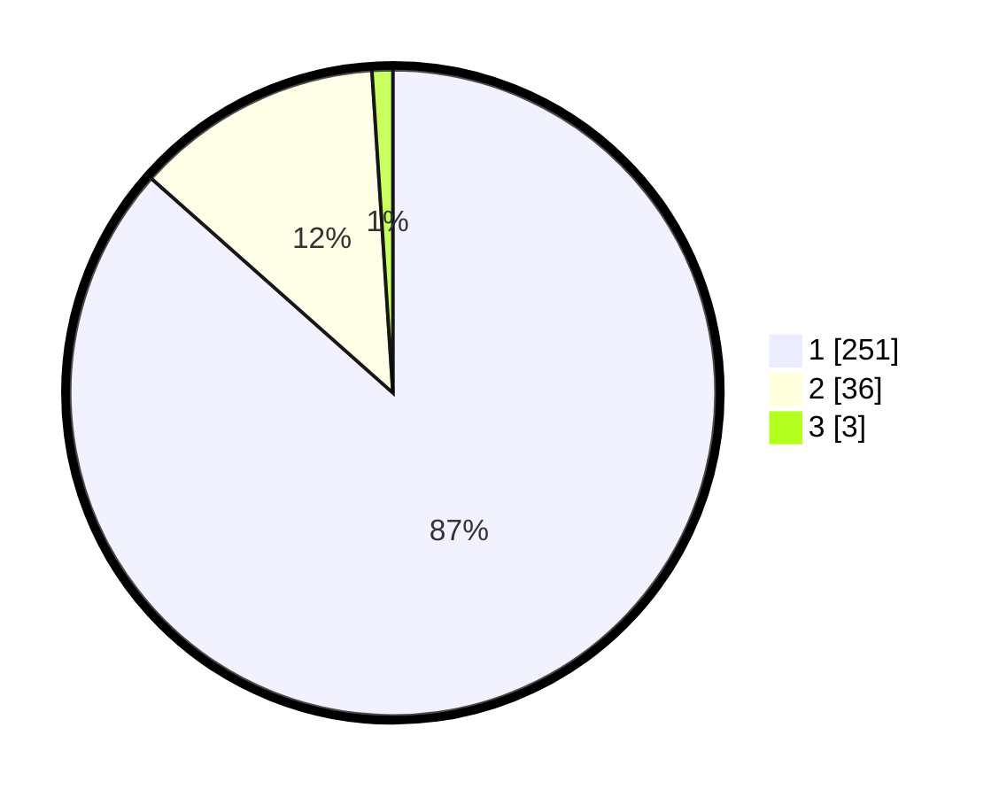

# Hasil

## Grafik

## Tabel

| No. | Nama Paslon    | Suara | Suara (raw) | Persentase |
|:--- |:-------------- | -----:| -----------:| ----------:|
| 1   | ANIES MUHAIMIN | 251   | [251][p-1]  | 86,55      |
| 2   | PRABOWO GIBRAN | 36    | [36][p-2]   | 12,41      |
| 3   | GANJAR MAHFUD  | 3     | [3][p-3]    | 1,03       |

[p-1]: https://github.com/gigit-pemilu/pemilu-2024-11-aceh/blob/main/pilpres/hitung-suara/sub/11-aceh/sub/08-aceh-utara/sub/23-lapang/sub/2011-kuala-cangkoy/sub/002-tps/sub/paslon-1.txt
[p-2]: https://github.com/gigit-pemilu/pemilu-2024-11-aceh/blob/main/pilpres/hitung-suara/sub/11-aceh/sub/08-aceh-utara/sub/23-lapang/sub/2011-kuala-cangkoy/sub/002-tps/sub/paslon-2.txt
[p-3]: https://github.com/gigit-pemilu/pemilu-2024-11-aceh/blob/main/pilpres/hitung-suara/sub/11-aceh/sub/08-aceh-utara/sub/23-lapang/sub/2011-kuala-cangkoy/sub/002-tps/sub/paslon-3.txt

## Foto C Plano

https://sirekap-obj-formc.kpu.go.id/a4ac/pemilu/ppwp/11/08/23/20/11/1108232011002-20240223-173140--c83be783-e499-4063-8b40-1611765b250d.jpg

https://sirekap-obj-formc.kpu.go.id/a4ac/pemilu/ppwp/11/08/23/20/11/1108232011002-20240215-170832--6831f691-05df-41b4-bc93-4258cd538798.jpg

https://sirekap-obj-formc.kpu.go.id/a4ac/pemilu/ppwp/11/08/23/20/11/1108232011002-20240215-170850--cb9b5dd8-dd12-4689-b521-7e35c860377f.jpg

## Metadata

| Key        | Value               |
| ---------- | ------------------- |
| Time Stamp | 2024-02-24 22:31:28 |

