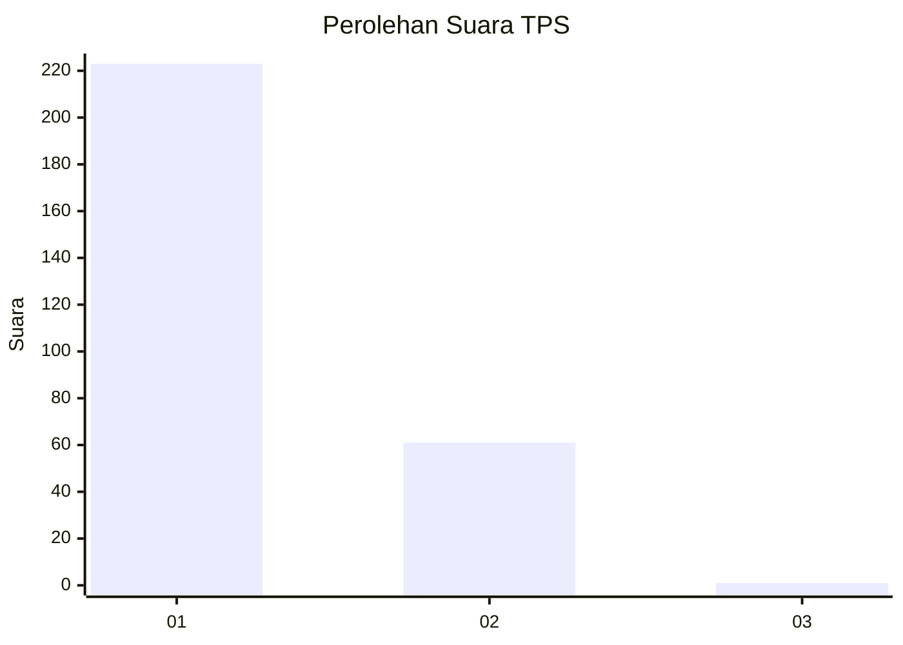
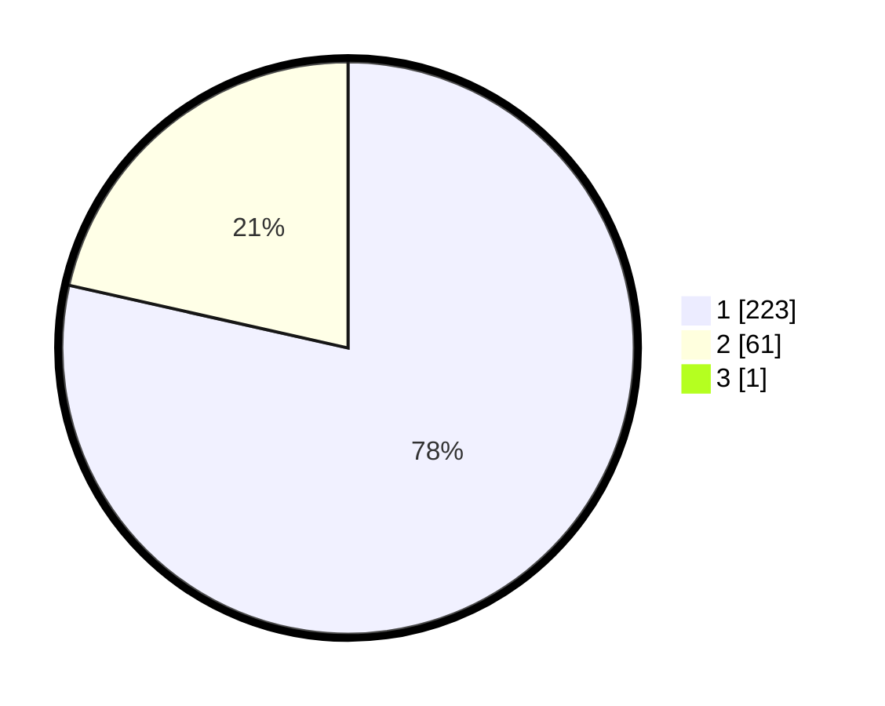

# Hasil

## Grafik

## Tabel

| No. | Nama Paslon    | Suara | Suara (raw) | Persentase |
|:--- |:-------------- | -----:| -----------:| ----------:|
| 1   | ANIES MUHAIMIN | 223   | [223][p-1]  | 78,25      |
| 2   | PRABOWO GIBRAN | 61    | [61][p-2]   | 21,40      |
| 3   | GANJAR MAHFUD  | 1     | [1][p-3]    | 0,35       |

[p-1]: https://github.com/gigit-pemilu/pemilu-2024-11-aceh/blob/main/pilpres/hitung-suara/sub/11-aceh/sub/08-aceh-utara/sub/23-lapang/sub/2011-kuala-cangkoy/sub/003-tps/sub/paslon-1.txt
[p-2]: https://github.com/gigit-pemilu/pemilu-2024-11-aceh/blob/main/pilpres/hitung-suara/sub/11-aceh/sub/08-aceh-utara/sub/23-lapang/sub/2011-kuala-cangkoy/sub/003-tps/sub/paslon-2.txt
[p-3]: https://github.com/gigit-pemilu/pemilu-2024-11-aceh/blob/main/pilpres/hitung-suara/sub/11-aceh/sub/08-aceh-utara/sub/23-lapang/sub/2011-kuala-cangkoy/sub/003-tps/sub/paslon-3.txt

## Foto C Plano

https://sirekap-obj-formc.kpu.go.id/f3a2/pemilu/ppwp/11/08/23/20/11/1108232011003-20240215-074332--f58ad6f1-65ba-4146-b25c-3ea4b6fa7f16.jpg

https://sirekap-obj-formc.kpu.go.id/f3a2/pemilu/ppwp/11/08/23/20/11/1108232011003-20240215-074516--175bdf76-8dab-4993-80ce-039bd03f8b79.jpg

https://sirekap-obj-formc.kpu.go.id/f3a2/pemilu/ppwp/11/08/23/20/11/1108232011003-20240215-074824--06dce197-812c-47e2-9bfc-22270c576c1d.jpg

## Metadata

| Key        | Value               |
| ---------- | ------------------- |
| Time Stamp | 2024-02-15 17:30:25 |

## DATA PEMILIH TETAP

Jumlah pemilih dalam DPT: **299**.
 * L: **160**.
 * P: **139**.

## DATA PENGGUNA HAK PILIH

Jumlah pengguna hak pilih dalam DPT: **296**.
 * L: **160**.
 * P: **136**.

Jumlah pengguna hak pilih dalam DPTb: **0**.
 * L: **0**.
 * P: **0**.

Jumlah pengguna hak pilih dalam DPK: **3**.
 * L: **0**.
 * P: **3**.

Jumlah pengguna hak pilih: **299**.
 * L: **160**.
 * P: **139**.

## JUMLAH SUARA SAH DAN TIDAK SAH

JUMLAH SELURUH SUARA SAH: **285**.

JUMLAH SUARA TIDAK SAH: **14**.

JUMLAH SELURUH SUARA SAH DAN SUARA TIDAK SAH: **299**.

