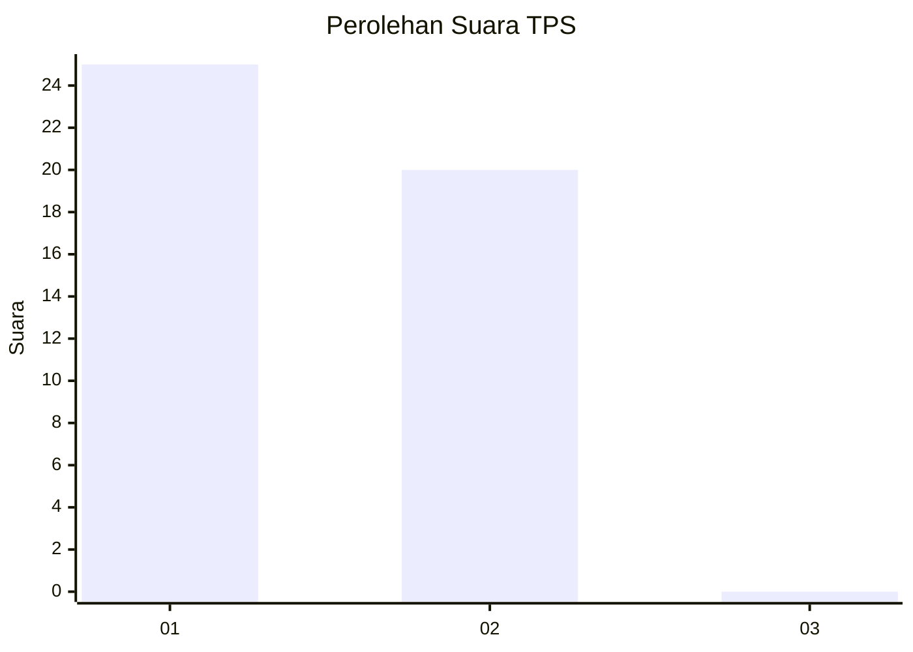
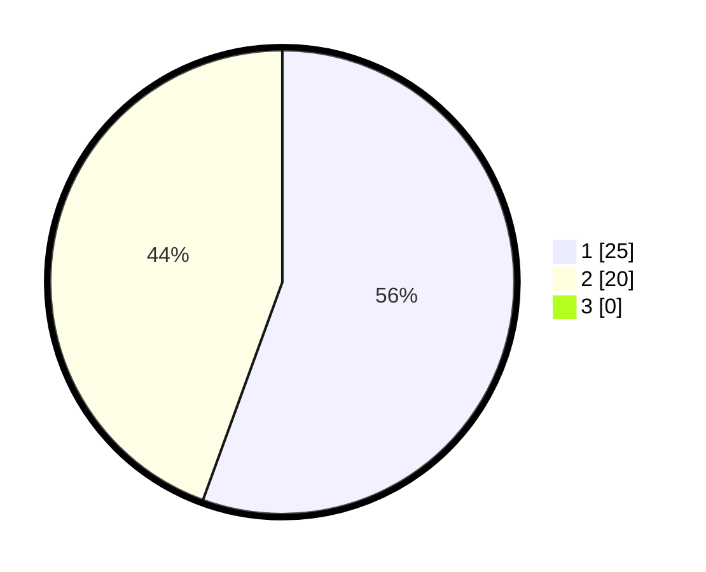

# Hasil

## Grafik

## Tabel

| No. | Nama Paslon    | Suara | Suara (raw) | Persentase |
|:--- |:-------------- | -----:| -----------:| ----------:|
| 1   | ANIES MUHAIMIN | 25    | [25][p-1]   | 55,56      |
| 2   | PRABOWO GIBRAN | 20    | [20][p-2]   | 44,44      |
| 3   | GANJAR MAHFUD  | 0     | [0][p-3]    | 0,00       |

[p-1]: https://github.com/gigit-pemilu/pemilu-2024-11-aceh/blob/main/pilpres/hitung-suara/sub/11-aceh/sub/08-aceh-utara/sub/24-pirak-timur/sub/2005-beuracan-rata/sub/001-tps/sub/paslon-1.txt
[p-2]: https://github.com/gigit-pemilu/pemilu-2024-11-aceh/blob/main/pilpres/hitung-suara/sub/11-aceh/sub/08-aceh-utara/sub/24-pirak-timur/sub/2005-beuracan-rata/sub/001-tps/sub/paslon-2.txt
[p-3]: https://github.com/gigit-pemilu/pemilu-2024-11-aceh/blob/main/pilpres/hitung-suara/sub/11-aceh/sub/08-aceh-utara/sub/24-pirak-timur/sub/2005-beuracan-rata/sub/001-tps/sub/paslon-3.txt

## Foto C Plano

https://sirekap-obj-formc.kpu.go.id/b87b/pemilu/ppwp/11/08/24/20/05/1108242005001-20240214-155654--231af79a-97ab-4765-9096-3c14a4823fc0.jpg

https://sirekap-obj-formc.kpu.go.id/b87b/pemilu/ppwp/11/08/24/20/05/1108242005001-20240214-155451--ee394319-4efc-4514-97ff-1f263b019edd.jpg

https://sirekap-obj-formc.kpu.go.id/b87b/pemilu/ppwp/11/08/24/20/05/1108242005001-20240214-155629--e99ae58a-de91-4e60-a591-a21e4d0a79d5.jpg

## Metadata

| Key        | Value               |
| ---------- | ------------------- |
| Time Stamp | 2024-02-15 00:41:44 |

## DATA PEMILIH TETAP

Jumlah pemilih dalam DPT: **47**.
 * L: **23**.
 * P: **24**.

## DATA PENGGUNA HAK PILIH

Jumlah pengguna hak pilih dalam DPT: **45**.
 * L: **22**.
 * P: **23**.

Jumlah pengguna hak pilih dalam DPTb: **0**.
 * L: **0**.
 * P: **0**.

Jumlah pengguna hak pilih dalam DPK: **0**.
 * L: **0**.
 * P: **0**.

Jumlah pengguna hak pilih: **45**.
 * L: **22**.
 * P: **23**.

## JUMLAH SUARA SAH DAN TIDAK SAH

JUMLAH SELURUH SUARA SAH: **45**.

JUMLAH SUARA TIDAK SAH: **0**.

JUMLAH SELURUH SUARA SAH DAN SUARA TIDAK SAH: **45**.

