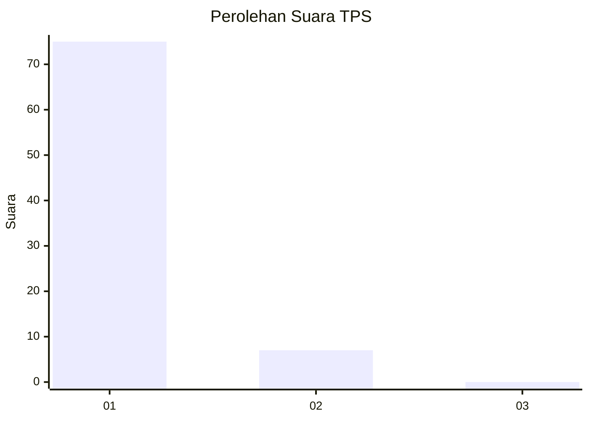
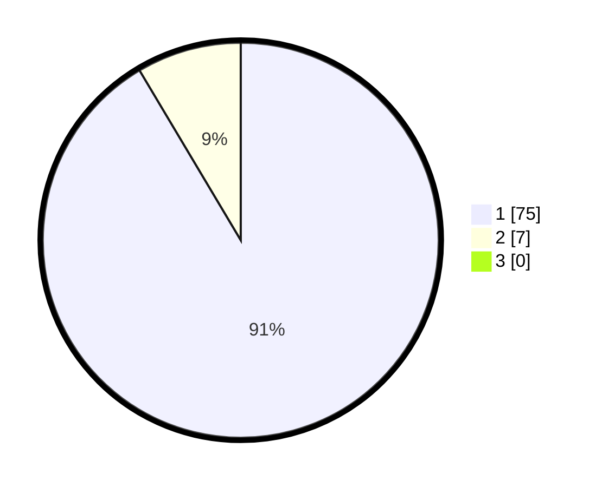

# Hasil

## Grafik

## Tabel

| No. | Nama Paslon    | Suara | Suara (raw) | Persentase |
|:--- |:-------------- | -----:| -----------:| ----------:|
| 1   | ANIES MUHAIMIN | 75    | [75][p-1]   | 91,46      |
| 2   | PRABOWO GIBRAN | 7     | [7][p-2]    | 8,54       |
| 3   | GANJAR MAHFUD  | 0     | [0][p-3]    | 0,00       |

[p-1]: https://github.com/gigit-pemilu/pemilu-2024-11-aceh/blob/main/pilpres/hitung-suara/sub/11-aceh/sub/08-aceh-utara/sub/24-pirak-timur/sub/2007-trieng-krueng-kreh/sub/001-tps/sub/paslon-1.txt
[p-2]: https://github.com/gigit-pemilu/pemilu-2024-11-aceh/blob/main/pilpres/hitung-suara/sub/11-aceh/sub/08-aceh-utara/sub/24-pirak-timur/sub/2007-trieng-krueng-kreh/sub/001-tps/sub/paslon-2.txt
[p-3]: https://github.com/gigit-pemilu/pemilu-2024-11-aceh/blob/main/pilpres/hitung-suara/sub/11-aceh/sub/08-aceh-utara/sub/24-pirak-timur/sub/2007-trieng-krueng-kreh/sub/001-tps/sub/paslon-3.txt

## Foto C Plano

https://sirekap-obj-formc.kpu.go.id/e9ee/pemilu/ppwp/11/08/24/20/07/1108242007001-20240214-155407--719617ff-6523-4e35-a00a-5414884d5215.jpg

https://sirekap-obj-formc.kpu.go.id/e9ee/pemilu/ppwp/11/08/24/20/07/1108242007001-20240214-155425--2905e47d-a715-4d65-abb1-44407c08822c.jpg

https://sirekap-obj-formc.kpu.go.id/e9ee/pemilu/ppwp/11/08/24/20/07/1108242007001-20240214-155438--d3e97f79-4676-4236-86d8-41e7a6448987.jpg

## Metadata

| Key        | Value               |
| ---------- | ------------------- |
| Time Stamp | 2024-02-14 21:46:01 |

## DATA PEMILIH TETAP

Jumlah pemilih dalam DPT: **89**.
 * L: **41**.
 * P: **48**.

## DATA PENGGUNA HAK PILIH

Jumlah pengguna hak pilih dalam DPT: **82**.
 * L: **37**.
 * P: **45**.

Jumlah pengguna hak pilih dalam DPTb: **0**.
 * L: **0**.
 * P: **0**.

Jumlah pengguna hak pilih dalam DPK: **0**.
 * L: **0**.
 * P: **0**.

Jumlah pengguna hak pilih: **82**.
 * L: **37**.
 * P: **45**.

## JUMLAH SUARA SAH DAN TIDAK SAH

JUMLAH SELURUH SUARA SAH: **82**.

JUMLAH SUARA TIDAK SAH: **0**.

JUMLAH SELURUH SUARA SAH DAN SUARA TIDAK SAH: **82**.

