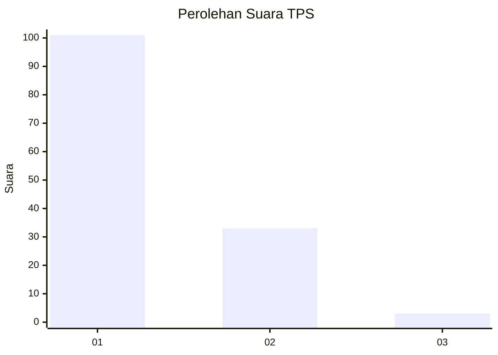
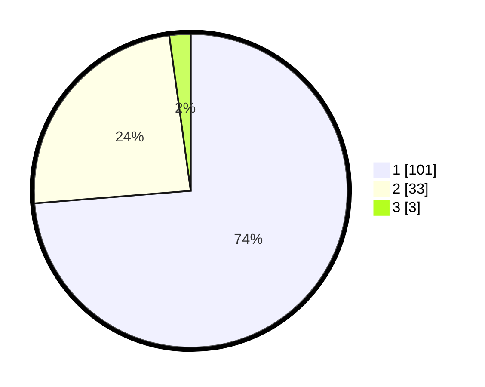

# Hasil

## Grafik

## Tabel

| No. | Nama Paslon    | Suara | Suara (raw) | Persentase |
|:--- |:-------------- | -----:| -----------:| ----------:|
| 1   | ANIES MUHAIMIN | 101   | [101][p-1]  | 73,72      |
| 2   | PRABOWO GIBRAN | 33    | [33][p-2]   | 24,09      |
| 3   | GANJAR MAHFUD  | 3     | [3][p-3]    | 2,19       |

[p-1]: https://github.com/gigit-pemilu/pemilu-2024-11-aceh/blob/main/pilpres/hitung-suara/sub/11-aceh/sub/08-aceh-utara/sub/24-pirak-timur/sub/2011-alue-rimee/sub/002-tps/sub/paslon-1.txt
[p-2]: https://github.com/gigit-pemilu/pemilu-2024-11-aceh/blob/main/pilpres/hitung-suara/sub/11-aceh/sub/08-aceh-utara/sub/24-pirak-timur/sub/2011-alue-rimee/sub/002-tps/sub/paslon-2.txt
[p-3]: https://github.com/gigit-pemilu/pemilu-2024-11-aceh/blob/main/pilpres/hitung-suara/sub/11-aceh/sub/08-aceh-utara/sub/24-pirak-timur/sub/2011-alue-rimee/sub/002-tps/sub/paslon-3.txt

## Foto C Plano

https://sirekap-obj-formc.kpu.go.id/c61e/pemilu/ppwp/11/08/24/20/11/1108242011002-20240218-120527--4d4896ae-fea3-4243-9352-28b1daea35b3.jpg

https://sirekap-obj-formc.kpu.go.id/c61e/pemilu/ppwp/11/08/24/20/11/1108242011002-20240218-120553--abb18f63-fd3d-448a-8505-76d229ec47eb.jpg

https://sirekap-obj-formc.kpu.go.id/c61e/pemilu/ppwp/11/08/24/20/11/1108242011002-20240218-120618--60a52b3e-8c75-4a98-bb4f-c0adc3d4114c.jpg

## Metadata

| Key        | Value               |
| ---------- | ------------------- |
| Time Stamp | 2024-02-24 22:31:28 |

