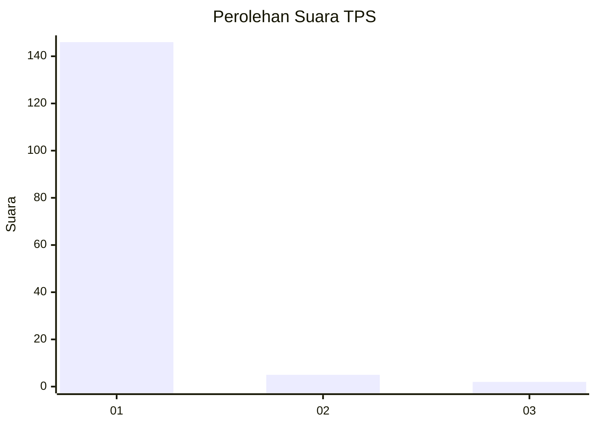
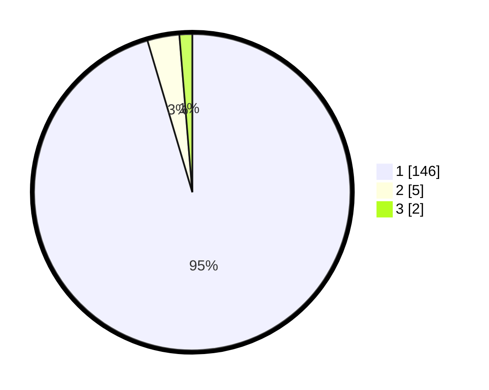

# Hasil

## Grafik

## Tabel

| No. | Nama Paslon    | Suara | Suara (raw) | Persentase |
|:--- |:-------------- | -----:| -----------:| ----------:|
| 1   | ANIES MUHAIMIN | 146   | [146][p-1]  | 95,42      |
| 2   | PRABOWO GIBRAN | 5     | [5][p-2]    | 3,27       |
| 3   | GANJAR MAHFUD  | 2     | [2][p-3]    | 1,31       |

[p-1]: https://github.com/gigit-pemilu/pemilu-2024-11-aceh/blob/main/pilpres/hitung-suara/sub/11-aceh/sub/08-aceh-utara/sub/24-pirak-timur/sub/2019-ceumeucet/sub/001-tps/sub/paslon-1.txt
[p-2]: https://github.com/gigit-pemilu/pemilu-2024-11-aceh/blob/main/pilpres/hitung-suara/sub/11-aceh/sub/08-aceh-utara/sub/24-pirak-timur/sub/2019-ceumeucet/sub/001-tps/sub/paslon-2.txt
[p-3]: https://github.com/gigit-pemilu/pemilu-2024-11-aceh/blob/main/pilpres/hitung-suara/sub/11-aceh/sub/08-aceh-utara/sub/24-pirak-timur/sub/2019-ceumeucet/sub/001-tps/sub/paslon-3.txt

## Foto C Plano

https://sirekap-obj-formc.kpu.go.id/6c2b/pemilu/ppwp/11/08/24/20/19/1108242019001-20240215-054916--cc6fe551-3fd3-4ad2-a20e-b040434a40f8.jpg

https://sirekap-obj-formc.kpu.go.id/6c2b/pemilu/ppwp/11/08/24/20/19/1108242019001-20240216-152234--94b0db14-5c08-4bb9-96ec-f26378bcbb2c.jpg

https://sirekap-obj-formc.kpu.go.id/6c2b/pemilu/ppwp/11/08/24/20/19/1108242019001-20240215-055148--952d2be7-cb5a-42e2-b957-7b158be25274.jpg

## Metadata

| Key        | Value               |
| ---------- | ------------------- |
| Time Stamp | 2024-02-16 16:25:10 |

