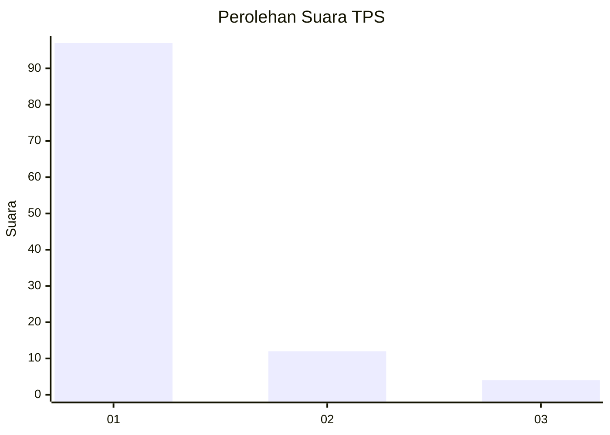
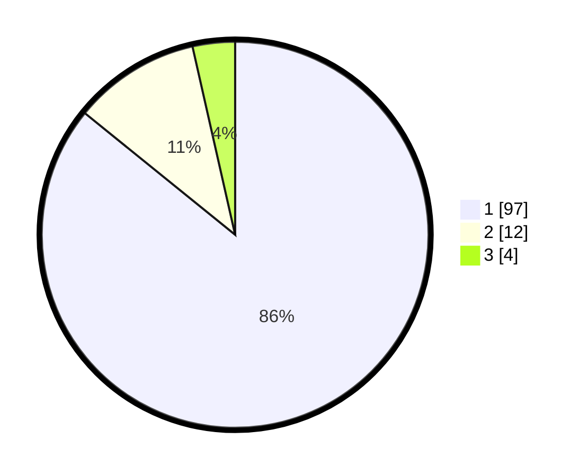

# Hasil

## Grafik

## Tabel

| No. | Nama Paslon    | Suara | Suara (raw) | Persentase |
|:--- |:-------------- | -----:| -----------:| ----------:|
| 1   | ANIES MUHAIMIN | 97    | [97][p-1]   | 85,84      |
| 2   | PRABOWO GIBRAN | 12    | [12][p-2]   | 10,62      |
| 3   | GANJAR MAHFUD  | 4     | [4][p-3]    | 3,54       |

[p-1]: https://github.com/gigit-pemilu/pemilu-2024-11-aceh/blob/main/pilpres/hitung-suara/sub/11-aceh/sub/08-aceh-utara/sub/25-geuredong-pase/sub/2001-lhok-asan/sub/001-tps/sub/paslon-1.txt
[p-2]: https://github.com/gigit-pemilu/pemilu-2024-11-aceh/blob/main/pilpres/hitung-suara/sub/11-aceh/sub/08-aceh-utara/sub/25-geuredong-pase/sub/2001-lhok-asan/sub/001-tps/sub/paslon-2.txt
[p-3]: https://github.com/gigit-pemilu/pemilu-2024-11-aceh/blob/main/pilpres/hitung-suara/sub/11-aceh/sub/08-aceh-utara/sub/25-geuredong-pase/sub/2001-lhok-asan/sub/001-tps/sub/paslon-3.txt

## Foto C Plano

https://sirekap-obj-formc.kpu.go.id/8908/pemilu/ppwp/11/08/25/20/01/1108252001001-20240218-225307--f9e8939a-321c-48d0-a3f4-d68b5449863c.jpg

https://sirekap-obj-formc.kpu.go.id/8908/pemilu/ppwp/11/08/25/20/01/1108252001001-20240218-225309--e0c4032f-f66d-4f7e-8cb2-2f9e4964bc6c.jpg

https://sirekap-obj-formc.kpu.go.id/8908/pemilu/ppwp/11/08/25/20/01/1108252001001-20240218-225308--237e303e-8cbe-4f6a-a2da-cd1a833f10cc.jpg

## Metadata

| Key        | Value               |
| ---------- | ------------------- |
| Time Stamp | 2024-02-21 19:00:00 |

## DATA PEMILIH TETAP

Jumlah pemilih dalam DPT: **141**.
 * L: **68**.
 * P: **73**.

## DATA PENGGUNA HAK PILIH

Jumlah pengguna hak pilih dalam DPT: **116**.
 * L: **56**.
 * P: **60**.

Jumlah pengguna hak pilih dalam DPTb: **1**.
 * L: **1**.
 * P: **0**.

Jumlah pengguna hak pilih dalam DPK: **1**.
 * L: **0**.
 * P: **1**.

Jumlah pengguna hak pilih: **118**.
 * L: **57**.
 * P: **61**.

## JUMLAH SUARA SAH DAN TIDAK SAH

JUMLAH SELURUH SUARA SAH: **113**.

JUMLAH SUARA TIDAK SAH: **5**.

JUMLAH SELURUH SUARA SAH DAN SUARA TIDAK SAH: **118**.

